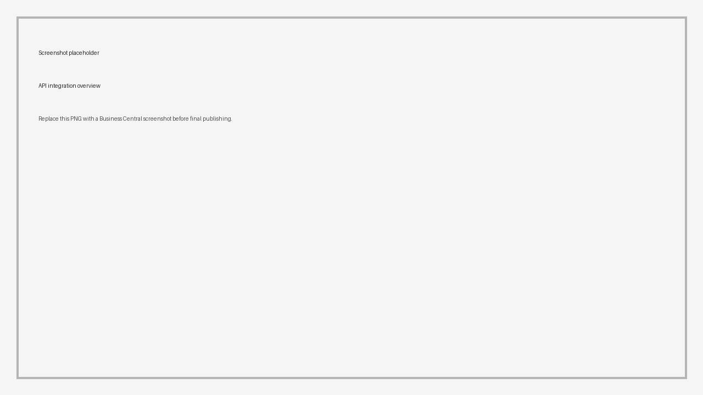

# API

Shipper TMS exposes Business Central API pages for integrations that need transport data without using the Business Central user interface.

Use the API for:

- carrier, driver, vehicle, map location, and logistic unit master data,
- Transport Order and Transport Request line integrations,
- delivery execution facts and attachments,
- telematics setup, webhooks, and administration actions.



## API identity

| Setting | Value |
|---|---|
| Publisher | `extensionslab` |
| API group | `stms` |
| Version | `v1.0` |

Business Central API URLs use this pattern:

```http
https://api.businesscentral.dynamics.com/v2.0/{environment}/api/extensionslab/stms/v1.0/companies({companyId})/{entitySet}
```

Use the standard Business Central OAuth 2.0 and Microsoft Entra ID model for authentication. Create a dedicated integration account or app registration and assign only the Shipper TMS permission sets required for the integration.

## Endpoint table

| API page | Entity name | Entity set | Use |
|---|---|---|---|
| TMAS API Carrier | `carrier` | `carriers` | Carrier master data |
| TMAS API Driver | `driver` | `drivers` | Driver master data |
| TMAS API Vehicle | `vehicle` | `vehicles` | Vehicle master data |
| TMAS API MAP Location | `maplocation` | `maplocations` | Map locations and coordinates |
| TMAS API Logistic Unit | `logisticunit` | `logisticunits` | Logistic unit headers |
| TMAS API Logistic Unit Line | `logisticunitline` | `logisticunitlines` | Logistic unit line data |
| TMAS API Transport Order | `transportorder` | `transportorders` | Transport Order headers |
| TMAS API Transport Order Line | `transportorderline` | `transportorderlines` | Transport Order lines and route details |
| TMAS API TR Line | `transportrequestline` | `transportrequestlines` | Transport Request line data |
| TMAS API Execution Entry | `executionentry` | `executionentries` | Delivery and execution facts |
| TMAS API Exec. Entry Attch. | `executionentryattachment` | `executionentryattachments` | Execution-entry attachment metadata and file content |
| TMAS API Telematics Setup | `telematicsSetup` | `telematicsSetups` | Telematics setup and webhook ingress |
| TMAS API Telematics Admin | `telematicsAdmin` | `telematicsAdmins` | Provider administration actions |

## Permission sets

| Integration type | Permission set caption | Permission set name |
|---|---|---|
| General Shipper TMS API integration | Shipper TMS - API | `Shipper TMS API` |
| Telematics webhook or data integration | Shipper TMS - Tel. API | `TMAS Telematics API` |
| Telematics administration integration | Shipper TMS - Tel. Admin API | `TMAS Tel. Admin API` |

For user-facing setup, see [Assign Permission Sets](assignpermissionsets.md).

## Example requests

### List Transport Orders

```http
GET /api/extensionslab/stms/v1.0/companies({companyId})/transportorders?$select=id,no,status,carrierNo,driverNo,vehicleNo,totalDistance
Authorization: Bearer {token}
Accept: application/json
```

### Filter Transport Orders by status

```http
GET /api/extensionslab/stms/v1.0/companies({companyId})/transportorders?$filter=status eq 'Open'
Authorization: Bearer {token}
Accept: application/json
```

### Update a vehicle assignment

```http
PATCH /api/extensionslab/stms/v1.0/companies({companyId})/transportorders({id})
Authorization: Bearer {token}
If-Match: *
Content-Type: application/json

{
  "vehicleNo": "TRUCK-01",
  "driverNo": "DRIVER-01"
}
```

### Create a map location

```http
POST /api/extensionslab/stms/v1.0/companies({companyId})/maplocations
Authorization: Bearer {token}
Content-Type: application/json

{
  "no": "CUST-ATL-01",
  "description": "Atlanta customer dock",
  "address": "100 Main St",
  "city": "Atlanta",
  "postCode": "30301",
  "countryRegionCode": "US",
  "latitude": 33.7490,
  "longitude": -84.3880
}
```

Field names follow the API page field names from the extension. Confirm names in your Business Central `$metadata` endpoint before building a production connector.

## Execution entry attachments

The execution-entry attachment API supports service actions for:

- `DownloadAttachment`
- `UploadAttachment(base64content, Description1, MimeType1)`

Use these actions for proof-of-delivery photos, signed documents, or delivery evidence that must be attached to an execution entry.

Example upload action body:

```json
{
  "base64content": "JVBERi0xLjQK...",
  "Description1": "Signed delivery note",
  "MimeType1": "application/pdf"
}
```

## Telematics API actions

The telematics setup API supports webhook ingress:

| Entity set | Action | Use |
|---|---|---|
| `telematicsSetups` | `ReceiveWebhook(RequestUri, HeadersJson, PayloadText)` | Receive provider webhook payloads |

The telematics admin API supports provider administration:

| Entity set | Action | Use |
|---|---|---|
| `telematicsAdmins` | `RegisterSamsaraRouteWebhook` | Register Samsara route webhook for the selected setup |
| `telematicsAdmins` | `DeleteSamsaraRouteWebhook` | Delete Samsara route webhook for the selected setup |
| `telematicsAdmins` | `EnsureWebfleetRouteQueue` | Ensure Webfleet route queue exists |
| `telematicsAdmins` | `DeleteWebfleetRouteQueue` | Delete Webfleet route queue |
| `telematicsAdmins` | `GetRouteIngressContract` | Return the expected route-ingress contract |

Treat telematics admin actions as privileged operations. Do not expose them to broad integration accounts.

## Error handling

| Error | Common cause | What to do |
|---|---|---|
| 401 Unauthorized | Missing or expired OAuth token | Refresh the token and verify the app registration |
| 403 Forbidden | Permission set missing | Assign the required Shipper TMS API permission set |
| 404 Not Found | Wrong company, environment, entity set, or record id | Verify the URL and company id |
| 409 Conflict | Record was changed by another user or process | Re-read the record and retry with the current ETag |
| 422 or validation error | Business Central validation failed | Read the error detail and fix required fields, status, or setup |
| 500 Provider error | External telematics or map provider failed | Check Shipper TMS logs and provider credentials |

## Versioning

The current API version is `v1.0`. Treat entity set names and service action contracts as integration contracts for this version. Recheck `$metadata` after installing a new Shipper TMS app version, especially before changing telematics or attachment integrations.

## Security guidance

- Use a dedicated service account or app registration.
- Assign only the required Shipper TMS API permission sets.
- Store client secrets, certificates, API keys, and provider tokens in an approved secret store.
- Do not reuse personal user accounts for integrations.
- Do not capture OAuth tokens, provider keys, or telematics secrets in screenshots.
- Log integration errors outside the production UI where support teams can review them.

## Related

- [Assign Permission Sets](assignpermissionsets.md)
- [Telematics](telematics.md)
- [Telematics setup](telematics-setup.md)
- [Execution Entries](execution-entries.md)
- [Transport Order](transportorder.md)
