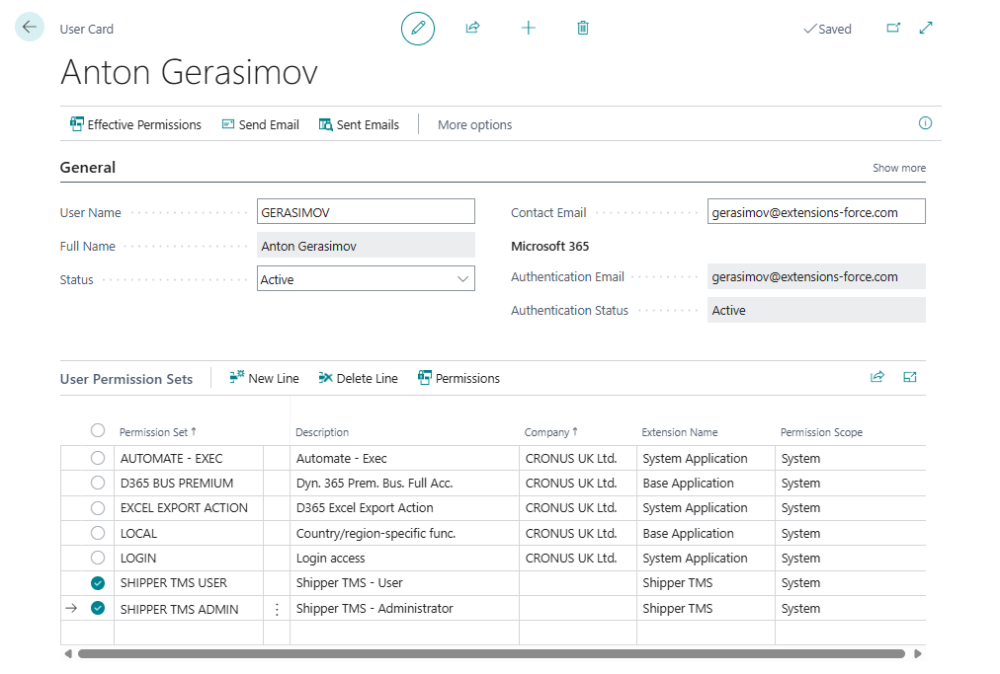

# Assign permission sets

After the app is installed and licenses are assigned, give users access to Shipper TMS by assigning the correct permission sets in Business Central.

## Which permission set to use

| Use this when | Permission set caption | Permission set name |
|---|---|---|
| Daily planning and execution | **Shipper TMS - User** | `Shipper TMS User` |
| Setup and administration | **Shipper TMS - Administrator** | `Shipper TMS Admin` |
| API integration | **Shipper TMS - API** | `Shipper TMS API` |
| Telematics API access | **Shipper TMS - Tel. API** | `TMAS Telematics API` |
| Telematics admin API access | **Shipper TMS - Tel. Admin API** | `TMAS Tel. Admin API` |

## Recommended assignment pattern

- Planners and dispatchers: **Shipper TMS - User**
- System administrators: **Shipper TMS - User** and **Shipper TMS - Administrator**
- Integration/service accounts: **Shipper TMS - API**
- Telematics-specific integrations: add the telematics API permission sets as needed

Use the smallest permission set that fits the job. Do not give telematics admin API access to normal planner users or broad service accounts.

## Assign a permission set

1. Open **Users** in Business Central.
2. Open the user card.
3. In **User Permission Sets**, add a new line.
4. In **Permission Set**, select the required Shipper TMS permission set.
5. Repeat for any additional roles the user needs.

## Verify

Use these quick checks:

- Planner: search for **Transport Requests**
- Administrator: search for **Shipper TMS Setup**
- API account: test the relevant API endpoint

If the page or API is accessible, the permission set is assigned correctly.

## Common access problems

| Problem | What to check |
|---|---|
| User can open Business Central but not Shipper TMS pages | Assign **Shipper TMS - User** and confirm the app license is assigned. |
| User can plan but cannot change setup | Add **Shipper TMS - Administrator** only for setup/admin users. |
| API returns 403 Forbidden | Assign the relevant API permission set to the integration account. |
| Telematics admin action fails | Add **Shipper TMS - Tel. Admin API** only to the account that performs provider administration. |

## Related

- [Installation](installation.md)
- [Buy licenses](buylicenses.md)
- [TMS Setup](setup.md)
