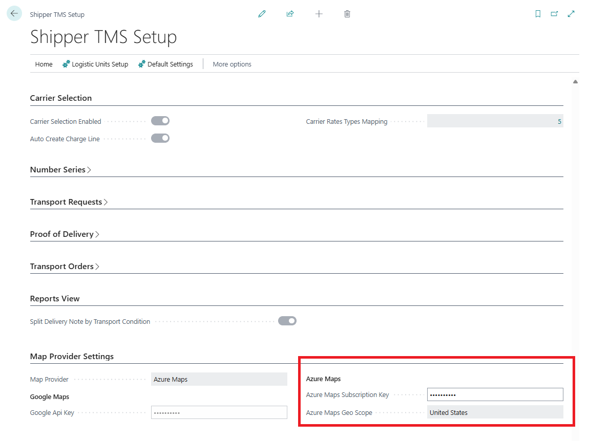

# Azure Maps integration

Use this guide when your company wants Shipper TMS to use **Azure Maps** for:

- address geocoding,
- route display,
- distance calculation,
- travel-time estimation,
- truck-aware routing.

This app currently expects an **Azure Maps Subscription Key** in **Shipper TMS Setup**.

## How to work with this setup

Use this page when Azure Maps is the selected provider.

1. Create or open the Azure Maps account in Azure.
2. Copy the **Primary Key** from **Authentication**.
3. Open **Shipper TMS Setup**.
4. Set **Map Provider** to **Azure Maps**.
5. Paste the key into **Azure Maps Subscription Key**.
6. Select **Azure Maps Geo Scope** if your company uses a specific processing region.
7. Test geocoding from a Map Location.
8. If truck-aware routing is required, create [Vehicle Routing Profiles](vehicle-routing-profiles.md) and assign them to vehicle unit types.
9. Test distance calculation from a Transport Request or Transport Order that uses a configured vehicle type.

## Before you start

- You need an Azure subscription.
- You need permission to create or manage an **Azure Maps** account in the Azure portal.
- Your company should decide which Azure region or data scope it wants to use.

## Create the Azure Maps account

1. Sign in to the **Azure portal**.
2. Choose **Create a resource**.
3. Search for **Azure Maps**.
4. Create a new Azure Maps account.
5. Select the Azure subscription and resource group.
6. Enter the account name.
7. Select the pricing tier that your company will use.
8. Create the resource.

## Get the subscription key

1. Open the Azure Maps account in the Azure portal.
2. Open **Authentication**.
3. Copy the **Primary Key**.

Use the **Primary Key** as the subscription key unless your company is intentionally using the secondary key for rotation scenarios.

## Enter the key in Shipper TMS

1. Open **Shipper TMS Setup** in Business Central.
2. In **Map Provider Settings**, set **Map Provider** to **Azure Maps**.
3. Paste the value into **Azure Maps Subscription Key**.
4. Select **Azure Maps Geo Scope** if your company wants a specific processing region.

## Optional: Enable truck-aware routing

Azure Maps becomes much more useful for transportation planning when you also configure vehicle-routing profiles.

Recommended setup:

1. Open [Vehicle Routing Profiles](vehicle-routing-profiles.md).
2. Create one or more profiles for your equipment types.
3. Assign the profile to the relevant vehicle unit type.
4. Use that vehicle type on the Transport Order.

This is how the route engine can consider dimensions, weight, axle, and hazardous-load restrictions.

## Verify the integration

1. Open a [Map Location](maplocation.md) with a valid address.
2. Choose **Geocode address**.
3. Confirm that coordinates are returned.
4. Open a [Transport Order](transportorder.md) or [Transport Request](transportrequest.md) and run the route or distance action.

If geocoding works and route calculations return distance and duration, the integration is configured correctly.

## Security note

Treat the Azure Maps key as a secret.

- Do not share it in screenshots.
- Do not store it in plain text outside approved admin tools.
- Rotate it according to your company's Azure key-management policy if needed.

## Related

- [Map Providers](mapproviders.md)
- [TMS Setup](setup.md)
- [Map Locations](maplocation.md)
- [Vehicle Routing Profiles](vehicle-routing-profiles.md)
- [Transport Order](transportorder.md)
