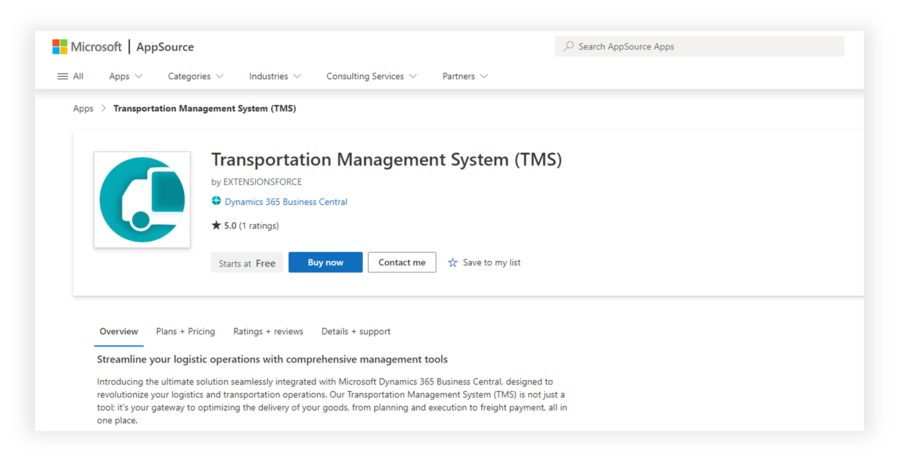
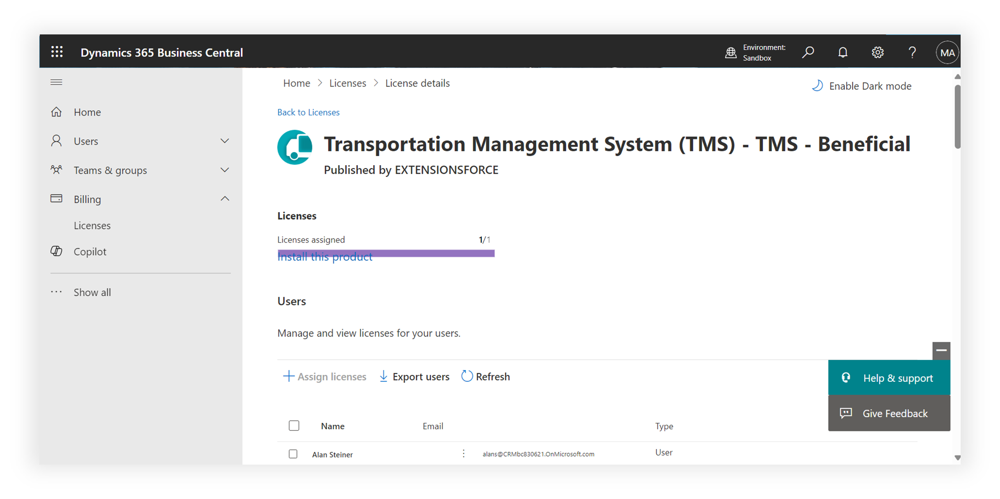

# Buy licenses

Shipper TMS uses its own AppSource licensing. Only users who actively work with TMS features need a Shipper TMS license.

## Who needs a license

Assign a Shipper TMS license to users who:

- create or release Transport Requests,
- plan Transport Orders,
- work in Load Management, Truck Load Management, Driver Load Management, or Visual Scheduler,
- work with TMS setup, telematics, or TMS APIs.

Users who never open or use TMS features do not need a Shipper TMS license.

## Buy the licenses

1. Open the Shipper TMS offer in AppSource.
2. Choose **Buy now**.
3. Select the pricing plan that matches your team size.
4. Complete the Microsoft purchase flow.

After the purchase, the licenses are provisioned to your Microsoft 365 tenant.

## Assign licenses to users

1. Open the **Microsoft 365 admin center**.
2. Go to **Billing** > **Licenses**.
3. Open the Shipper TMS product.
4. Choose **Assign licenses**.
5. Select the users who need access.
6. Save the change.

## Verify

Ask one licensed user to sign in to Business Central and search for **Transport Requests** or **Shipper TMS Setup**.

If the page opens without a licensing message, the license assignment is working.

## Related

- [Installation](installation.md)
- [Assign permission sets](assignpermissionsets.md)
