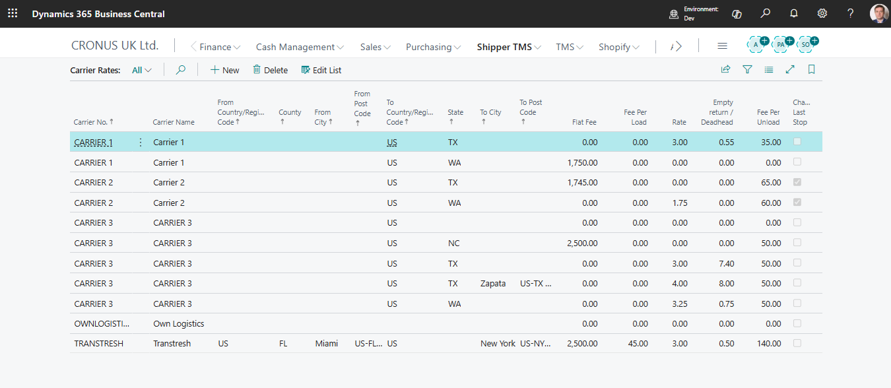
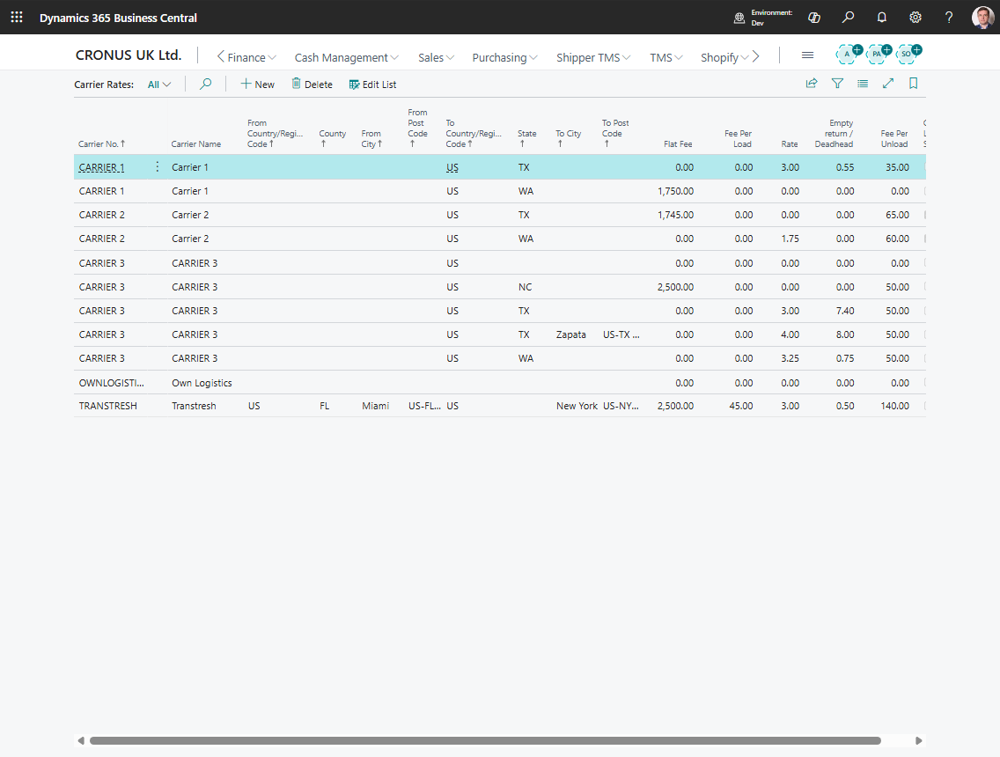

# Carrier Rates

Use **Carrier Rates** to define how a carrier should be priced during [Carrier Selection](carrierselection.md).

A rate can include:

- route-based rate amount,
- flat fee,
- fee per load,
- fee per unload,
- empty-return rate,
- geographic filters such as country/region code, county, city, or post code.

## Before you start

Complete these setup items first:

1. Create the [Carrier](carrier.md).
2. Configure [Map Providers](mapproviders.md) if you want distance-based rates.
3. Enable carrier selection in [TMS Setup](setup.md).
4. Configure [Carrier Rate Type Mapping](carrier-rate-type-mapping.md) in TMS Setup.

## Create a carrier rate

1. Open **Carriers**.
2. Open the carrier card.
3. Choose **Carrier Rates**.
4. Create a new line.
5. Fill the origin and destination filters that define where the rate applies.
6. Fill the pricing fields your company uses.
7. Repeat for each lane, geography, or fee rule.

## Main pricing fields

| Field | Use |
|---|---|
| **Rate** | Distance-based rate used for the main route |
| **Empty Return Rate** | Rate used for return distance or empty return logic |
| **Flat Fee** | Fixed amount added once for the matching rate |
| **Fee Per Load** | Charge added for loading activity |
| **Fee Per Unload** | Charge added for unload stops |
| **Charge Last Stop** | Controls whether the unload fee also applies to the final stop |

## Geographic matching

Use the origin and destination filters to make a rate more specific. Carrier Selection currently matches rates by:

1. **From Country/Region Code** and **To Country/Region Code**,
2. **From County** and **To County**,
3. **From City** and **To City**,
4. **From Post Code** and **To Post Code**.

> **Important:** **From Region Code** and **To Region Code** are available on Carrier Rates for classification and reporting, but the current Carrier Selection matching logic does not use those fields when it chooses a rate.

Start broad, then add specific rates only where they are needed:

1. country,
2. county,
3. city,
4. post code.

Avoid duplicate overlapping rates unless your carrier-pricing policy intentionally needs them.

## Verify the rate

1. Open a test [Transport Order](transportorder.md) with route stops.
2. Make sure the order is **Open**.
3. Choose **Carrier Selection**.
4. Confirm that the carrier appears.
5. Review the calculated amount and cost breakdown.

Expected result:

- The carrier appears as a selectable option when the route matches the rate filters.
- The cost breakdown shows the rate components that apply to the route.
- Applying the carrier updates the Transport Order carrier fields.

## Example: lane with distance and stop fees

Use this pattern when a carrier charges both a route rate and fixed operational fees.

| Component | Example value | Result |
|---|---:|---:|
| Main route distance | 120 km | Used with **Rate** |
| **Rate** | 2.00 per km | 240.00 |
| **Fee Per Load** | 25.00 | 25.00 for the loading stop |
| **Fee Per Unload** | 30.00 | 30.00 for the unloading stop |
| Empty return distance | 40 km | Used with **Empty Return Rate** when empty return applies |
| **Empty Return Rate** | 1.50 per km | 60.00 |
| **Flat Fee** | 50.00 | 50.00 |

The calculated carrier amount in this example is 405.00 before taxes or finance-specific charges. If **Auto Create Charge Line** is enabled, each cost component that creates a charge must have a valid [Carrier Rate Type Mapping](carrier-rate-type-mapping.md).

## Troubleshooting

| Problem | Check |
|---|---|
| Carrier does not appear | Carrier is blocked or not eligible |
| Carrier Selection returns no carriers | Confirm the Transport Order has route stops, the order is **Open**, carrier selection is enabled, and at least one unblocked carrier has matching rate geography. |
| Amount is zero | No matching rate exists or only a fallback comparison row was created |
| Rate is too high or too low | Distance, empty-return setup, fees, and geographic filters |
| A rate with Region Code is ignored | Use country/region code, county, city, or post code for matching. Region Code is not used by the current Carrier Selection matching logic. |
| Auto charge line is missing | **Auto Create Charge Line** and [Carrier Rate Type Mapping](carrier-rate-type-mapping.md) in TMS Setup |
| Mapping error when applying a carrier | Every selected rate type that creates a charge must have an item charge mapping |

## Related

- [Carriers](carrier.md)
- [Carrier Rate Type Mapping](carrier-rate-type-mapping.md)
- [Carrier Selection](carrierselection.md)
- [Transport Charges](transport-charges.md)
- [TMS Setup](setup.md)
