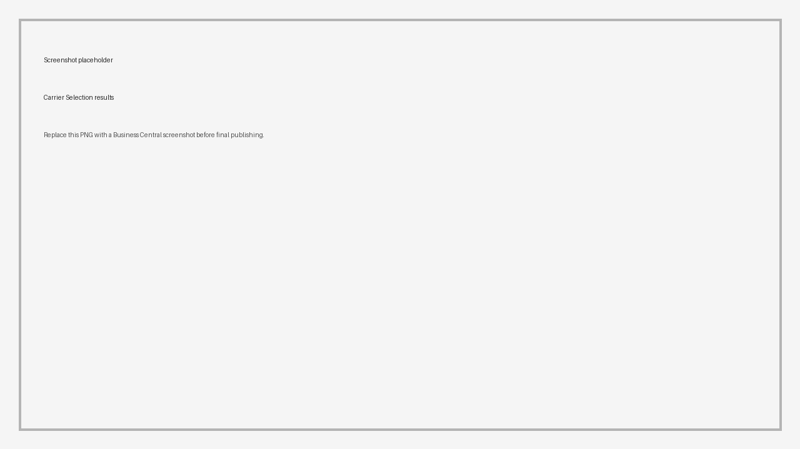

# Carrier Selection

Use **Carrier Selection** on an **Open** Transport Order when you want Shipper TMS to compare carriers for the current route.

The feature helps planners choose a carrier based on configured rates instead of manual estimates.

## Before you start

Make sure these items are in place:

1. **Carrier Selection Enabled** is turned on in [TMS Setup](setup.md).
2. [Carrier Rates](carrier-rates.md) exist for the carriers you want to compare.
3. [Carrier Rate Type Mapping](carrier-rate-type-mapping.md) is configured if automatic charge lines will be created.
4. The Transport Order is **Open**.
5. Route stops are already defined.
6. If you want automatic charges, **Auto Create Charge Line** is enabled.

## Run Carrier Selection

1. Open the [Transport Order](transportorder.md).
2. Make sure the order status is **Open**.
3. Review route stops, addresses, and distance data.
4. Choose **Carrier Selection**.
5. Review the returned carrier rows.
6. Open or review the cost breakdown if needed.
7. Select the carrier you want to use.
8. Confirm that **Carrier No.** and **Carrier Name** are updated on the order.
9. If automatic charge creation is enabled, review [Transport Charges](transport-charges.md).

Expected result:

- The selected carrier is written to the Transport Order.
- If the carrier is vendor-based and **Auto Create Charge Line** is enabled, Shipper TMS creates transport charge lines from the carrier selection entries.
- If automatic charge creation is not enabled, the carrier is selected but charges must be created or reviewed manually.

## What the comparison can include

The calculation can include:

- route-based rate amount,
- flat fee amount,
- fee per load,
- fee per unload,
- empty-return amount,
- carrier start or end map locations when configured on the carrier.

When you apply the result, the selected carrier is written back to the Transport Order.

If **Auto Create Charge Line** is enabled, Shipper TMS can also create charge lines on the order.

## How setup records work together

| Setup record | Why it matters |
|---|---|
| **Carrier** | Defines the provider, source vendor/customer relationship, default vehicle, default driver, and optional start or end map locations |
| **Default Vehicle** | Supplies vehicle capacity and may carry a unit type used for routing or planning |
| **Default Driver** | Gives planners a suggested driver when the carrier represents own-fleet or dedicated resources |
| **Start MAP Location No.** and **End MAP Location No.** | Add carrier depot or return legs when the rate logic uses them |
| **Carrier Rate** | Defines geographic matching and rate components |
| **Carrier Rate Type Mapping** | Maps rate components to Business Central item charges for automatic charge-line creation |
| **Item Charge Assignment** | Determines whether created charge lines must be assigned back to source document lines before posting |

## How rate matching works

Carrier Selection looks for rates that match each route leg. It matches the carrier and these origin/destination fields:

- country/region code,
- county,
- city,
- post code.

The matching logic accepts a blank value on the rate as a broad rule. For example, a rate with a blank city can still match routes in several cities if the other filters match.

**From Region Code** and **To Region Code** can be stored on Carrier Rates, but they are not used by the current Carrier Selection matching logic.

## When automatic charge lines are created

Selecting a carrier does not always create charge lines. Shipper TMS creates charge lines only when all of these are true:

- **Auto Create Charge Line** is turned on in TMS Setup;
- the selected carrier has **Source Type** = Vendor;
- the selected carrier has a vendor **Source No.**;
- the selected carrier option has at least one non-zero cost entry;
- each non-zero cost entry has a matching [Carrier Rate Type Mapping](carrier-rate-type-mapping.md).

If any of those conditions is not met, the carrier can still be selected, but charges must be reviewed or entered manually.

## Troubleshooting

| Problem | What to check |
|---|---|
| The action is unavailable | The Transport Order must be **Open**, and **Carrier Selection Enabled** must be turned on in TMS Setup. |
| Carrier Selection returns no carriers | The carrier must not be blocked, the order must have usable route stops or distances, and at least one rate must match the route geography. |
| A rate with Region Code does not match | Region Code is not used by the current matching logic. Use country/region code, county, city, or post code. |
| Amount is zero or unexpected | Check distance, empty return setup, flat fee, load/unload fees, and origin/destination filters. |
| The wrong carrier start or end point is used | Review **Start MAP Location No.** and **End MAP Location No.** on the carrier. |
| Charge lines are missing | Check **Auto Create Charge Line**, carrier source vendor, and **Carrier Rate Type Mapping**. |
| A mapping error appears | Add a mapping for each carrier selection entry type that can create a charge line. |

## Related

- [Carrier Rates](carrier-rates.md)
- [Carrier Rate Type Mapping](carrier-rate-type-mapping.md)
- [Carriers](carrier.md)
- [Transport Order](transportorder.md)
- [Transport Charges](transport-charges.md)
- [TMS Setup](setup.md)
