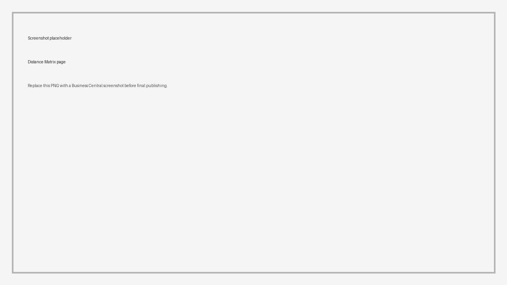

# Distance Matrix

Shipper TMS can store distance and duration values so route calculations and charge allocation can reuse known results.

Use distance records when you need:

- stable distance values for repeated lanes,
- faster planning for frequent routes,
- auditable distance and duration values,
- distance-based cost allocation.

## Distance Matrix

Use **Distance Matrix** for point-to-point distance and duration values.

1. Open **Distance Matrix**.
2. Create or open a record.
3. Confirm the origin and destination map locations.
4. Choose **Update Distance and Duration**.
5. Review the returned distance and duration.

## Route Distance Matrix

Use **Route Distance Matrix** when the value belongs to a route profile or route signature.

The record can store:

- map provider,
- route profile signature,
- distance,
- duration.

This matters when Azure Maps routing profiles are used, because vehicle restrictions can change the route.

## Manual versus calculated values

| Type of value | When to use it | How to maintain it |
|---|---|---|
| Manual distance or duration | Your company uses contracted, audited, or legally agreed lane values | Enter and review the value directly, then avoid recalculating unless the lane policy changes |
| Calculated distance or duration | You want the map provider to return current route distance and travel time | Choose **Update Distance and Duration** or run the route calculation from a request or order |
| Route-profile-specific value | The route depends on vehicle dimensions, weight, hazardous load, or avoid settings | Recalculate after changing the vehicle routing profile, map provider, or stop sequence |

## When to update distances

Update distances after you change:

- map provider,
- map provider key or geo scope,
- map location coordinates,
- vehicle routing profile,
- route stop sequence,
- road restrictions that affect truck routing.

Do not recalculate a manually maintained record unless the manual value is intentionally being replaced by provider-calculated data.

## Where distance values are used

Distance and duration can affect:

- Transport Request distance calculation,
- Transport Order route calculation,
- Carrier Selection,
- Transport Charge allocation by distance,
- planning views that show route timing.

## Related

- [Map Providers](mapproviders.md)
- [Map Locations](maplocation.md)
- [Vehicle Routing Profiles](vehicle-routing-profiles.md)
- [Carrier Selection](carrierselection.md)
- [Transport Charges](transport-charges.md)
