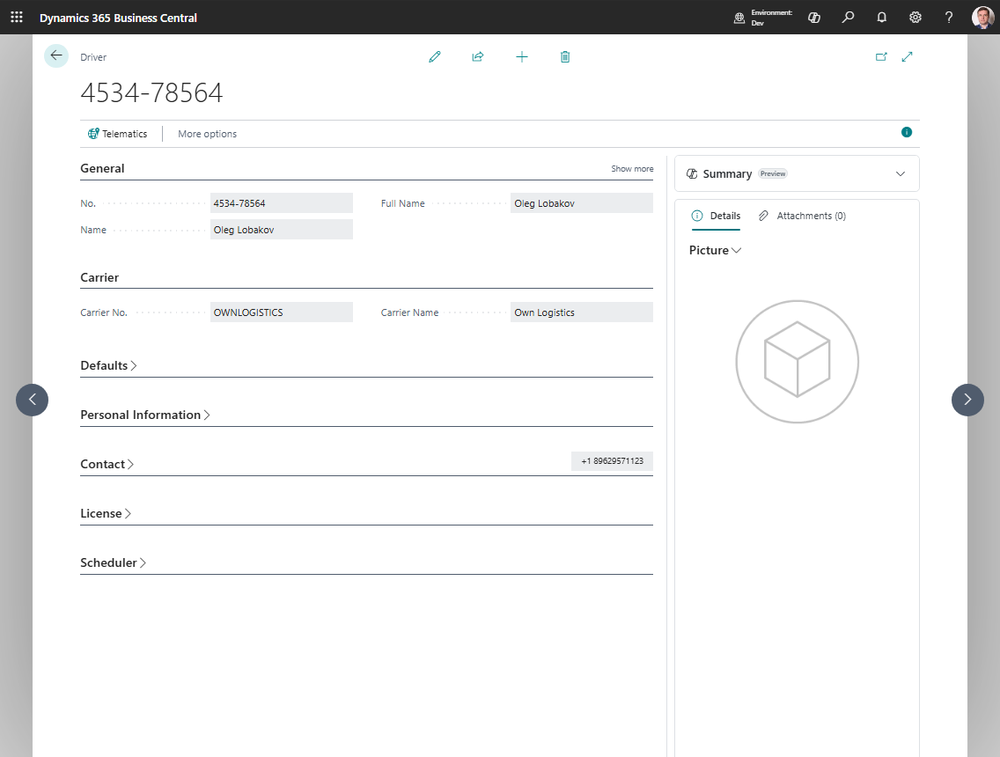

# Drivers

Use **Drivers** to maintain the people who execute transportation. A driver record is used for:

- Transport Order assignment,
- Driver Load Management,
- default vehicle assignment,
- Proof of Delivery user mapping,
- telematics mapping and location history.

## How to work in this page

Use the driver card to keep dispatching, compliance, and telematics data ready for planning.

1. Fill **General** with the driver name and active/blocked state.
2. In **Carrier**, select the carrier the driver works for.
3. In **Defaults**, set **Default Vehicle No.** if the driver normally uses one vehicle.
4. Maintain **Contact** and **License** data so dispatchers can see operational and compliance information.
5. If Proof of Delivery is enabled, fill **PoD User E-mail** in **Proof Of Delivery Settings**.
6. In **Scheduler**, set **Scheduler Sort Order** or **Block for Scheduling**.
7. If telematics is used, use **Telematics Mapping** to connect this driver to the external provider identity.
8. Use **Current Location**, **Position History**, and **Telematics Log** only after the driver has a telematics mapping.

## Create a driver

1. Search for **Drivers**.
2. Choose **New**.
3. Fill in **No.** and **Name**.
4. Set **Carrier No.**.
5. If needed, set **Default Vehicle No.**.
6. Fill in the contact and compliance fields your company requires.
7. If the driver should not appear in scheduling tools, enable **Block for Scheduling**.

## Fields that matter most

| Field | Why it matters |
|---|---|
| **Carrier No.** | Controls which carrier the driver belongs to |
| **Default Vehicle No.** | Lets the system propose a vehicle automatically |
| **Blocked** | Prevents the driver from being used in new work |
| **PoD User E-mail** | Links the driver to the Proof of Delivery user |
| **Scheduler Sort Order** | Controls how the driver appears in scheduler views |
| **Block for Scheduling** | Removes the driver from planning boards without deleting the driver |

## Compliance fields you should keep current

Review these regularly:

- **License No.**
- **License Expiration Date**
- **Medical Card Number**
- **Medical Card Expiration**
- **ADR No.**
- **ADR Expiration Date**

## What happens on a Transport Order

When you assign a driver to a Transport Order:

- the driver name is filled automatically,
- the default vehicle can also be filled if the order does not already have one.

When you change the carrier on the order, Business Central clears incompatible vehicle or driver values to prevent mismatches.

## Related

- [Driver Load Management](driverloadmanagement.md)
- [Vehicles](vehicle.md)
- [Carriers](carrier.md)
- [Transport Order](transportorder.md)
- [Telematics](telematics.md)
