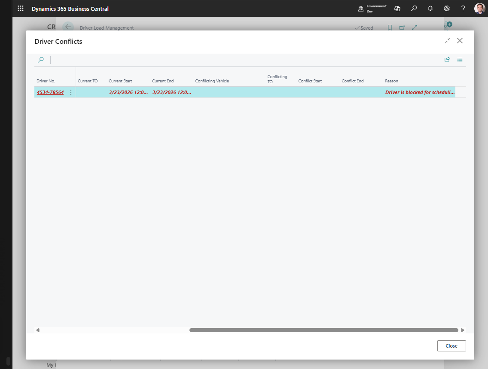

# Driver Load Management

Use **Driver Load Management** when you want to plan from the driver side first.

This page answers the question: "Which driver is working in this time slot, with which vehicle, and are there any conflicts?"

## When to use it

Use Driver Load Management when you need to:

- check driver availability,
- assign or change the vehicle for a driver,
- review the current load linked to a driver,
- detect double-booking or overlapping work,
- resolve driver-specific conflicts.

Use Truck Load Management when the main question is what a specific vehicle should carry. Use Driver Load Management when the main question is whether a driver is available and correctly assigned.

## Which planning tool should I use?

| Planner question | Best tool |
|---|---|
| Is this driver available for this slot? | **Driver Load Management** |
| What should this truck carry? | [Truck Load Management](truckloadmanagement.md) |
| Which requests should be grouped first? | [Transport Request Load Planning](loadmanagement.md) |
| Where do driver loads overlap on a timeline? | [Visual Scheduler](visualscheduler.md) |

## Before you start

- Configure **Truck Load Time Slot Profile** in [TMS Setup](setup.md).
- Create drivers and link them to carriers when carrier-specific driver filtering is used.
- Create vehicles and default driver assignments if your company relies on default fleet planning.
- Make sure vehicle and driver records are not blocked.

## What the page shows

Each row represents one **driver slot**:

- driver,
- planning date,
- time slot,
- assigned or default vehicle,
- linked Transport Order,
- load percentage,
- conflict information.

## How to work in this window

Use this window when the question is about driver availability or driver workload.

1. Set the period with **Previous Period**, **Set Planning Period**, or **Next Period**.
2. Use **Carrier** to show drivers for one carrier.
3. Use **Vehicle Unit Type** if the driver must work with a certain type of equipment.
4. Use **Time Slot** to focus on one shift or delivery window.
5. Use **Depot** to show only drivers linked to vehicles from one depot.
6. Select a driver slot.
7. Check **Default Vehicle**, **Assigned Vehicle**, **Status**, **Next Step**, **Load %**, and conflict columns.
8. If the driver has no vehicle for the slot, choose **Assign Vehicle**.
   The driver slot receives a manual vehicle assignment if the target vehicle is available.
9. If the wrong vehicle was assigned manually, choose **Clear Assigned Vehicle**.
   The manual assignment is removed if the vehicle slot does not already carry a load.
10. Choose **Open Selected Load** to review the load connected to that driver.
11. If there is a conflict, choose **Show Driver Conflicts** and review the cause.
12. Use **Open Transport Order** when you need to adjust the execution document itself.

If you need to move work from one driver to another, open the selected load and use **Move to Another Driver** from the load detail page.

## Main actions

| Action | Use it for |
|---|---|
| **Assign Vehicle** | Assign a vehicle to the selected driver slot |
| **Clear Assigned Vehicle** | Remove the manual vehicle assignment |
| **Open Selected Load** | Open the truck-load detail for the selected driver |
| **Open Transport Order** | Open the linked order directly |
| **Show Driver Conflicts** | Review conflict details for the selected slot |

## Typical workflow

1. Open **Driver Load Management**.
2. Set the planning period and filters.
3. Select the driver slot you want to review.
4. If needed, choose **Assign Vehicle**.
5. Choose **Open Selected Load** to inspect the linked work.
6. If the slot shows a conflict, choose **Show Driver Conflicts** and resolve it.

## Conflict and availability indicators

| Indicator | Meaning |
|---|---|
| Assigned vehicle | Vehicle manually assigned to the driver slot |
| Default vehicle | Vehicle suggested from driver or vehicle master data |
| Linked Transport Order | Load already connected to the driver slot |
| Load % | Capacity usage of the linked load |
| Conflict count | Number of driver conflicts for the selected period or slot |
| Status or next step | What the planner should do next for the driver slot |

## Common conflict examples

| Conflict | What it usually means | Typical fix |
|---|---|---|
| Driver has overlapping work | The same driver is linked to more than one load in the same period or time slot. | Move one load to another driver or change the time slot. |
| Vehicle is not available for the driver slot | The assigned vehicle is already used or does not have a valid truck slot for the same date and time. | Assign another vehicle or move the load. |
| Default vehicle does not match the plan | The driver has a default vehicle, but the load is planned on another vehicle. | Confirm the manual assignment or clear and reassign the vehicle. |
| Driver is required before release | Setup requires a driver before releasing the truck load, but the linked order has no driver. | Assign a driver before choosing **Release Load**. |

## Example: driver-first planning

1. Open **Driver Load Management** for the planning date.
2. Filter to the carrier and time slot.
3. Select the driver you want to schedule.
4. Assign a vehicle if the slot has no valid vehicle.
5. Open the selected load and review requests, capacity, and route.
6. If a conflict appears, open **Show Driver Conflicts** and move the load, vehicle, or driver assignment.

## Troubleshooting

| Problem | What to check |
|---|---|
| A driver is missing | Check driver setup, carrier filter, planning period, time slot, depot filter, and blocked status. |
| **Assign Vehicle** fails | The selected vehicle must have a truck slot for the same date and time slot and must not be occupied by a blocking assignment. |
| **Clear Assigned Vehicle** fails | You cannot clear the assignment if the related vehicle slot already has a load. |
| Conflict count is not zero | Use **Show Driver Conflicts** and resolve overlapping assignments or availability problems. |
| **Open Selected Load** opens nothing | The driver slot may not yet have a linked Transport Order. Plan the vehicle load first. |

## Related

- [Truck Load Management](truckloadmanagement.md)
- [Transport Request Load Planning](loadmanagement.md)
- [Drivers](driver.md)
- [Transport Order](transportorder.md)
