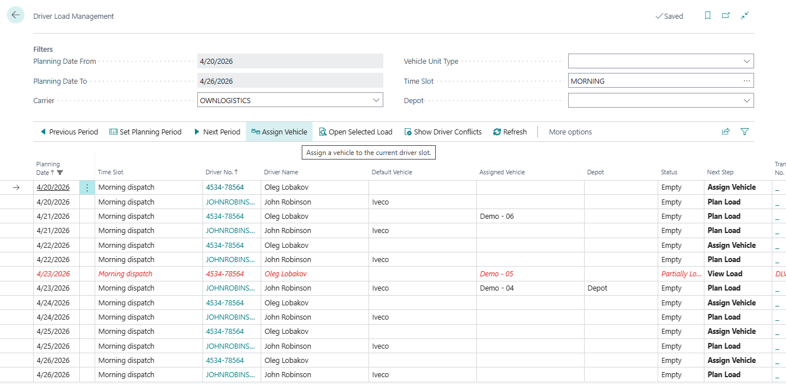

# Driver Load Management

Use **Driver Load Management** when you want to plan from the driver side first.

This page answers the question: "Which driver is working in this time slot, with which vehicle, and are there any conflicts?"

## When to use it

Use Driver Load Management when you need to:

- check driver availability,
- assign or change the vehicle for a driver,
- review the current load linked to a driver,
- detect double-booking or overlapping work,
- resolve driver-specific conflicts.

## What the page shows

Each row represents one **driver slot**:

- driver,
- planning date,
- time slot,
- assigned or default vehicle,
- linked Transport Order,
- load percentage,
- conflict information.

## How to work in this window

Use this window when the question is about driver availability or driver workload.

1. Set the period with **Previous Period**, **Set Planning Period**, or **Next Period**.
2. Use **Carrier** to show drivers for one carrier.
3. Use **Vehicle Unit Type** if the driver must work with a certain type of equipment.
4. Use **Time Slot** to focus on one shift or delivery window.
5. Use **Depot** to show only drivers linked to vehicles from one depot.
6. Select a driver slot.
7. Check **Default Vehicle**, **Assigned Vehicle**, **Status**, **Next Step**, **Load %**, and conflict columns.
8. If the driver has no vehicle for the slot, choose **Assign Vehicle**.
9. If the wrong vehicle was assigned manually, choose **Clear Assigned Vehicle**.
10. Choose **Open Selected Load** to review the load connected to that driver.
11. If there is a conflict, choose **Show Driver Conflicts** and review the cause.
12. Use **Open Transport Order** when you need to adjust the execution document itself.

If you need to move work from one driver to another, open the selected load and use **Move to Another Driver** from the load detail page.

## Main actions

| Action | Use it for |
|---|---|
| **Assign Vehicle** | Assign a vehicle to the selected driver slot |
| **Clear Assigned Vehicle** | Remove the manual vehicle assignment |
| **Open Selected Load** | Open the truck-load detail for the selected driver |
| **Open Transport Order** | Open the linked order directly |
| **Show Driver Conflicts** | Review conflict details for the selected slot |

## Typical workflow

1. Open **Driver Load Management**.
2. Set the planning period and filters.
3. Select the driver slot you want to review.
4. If needed, choose **Assign Vehicle**.
5. Choose **Open Selected Load** to inspect the linked work.
6. If the slot shows a conflict, choose **Show Driver Conflicts** and resolve it.

## Related

- [Truck Load Management](truckloadmanagement.md)
- [Load Management](loadmanagement.md)
- [Drivers](driver.md)
- [Transport Order](transportorder.md)
