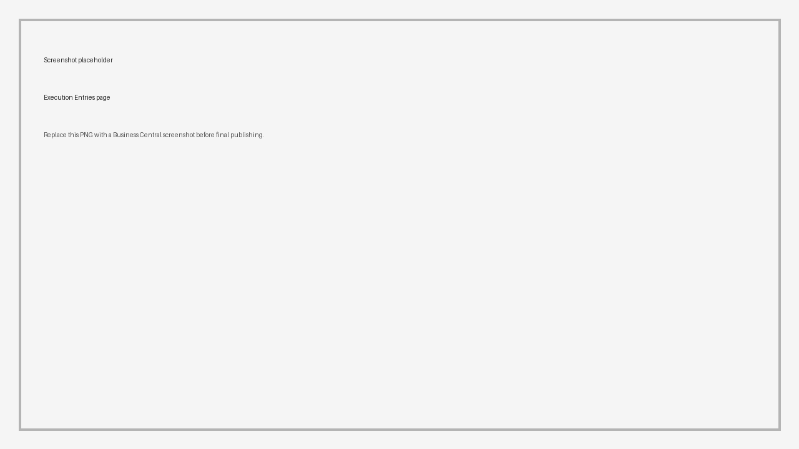
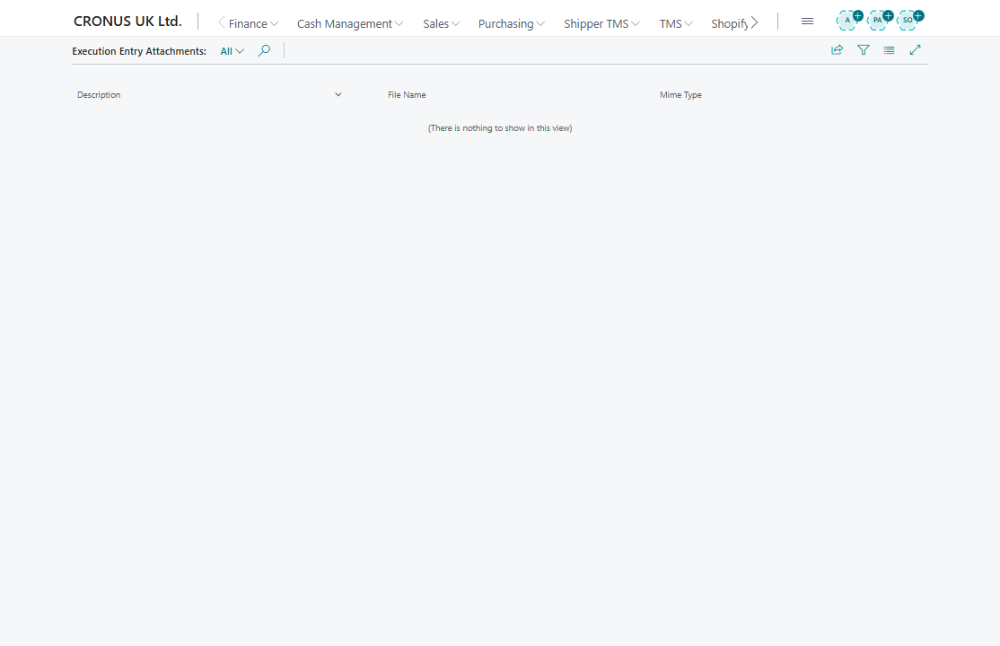

# Execution Entries

Use **Execution Entries** to review status events and proof-of-delivery facts for a Transport Order.

Execution entries can come from:

- manual user updates,
- proof-of-delivery workflows,
- telematics synchronization,
- API integrations.

## What an entry can show

An execution entry can include:

- status,
- date and time,
- route stop or request reference,
- driver or vehicle context,
- comments,
- pictures,
- attachments,
- provider or API-originated data.

## Open execution entries

1. Open a [Transport Order](transportorder.md) or [Posted Transport Order](posted-transport-orders.md).
2. Choose **Execution Entries**.
3. Review the event list.
4. Open attachments or pictures when available.

Expected result:

- The page shows recorded execution events for the selected transport document.
- Attachments and pictures can be opened when the event includes proof or supporting files.
- Posted orders keep execution history for later customer-service and audit review.

## Attachments and pictures

Use attachments for evidence such as:

- proof-of-delivery image,
- signed document,
- damage photo,
- delivery note scan.

Integration accounts can also use the API attachment endpoints to upload or download execution-entry attachments. See [API](api.md).

## Attachment rules for integrations

When attachments are uploaded through the API:

- allowed file types are JPEG, PNG, GIF, and PDF;
- file content must be sent as base64;
- the decoded file size must be 10 MB or less;
- the MIME type must match the actual file signature.

For the full API contract, see [Attachment upload rules](api.md#attachment-upload-rules).

## Proof-of-delivery scenario

Use this flow when the driver or integration captures delivery confirmation before posting.

1. The Transport Order is moved to **In Progress**.
2. A delivery status is recorded for the relevant stop or request.
3. The execution entry stores date, time, status, comments, and optional coordinates.
4. A signature, photo, or document scan is attached as an execution entry attachment.
5. The dispatcher reviews the entry before posting the Transport Order.
6. After posting, the posted order keeps the execution history for audit and customer-service review.

## Status setup

Execution statuses use the status model selected in **Transport Execution Status Profile** in [TMS Setup](setup.md).

For status setup, see [Statuses and Status Profiles](statuses.md).

## Good to know

- Execution entries help dispatchers answer "what happened?" after a delivery event.
- Telematics providers may update execution facts when the provider supports the data.
- Attachments should not contain unnecessary personal data.

## Troubleshooting

| Problem | What to check |
|---|---|
| No entries are shown | Confirm that execution statuses, PoD, telematics, or API integration have actually written events for the order. |
| Attachments are missing | Check whether the event was created with an attachment and whether the integration user has permission to attachment data. |
| Status values are not what users expect | Review the **Transport Execution Status Profile** in TMS Setup and the related status setup. |
| Telematics events are missing | Check carrier telematics setup, vehicle mapping, and sync job results. |

## Related

- [Transport Order](transportorder.md)
- [Posted Transport Orders](posted-transport-orders.md)
- [Telematics](telematics.md)
- [Statuses and Status Profiles](statuses.md)
- [API](api.md)
