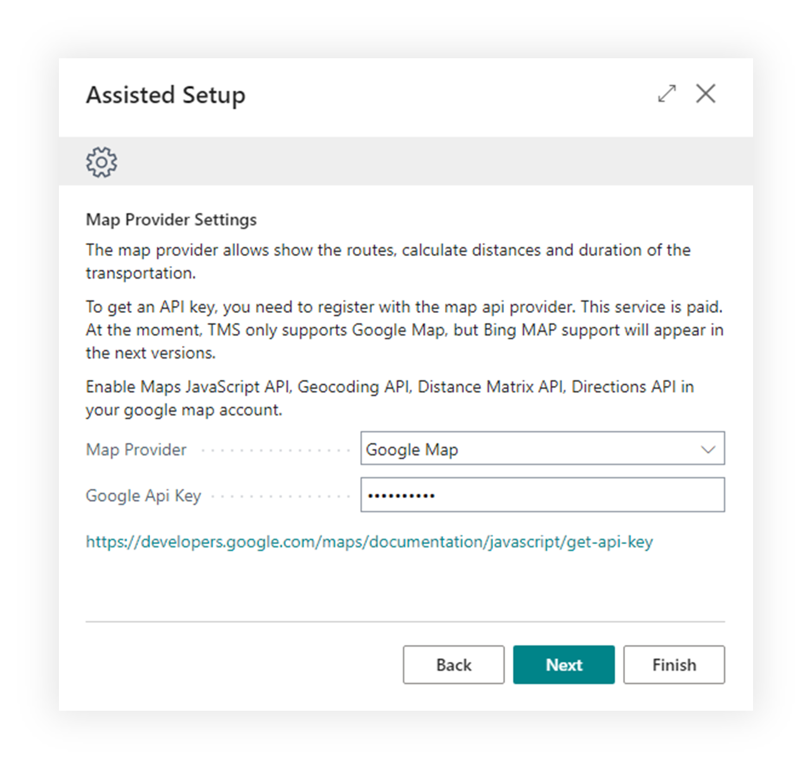

# Google Maps integration

Use this guide when your company wants Shipper TMS to use **Google Maps** for:

- address geocoding,
- route display,
- distance calculation,
- travel-time estimation.

## How to work with this setup

Use this page when Google Maps is the selected provider.

1. Prepare the Google Cloud project.
2. Enable the required APIs.
3. Create or copy the API key.
4. Open **Shipper TMS Setup**.
5. Set **Map Provider** to **Google Maps**.
6. Enter **Google Api Key**.
7. Test geocoding from a Map Location.
8. Test route display or distance calculation from a Transport Request or Transport Order.

## Before you start

- You need a Google Cloud project.
- Billing must be enabled for that project.
- The Google Cloud interface may change over time, but the required API concepts stay the same.

## Required Google APIs

Enable these APIs for the project you use with Shipper TMS:

- **Maps JavaScript API**
- **Directions API**
- **Geocoding API**
- **Distance Matrix API**

## Create the API key

1. Open the **Google Cloud Console**.
2. Go to **APIs & Services** > **Credentials**.
3. Choose **Create credentials** > **API key**.
4. Copy the generated key.
5. Restrict the key according to your company's security policy.

## Enter the key in Shipper TMS

1. Open **Shipper TMS Setup**.
2. In **Map Provider Settings**, set **Map Provider** to **Google Maps**.
3. Paste the key into **Google Api Key**.

## Verify the connection

1. Open a [Map Location](maplocation.md) with a valid address.
2. Choose **Geocode address**.
3. If coordinates are filled successfully, open the route or map view to confirm the provider is working.

## Related

- [Map Providers](mapproviders.md)
- [Map Locations](maplocation.md)
- [TMS Setup](setup.md)
