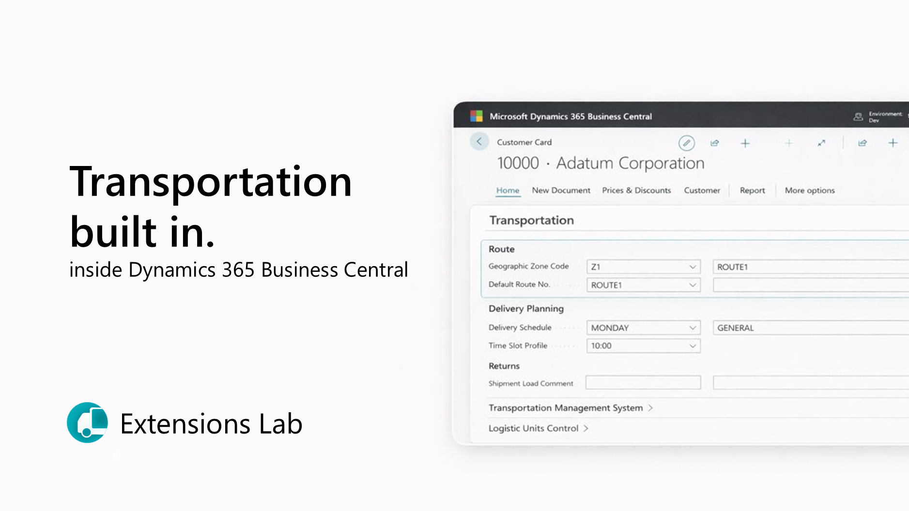
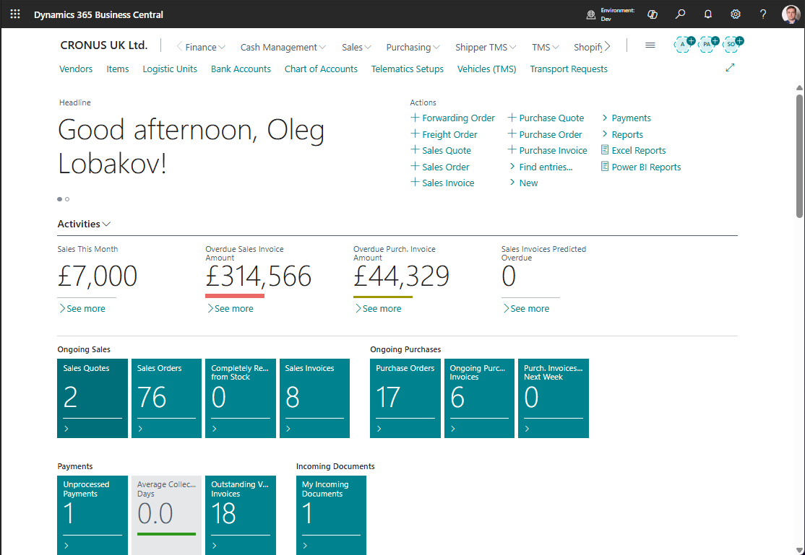

# Shipper TMS Help

Shipper TMS helps manufacturers, distributors, and retailers plan and control deliveries in Microsoft Dynamics 365 Business Central.

Use this help when you need to create transport demand, plan a trip, assign a carrier or fleet resource, create warehouse work, complete execution, or review posted transport history.





## How Shipper TMS works

Most transportation work follows this flow:

```text
Source document
    |
    v
Transport Request
    |
    v
Planning worksheet or scheduler
    |
    v
Transport Order
    |
    v
Carrier, vehicle, driver, route, charges, and warehouse documents
    |
    v
Execution entries and proof of delivery
    |
    v
Posted Transport Order
```

Use these terms this way:

| Term | Meaning |
|---|---|
| **Source document** | A Business Central sales, purchase, transfer, or posted document that creates transport demand. |
| **Transport Request** | What must be moved, from where, to where, and when. |
| **Transport Order** | The actual trip or load that will be executed. |
| **Transport Request Load Planning** | A request-first worksheet for assigning released requests to orders. |
| **Truck Load Management** | A vehicle-first worksheet for planning by truck slot, date, and time slot. |
| **Driver Load Management** | A driver-first worksheet for checking driver workload and conflicts. |
| **Carrier Selection** | A rate comparison tool for choosing an external carrier on an open Transport Order. |
| **Execution Entry** | A delivery event, status update, attachment, or proof-of-delivery fact. |
| **Posted Transport Order** | Read-only transport history after the live order is posted. |

## New to Shipper TMS

If you are setting up Shipper TMS for the first time, follow this order:

1. [Install Shipper TMS](installation.md)
2. [Buy licenses](buylicenses.md)
3. [Assign permission sets](assignpermissionsets.md)
4. [Complete TMS Setup](setup.md)
5. [Create a Transport Request from a Sales Order](usecase-salesorder-transportrequest.md)
6. [Create your first Transport Order](usecase-create-first-transport-order.md)

After step 6, your users should be able to create transport demand, plan it into a trip, and understand which page to open next.

## First 30 minutes

Use this short path when you want to prove the basic process in a sandbox:

1. Complete the minimum setup in [TMS Setup](setup.md).
2. Create or open one demo Sales Order.
3. Create a [Transport Request](usecase-salesorder-transportrequest.md) from that order.
4. Release the request.
5. Create a [Transport Order](usecase-create-first-transport-order.md).
6. Add the request to the order, review route stops, then release the order.

Do this before configuring advanced carrier rates, telematics, or truck-first planning. It gives planners a clean baseline for how source demand becomes an executable trip.

## Choose Your Role

| Role | Start with | Why |
|---|---|---|
| Transportation manager | [TMS Setup](setup.md), [Carriers](carrier.md), [Carrier Rates](carrier-rates.md), [Transport Charges](transport-charges.md) | Configure the rules, rates, defaults, and cost behavior. |
| Dispatcher or planner | [Transport Requests](transportrequest.md), [Transport Request Load Planning](loadmanagement.md), [Transport Orders](transportorder.md) | Turn demand into executable trips. |
| Fleet planner | [Truck Load Management](truckloadmanagement.md), [Driver Load Management](driverloadmanagement.md), [Vehicles](vehicle.md), [Drivers](driver.md) | Plan own-fleet capacity, driver assignment, and slot conflicts. |
| Warehouse user | [Warehouse Documents](warehouse-documents.md), [Reports and Documents](reports.md) | Create or open warehouse shipments and receipts connected to a trip. |
| Delivery coordinator | [Execution Entries](execution-entries.md), [Posted Transport Orders](posted-transport-orders.md) | Track delivery events, attachments, PoD facts, and completed trip history. |
| IT admin or integration developer | [Assign permission sets](assignpermissionsets.md), [Telematics](telematics.md), [API](api.md), [Map Providers](mapproviders.md) | Configure access and integrations. |

## Which planning tool should I use?

| Need | Use |
|---|---|
| I have released demand and need to decide which requests go together. | [Transport Request Load Planning](loadmanagement.md) |
| I plan own-fleet work by truck, date, and time slot. | [Truck Load Management](truckloadmanagement.md) |
| I need to check driver workload, assigned vehicles, or driver conflicts. | [Driver Load Management](driverloadmanagement.md) |
| I want a calendar or timeline view of requests and orders. | [Visual Scheduler](visualscheduler.md) |
| I need to compare external carriers and rates for one trip. | [Carrier Selection](carrierselection.md) |

Do not start with Truck Load Management if you do not manage vehicles or truck slots. Start with Carrier Selection when an external carrier will execute the delivery and rates are configured.

## Daily Work

| Job | Start here |
|---|---|
| Create transport demand from Business Central documents | [Source Documents](source-documents.md) |
| Split one document into several transport requests | [Transport Request Planning](transport-request-planning.md) |
| Prepare and release a request | [Transport Request](transportrequest.md) |
| Assign requests to a trip | [Transport Request Load Planning](loadmanagement.md) or [Transport Order](transportorder.md) |
| Plan by vehicle | [Truck Load Management](truckloadmanagement.md) |
| Plan by driver | [Driver Load Management](driverloadmanagement.md) |
| Compare carriers | [Carrier Selection](carrierselection.md) |
| Create warehouse work | [Warehouse Documents](warehouse-documents.md) |
| Print transport documents | [Reports and Documents](reports.md) |
| Complete and post the trip | [Transport Order](transportorder.md) |
| Review history | [Posted Transport Orders](posted-transport-orders.md) |

## Core Concepts

| Topic | What it explains |
|---|---|
| [Source Documents](source-documents.md) | Where transport demand starts in sales, purchase, transfer, and posted documents |
| [Transport Request](transportrequest.md) | The planning document that captures what must be moved |
| [Transport Request Planning](transport-request-planning.md) | How to split source lines across one or more requests |
| [Transport Order](transportorder.md) | The execution document for the actual trip |
| [Execution Entries](execution-entries.md) | Delivery, proof-of-delivery, and execution-status history |
| [Posted Transport Orders](posted-transport-orders.md) | Read-only history after a trip is posted |
| [Products](product.md) | TMS product master data when your process uses it |
| [Statuses and Status Profiles](statuses.md) | Custom execution-status setup for controlled workflows |

## Planning Tools

| Tool | Best for |
|---|---|
| [Transport Request Load Planning](loadmanagement.md) | Request-first planning |
| [Truck Load Management](truckloadmanagement.md) | Truck-first planning |
| [Driver Load Management](driverloadmanagement.md) | Driver-first planning |
| [Visual Scheduler](visualscheduler.md) | Timeline-based planning |
| [Carrier Selection](carrierselection.md) | Carrier comparison on a Transport Order |

## Cost and Warehouse Execution

| Topic | What it covers |
|---|---|
| [Carrier Rates](carrier-rates.md) | Rate setup used by Carrier Selection |
| [Carrier Rate Type Mapping](carrier-rate-type-mapping.md) | Item charge mapping used when Carrier Selection creates charge lines |
| [Transport Charges](transport-charges.md) | Purchase charges, sales re-billing, and charge allocation |
| [Warehouse Documents](warehouse-documents.md) | Warehouse shipments and receipts created from Transport Orders |
| [Reports and Documents](reports.md) | Loading Manifest, Packing List, Bill Of Lading, Delivery Note, and CMR Blank |

## Setup and Master Data

| Topic | What it covers |
|---|---|
| [TMS Setup](setup.md) | Core system settings |
| [Carriers](carrier.md) | Transport service providers |
| [Vehicles](vehicle.md) | Fleet and capacity-driving vehicle records |
| [Drivers](driver.md) | Driver records and defaults |
| [Routes](route.md) | Geographic route grouping |
| [Route Sequence](routesequence.md) | Preferred stop order |
| [Map Locations](maplocation.md) | Geocoded stop records |
| [Map Location Types](maplocationtype.md) | Classification of map locations |
| [Zones](zones.md) | Internal zones and telematics geofences |
| [Time Slots and Delivery Schedules](timeslots.md) | Automatic date and time logic |
| [Transportation Conditions](transportationconditions.md) | Separation of incompatible cargo |
| [Vehicle Compartments and Transportation Conditions](vehicle-compartments-and-transportation-conditions.md) | How compartments and cargo conditions work together in planning |
| [Logistic Unit Types](logisticunittype.md) | Capacity-related equipment profiles |
| [Vehicle Routing Profiles](vehicle-routing-profiles.md) | Azure Maps truck-routing constraints by unit type |
| [Distance Matrix](distance-matrix.md) | Stored distance and duration values |
| [Reference Master Data](reference-master-data.md) | Mode of transport, package types, fuel cards, IATA airports, and time zones |
| [Map Providers](mapproviders.md) | Google Maps and Azure Maps setup |
| [Google Maps Integration](googlemapintegration.md) | Google-specific key setup |
| [Azure Maps Integration](azuremapsintegration.md) | Azure-specific account and key setup |

## Integration and Administration

| Topic | What it covers |
|---|---|
| [Telematics](telematics.md) | Telematics guide for Geotab, Samsara, and Webfleet integration |
| [Telematics setup](telematics-setup.md) | Provider credentials, sync streams, and polling setup |
| [Telematics dispatch](telematics-dispatch.md) | Publishing, canceling, refreshing, and reviewing dispatches |
| [Telematics sync and logs](telematics-sync-and-logs.md) | Logs, inbound messages, sync state, positions, trips, and events |
| [API](api.md) | Business Central API pages, entity sets, permissions, examples, and telematics actions |

## Troubleshooting Starting Points

| Problem | Start with |
|---|---|
| I cannot create a Transport Request. | [Source Documents](source-documents.md) and [FAQ](faq.md) |
| I cannot release a Transport Request. | [Transport Request](transportrequest.md) |
| I cannot create or update a Transport Order. | [Transport Order](transportorder.md) |
| Carrier Selection shows no carrier or no price. | [Carrier Selection](carrierselection.md) and [Carrier Rates](carrier-rates.md) |
| Distance or time is not calculated. | [Map Providers](mapproviders.md), [Map Locations](maplocation.md), and [Distance Matrix](distance-matrix.md) |
| Warehouse documents were not created. | [Warehouse Documents](warehouse-documents.md) |
| A load cannot be released from Truck Load Management. | [Truck Load Management](truckloadmanagement.md) |
| The Transport Order cannot be posted. | [Transport Order](transportorder.md) and [Transport Charges](transport-charges.md) |

## Use Cases

- [Use case: Create a Transport Request from a Sales Order](usecase-salesorder-transportrequest.md)
- [Use case: Create your first Transport Order](usecase-create-first-transport-order.md)
- [Use case: Plan an outbound delivery from a Sales Order](usecase-plan-outbound-sales-order.md)
- [Use case: Plan an inbound pickup from a Purchase Order](usecase-plan-inbound-purchase-order.md)
- [Use case: Plan a transfer between locations](usecase-plan-transfer.md)
- [Use case: Plan a delivery with your own fleet](usecase-own-fleet-delivery.md)
- [Use case: Plan a delivery with an external carrier](usecase-external-carrier-delivery.md)
- [Use case: Compare carriers and assign freight cost](usecase-compare-carriers-assign-freight-cost.md)
- [Use case: Create warehouse documents from a Transport Order](usecase-create-warehouse-documents.md)
- [Use case: Complete and post a Transport Order](usecase-complete-post-transport-order.md)
- [Use case: Publish a Transport Order to telematics](usecase-publish-transport-order-telematics.md)
- [Use case: Review delivery execution and posted history](usecase-review-execution-history.md)

## Maintenance

- [Frequently asked questions](faq.md)
