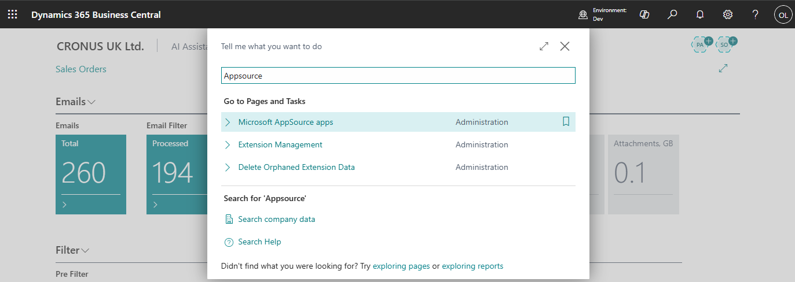
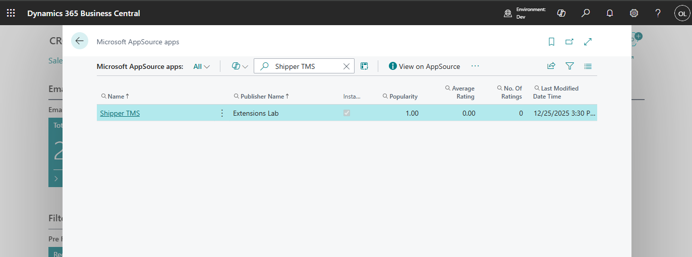

# Installation

## Prerequisites

- Microsoft Dynamics 365 Business Central [product page](https://www.microsoft.com/en-us/dynamics-365/products/business-central). TMS is an add-on extension for Business Central that builds on its core modules—such as Customers, Sales, Vendors, Purchasing, and Warehousing—using them as a solid foundation while adding only the features necessary for transportation management.

## Steps

There are several ways to install Shipper TMS. The first is from the AppSource page, and the second is directly within Business Central.

The easiest way to install TMS is directly from within Business Central. Just search for the AppSource page.

Search Shipper TMS

Open TMS card page and click "Install from AppSource"

## After Installation

After installing the TMS extension, several steps must be completed to make TMS available to users.

- Purchase and assign licenses. [See detailed instruction](buylicenses.md)
- Assign permission set to users [See detailed instruction](assignpermissionsets.md)
