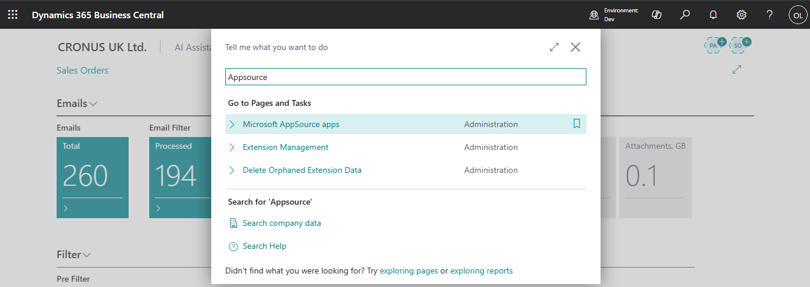
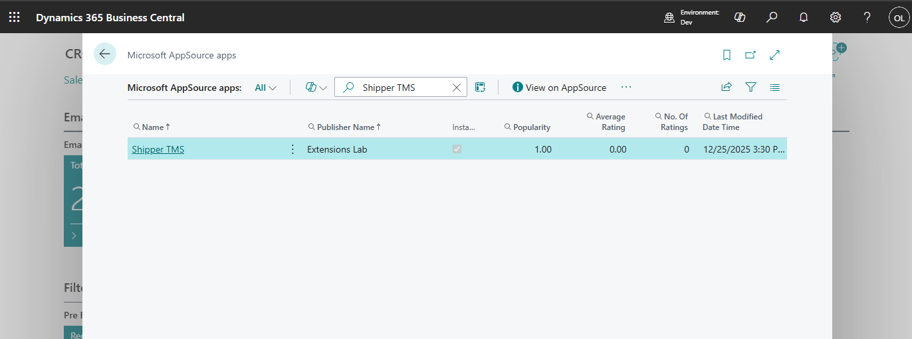

# Installation

Use this guide to install **Shipper TMS** in your Business Central environment.

## Before you start

- You need a Business Central environment where apps can be installed.
- You need admin rights in Business Central.
- Your users will also need Shipper TMS licenses and permission sets after installation.

## Install the app

1. Open Business Central.
2. Use **Tell Me** and search for **Extension Marketplace** or **AppSource**.
3. Search for **Shipper TMS**.
4. Open the app card.
5. Choose **Install** or **Get it now**, depending on the AppSource flow shown in your tenant.
6. Follow the on-screen prompts until installation is complete.

## What to do next

After installation, complete these tasks in order:

1. [Buy licenses](buylicenses.md)
2. [Assign permission sets](assignpermissionsets.md)
3. [Complete TMS Setup](setup.md)

## Verify the installation

1. Use **Tell Me**.
2. Search for **Shipper TMS Setup**.
3. Open the page.

If the page opens, the extension is installed correctly.

## Related

- [Buy licenses](buylicenses.md)
- [Assign permission sets](assignpermissionsets.md)
- [TMS Setup](setup.md)
