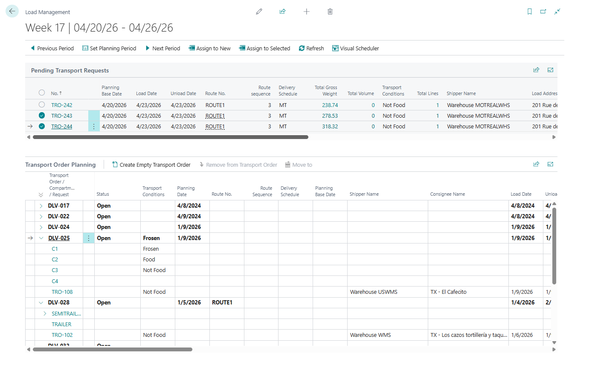

# Transport Request Load Planning

Use **Transport Request Load Planning** when your planner wants to start with a pool of released requests and assign them into Transport Orders.

This is the request-first planning page in Shipper TMS.

## When to use it

Transport Request Load Planning is best when:

- you plan from the request pool first,
- you want to assign many released requests quickly,
- you work with compartments,
- you want to move requests between Transport Orders in one worksheet.

Use Truck Load Management instead when the planner starts from a specific vehicle, date, and time slot.

## Which planning tool should I use?

| Planner question | Best tool |
|---|---|
| Which released requests should travel together? | **Transport Request Load Planning** |
| What should this truck carry in this slot? | [Truck Load Management](truckloadmanagement.md) |
| Is this driver available and conflict-free? | [Driver Load Management](driverloadmanagement.md) |
| Where does this work fit on a timeline? | [Visual Scheduler](visualscheduler.md) |

## Before you start

- Transport Requests must be **Released**.
- [TMS Setup](setup.md) must have Transport Request and Transport Order number series.
- Create vehicles, carriers, routes, and compartments first if your planning process depends on them.
- Set the planning period so the request pool and the planning tree show the same operating window.

## How the page is organized

The page has two working areas:

| Area | Purpose |
|---|---|
| **Pending Transport Requests** | Released requests that still need to be assigned |
| **Transport Order Planning** | Existing Transport Orders, compartments, and assigned requests |

## Set the planning period

Use:

- **Previous Period**
- **Set Planning Period**
- **Next Period**

The worksheet filters both the request pool and the planning tree to the selected period.

## How to work in this window

Use this window when you start from the list of unplanned requests.

1. Set the planning period.
2. Review **Pending Transport Requests** in the upper section.
3. Select one or more released requests that must be planned.
4. In **Transport Order Planning**, select the target Transport Order or compartment.
5. Choose **Assign to Selected Transport Order/Compartment**.
   The selected requests are added to the chosen order or compartment.
6. If no suitable Transport Order exists, select the requests and choose **Assign to New Transport Order**.
   Shipper TMS creates a new Open Transport Order and assigns the selected requests.
7. Review the lower tree to confirm where the requests were placed.
8. If the plan does not look right, select another target and reassign the request as needed.
9. Choose **Refresh** after changes made from another page.
10. Choose **Visual Scheduler** when you need to switch from worksheet planning to timeline planning.

Use this page instead of Truck Load Management when the planner thinks "which requests need to be assigned?" rather than "what should this truck carry?"

## Main actions

| Action | Use it for |
|---|---|
| **Assign to New Transport Order** | Create a new Transport Order from the selected pending requests |
| **Assign to Selected Transport Order/Compartment** | Add the selected pending requests to the selected Transport Order or compartment |
| **Refresh** | Rebuild both sections |
| **Visual Scheduler** | Open the scheduler for the same planning period |

## Planning indicators

| Indicator | How to use it |
|---|---|
| Pending request | Request is released and not assigned to a Transport Order |
| Assigned request | Request is already placed under a Transport Order or compartment |
| Compartment node | Vehicle compartment that can receive compatible requests |
| Capacity total | Current weight, volume, footage, or logistic unit usage for the target order |
| Conflict or warning | Planning rule that should be reviewed before release |

## Typical workflow

1. Open **Transport Request Load Planning**.
2. Set the planning period.
3. In the upper section, select the released requests that need a truck.
4. In the lower section, select an existing Transport Order or compartment.
5. Choose **Assign to Selected Transport Order/Compartment**.
6. If you need a new order, choose **Assign to New Transport Order** instead.
7. Review the lower planning tree and move work as needed.

## Good to know

- This page works with **Released** requests.
- The lower tree can show compartment-based planning when the vehicle configuration supports it.
- Use this page when you think in documents first.
- Use [Truck Load Management](truckloadmanagement.md) when you think in truck slots first.

## Troubleshooting

| Problem | What to check |
|---|---|
| A request is missing from the upper list | Confirm the request is **Released**, inside the planning period, and not already assigned to a Transport Order. |
| **Assign to Selected Transport Order/Compartment** does not do what you expect | Select both the pending request and a valid target order or compartment. |
| The target order cannot be changed | The target Transport Order must be **Open** for planning changes. |
| Capacity looks wrong | Review item weights/volumes, logistic unit estimates, vehicle capacity, and compartment setup. |
| The page looks stale after changes elsewhere | Choose **Refresh**. |

## Related

- [Truck Load Management](truckloadmanagement.md)
- [Driver Load Management](driverloadmanagement.md)
- [Visual Scheduler](visualscheduler.md)
- [Transport Request](transportrequest.md)
- [Transport Order](transportorder.md)
