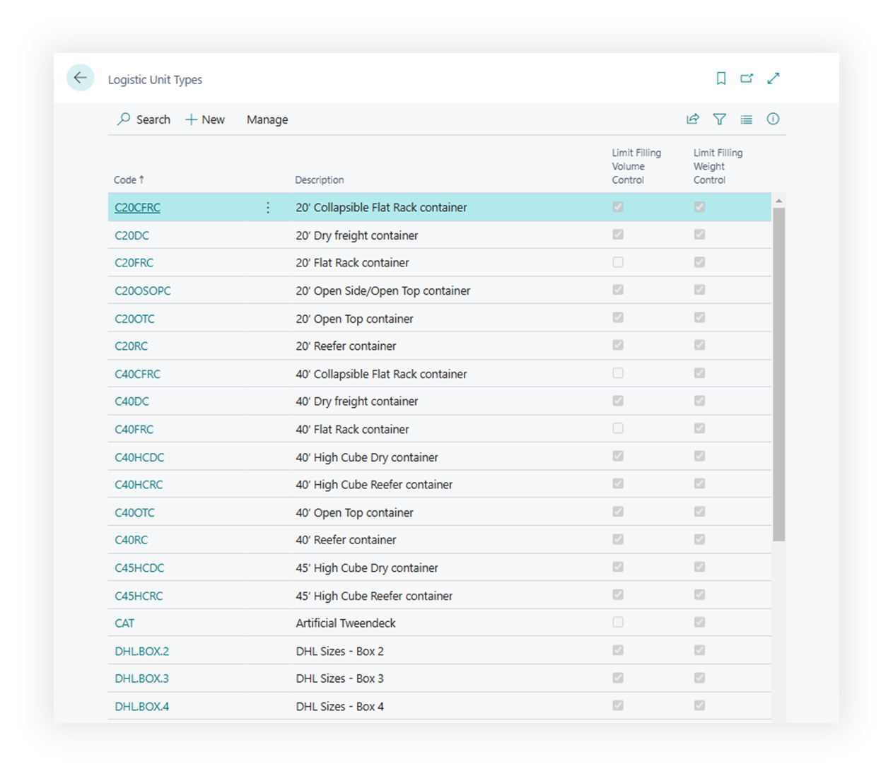

# Logistic Unit Types

**Logistic Unit Types** belong to the related Logistic Units extension, but they are important for Shipper TMS because they provide the capacity profile used by vehicles and planning logic.

Use them to define standard equipment such as:

- pallets,
- boxes,
- containers,
- trailers,
- vehicle or transport-unit profiles.

## How to work with this setup

1. Define the unit types your operation actually uses.
2. Fill weight limits when weight control is enabled.
3. Fill volume and dimensions when volume control is enabled.
4. Fill footage when floor-space planning matters.
5. Turn on strict controls only when the system should prevent exceeding the limit.
6. Assign transportation condition values when a unit type or compartment is dedicated to a condition such as Frozen or Ambient.
7. If you use Azure Maps truck routing, assign **Vehicle Routing Profile Code**.
8. Assign the unit type to vehicles or vehicle configurations that use that capacity profile.
9. Test a Transport Order or Truck Load Management slot to confirm load percentages look right.

## When this matters in Shipper TMS

This setup matters when you want consistent results in:

- Transport Request estimation,
- Transport Order capacity totals,
- Transport Request Load Planning,
- Truck Load Management,
- Driver Load Management,
- transportation-condition compatibility checks,
- Azure Maps truck-aware routing.

## Vehicle routing profile

Use **Vehicle Routing Profile Code** when the unit type represents equipment that should affect Azure Maps routing.

The profile can carry routing constraints such as dimensions, weight, axle weight, hazardous load, and road restrictions.

For setup, see [Vehicle Routing Profiles](vehicle-routing-profiles.md).

## Configuration examples

| Unit type | Useful fields | Result |
|---|---|---|
| Standard pallet | Dimensions, weight, volume | Better estimated capacity on requests and orders |
| Refrigerated trailer | Volume, footage, transportation condition, strict controls | Helps keep frozen or chilled cargo compatible with the right equipment |
| Heavy truck | Maximum weight, dimensions, Vehicle Routing Profile Code | Supports capacity checks and Azure Maps truck-aware routing |

When you change unit type dimensions or routing profile assignments, recalculate estimates and route distance on affected Transport Requests or Transport Orders.

## Related

- [Transportation Conditions](transportationconditions.md)
- [Vehicle Compartments and Transportation Conditions](vehicle-compartments-and-transportation-conditions.md)
- [Vehicle Routing Profiles](vehicle-routing-profiles.md)
- [Truck Load Management](truckloadmanagement.md)
- [Transport Order](transportorder.md)
