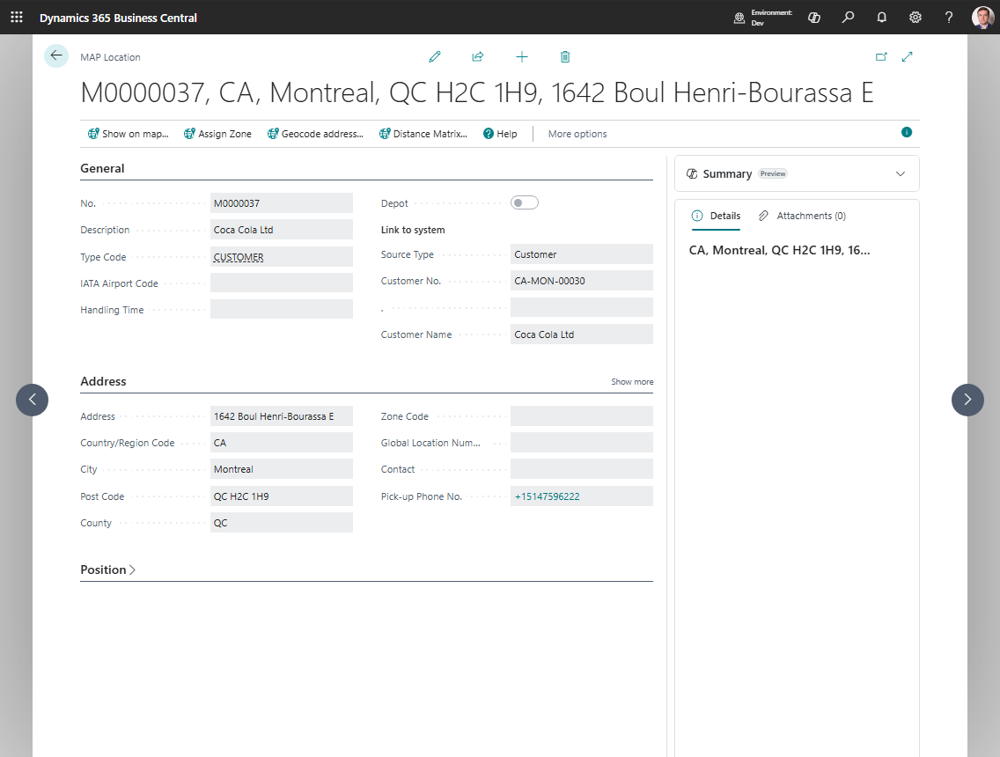

# Map Locations

Use **Map Locations** to store the real geographic point used by transportation planning.

A Map Location can represent:

- a customer delivery point,
- a vendor pickup point,
- the company address,
- a warehouse,
- a depot,
- a port, hub, or airport,
- or any other stop used in transport.

## How to work in this page

Use the Map Location card to keep address, coordinates, and zone data correct.

1. Fill **Description** and **Type Code** so planners understand what the point represents.
2. If the location is linked to a customer, vendor, ship-to address, order address, location, company, or contact, fill the **Link to system** fields.
3. Review the copied address and contact information.
4. Choose **Geocode address** when the location has an address but no coordinates.
5. Choose **Show on map** to review the map point.
6. Choose **Assign Zone** when zones are configured and the point should be linked to a zone.
7. Choose **Distance Matrix** when a manual distance or duration is needed for this point.
8. If the map point is not exact, open the map and use the exact-place actions to move the marker.

## Create a Map Location manually

1. Search for **Map Locations**.
2. Choose **New**.
3. Fill in:
   - **Description**
   - **Type Code**
   - address fields
4. Choose **Geocode address**.
5. Review the coordinates.
6. If needed, choose **Assign Zone**.

## Create a Map Location from an entity

You can also create a Map Location from:

- **Customer**
- **Ship-to Address**
- **Vendor**
- **Order Address**
- **Location**
- **Company**
- **Contact**

When you create the location from the source record, Shipper TMS fills the source link and copies the address values automatically.

## Company Map Location

Create a **Company** Map Location when source document lines may not have a Business Central **Location Code**.

Use this setup when your company does not maintain warehouses on sales or purchase lines, but you still need a real geographic point for route display, distance, and duration.

1. Open **Map Locations**.
2. Create a Map Location for the company address.
3. Set **Source Type** to **Company**.
4. Geocode the address or set the coordinates manually.
5. Open **Company Information**.
6. Fill **Default Map Location** with that Company Map Location.

After this setup, Transport Requests created from lines without **Location Code** use the company Map Location as the company-side endpoint. This is a transportation planning point only. It does not create a Business Central location and does not make warehouse documents available for those blank-location lines.

## Fine-tune the coordinates

If the geocoded point is close but not exact:

1. Open the map viewer for the location.
2. Choose **Set the Exact Place**.
3. Move the marker to the correct point.
4. Choose **Save Exact Place**.
5. If needed, use **Cancel Exact Place** instead of saving.

## Use zones with a Map Location

If your company uses [Zones](zones.md):

1. Make sure the Map Location has coordinates.
2. Choose **Assign Zone**.
3. Review the proposed zone and save it.

This is useful when the stop should carry a zone or geofence reference instead of only raw coordinates.

## When to use Distance Matrix

Use **Distance Matrix** when you need to store a manual distance or duration between two points, for example:

- port-to-port moves,
- locations where a provider route is not usable,
- company-specific planning exceptions.

## Related

- [Map Location Types](maplocationtype.md)
- [Zones](zones.md)
- [Map Providers](mapproviders.md)
- [Transport Request](transportrequest.md)
- [Transport Order](transportorder.md)
