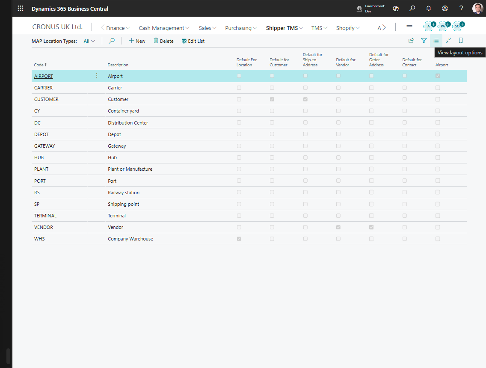

# Map Location Types

Use **Map Location Types** to classify locations by business purpose, such as:

- customer delivery point,
- vendor pickup point,
- company address,
- warehouse,
- hub,
- port,
- airport.

This helps keep newly created Map Locations consistent.

## How to work in this page

Use this page when you need consistent defaults for new Map Locations.

1. Create one type for each real category your planners use.
2. Use readable codes such as `CUSTOMER`, `VENDOR`, `DEPOT`, `PORT`, or `AIRPORT`.
3. Turn on a default flag only when new locations from that source should automatically receive this type.
4. Do not turn on multiple defaults for the same source category unless you intentionally want the latest change to replace the previous default.
5. Turn on **Airport** only for types that represent airports.

## Create a location type

1. Search for **Map Location Types**.
2. Choose **New**.
3. Fill in **Code** and **Description**.
4. Turn on the default flag only for the entity types where this should be the default.

## Default flags

Use the default flags carefully:

| Field | Meaning |
|---|---|
| **Default for Customer** | Used when a new Map Location is created from a customer |
| **Default for Vendor** | Used when a new Map Location is created from a vendor |
| **Default For Location** | Used when a new Map Location is created from a warehouse/location |
| **Default for Ship-to Address** | Used when created from a ship-to address |
| **Default for Order Address** | Used when created from an order address |
| **Default for Contact** | Used when created from a contact |
| **Default for Company** | Used when created from the company address |

Only one type should normally be the default for each source type.

## Airport flag

Turn on **Airport** only for location types that represent airports. This enables airport-specific behavior in Map Location handling.

## Related

- [Map Locations](maplocation.md)
