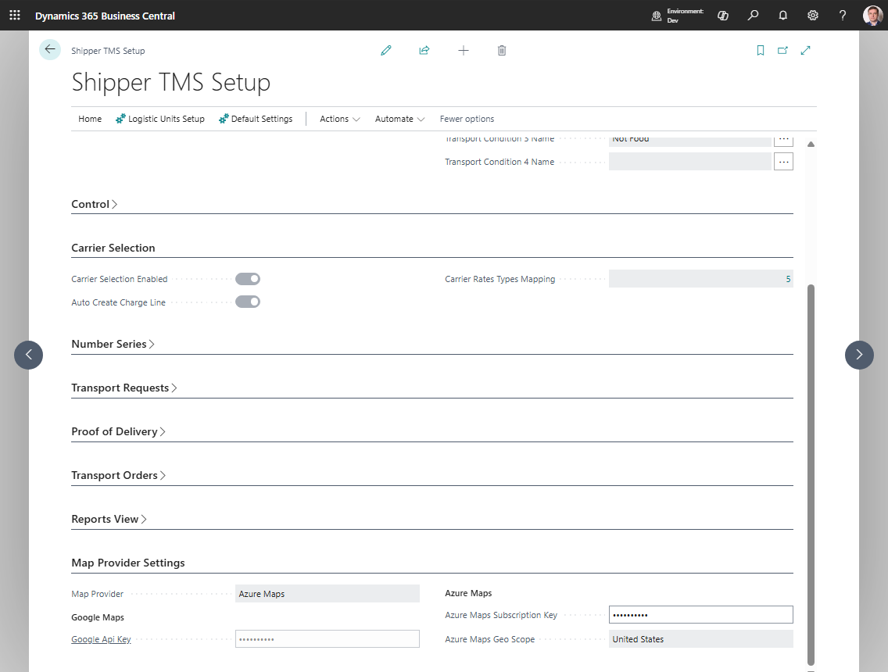

# Map providers

Shipper TMS uses a map provider for:

- geocoding addresses,
- showing routes on a map,
- calculating distance and duration,
- route optimization,
- route-distance caching.

## How to work with map provider setup

1. Decide which provider your company will use.
2. Configure the provider account outside Business Central.
3. Open **Shipper TMS Setup**.
4. Select **Map Provider**.
5. Enter the required provider key.
6. Create or update [Map Locations](maplocation.md) so important stops have coordinates.
7. Test **Geocode address** on a Map Location.
8. Test **Show Route** or **Get Transport Time & Distance** from a Transport Request or Transport Order.
9. If using Azure Maps for truck-aware routing, configure [Vehicle Routing Profiles](vehicle-routing-profiles.md).

## Which provider should you choose

| Provider | Best when | Main limitation to check |
|---|---|---|
| **Google Maps** | You need standard address geocoding and road routing | Truck-specific routing fields are not used like Azure Maps routing profiles |
| **Azure Maps** | You need truck-aware routing with vehicle restrictions | Requires Azure Maps setup and vehicle routing profiles for truck constraints |

## Configure the provider in TMS

1. Open **Shipper TMS Setup**.
2. Go to **Map Provider Settings**.
3. Select **Map Provider**.
4. Enter the required key:
   - **Google Api Key**
   - or **Azure Maps Subscription Key**
5. For Azure Maps, select **Azure Maps Geo Scope** if your company needs a specific processing region.

## Security note

Map provider keys are secrets.

- Do not include API keys or subscription keys in screenshots.
- Mask keys before sharing setup screenshots with support or consultants.
- Rotate keys according to your provider and company security policy.

## Troubleshooting

| Problem | Check |
|---|---|
| Geocoding does not return coordinates | Provider key, map provider selection, address quality |
| Route does not show | Coordinates, provider key, browser restrictions, route stop data |
| Distance does not update | Provider selection, key, route stop coordinates, [Distance Matrix](distance-matrix.md) |
| Truck-aware routing is ignored | Azure Maps provider, unit type, [Vehicle Routing Profile](vehicle-routing-profiles.md) |

## When to recalculate distance

Recalculate distance and duration after changing:

- shipper or consignee address;
- route stop order;
- carrier depot/start/end map location;
- map provider;
- vehicle or logistic unit type used for Azure truck routing;
- vehicle routing profile restrictions.

## Related

- [Google Maps integration](googlemapintegration.md)
- [Azure Maps integration](azuremapsintegration.md)
- [Vehicle Routing Profiles](vehicle-routing-profiles.md)
- [Distance Matrix](distance-matrix.md)
- [Map Locations](maplocation.md)
- [Transport Request](transportrequest.md)
- [Transport Order](transportorder.md)
