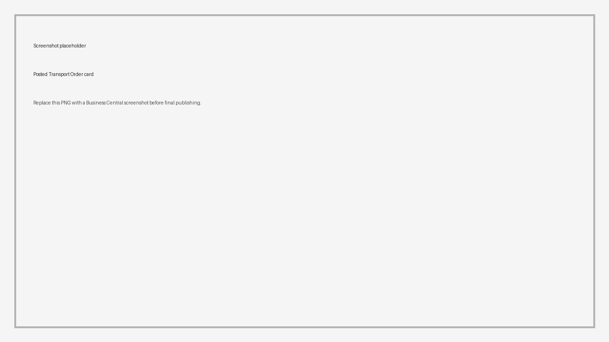
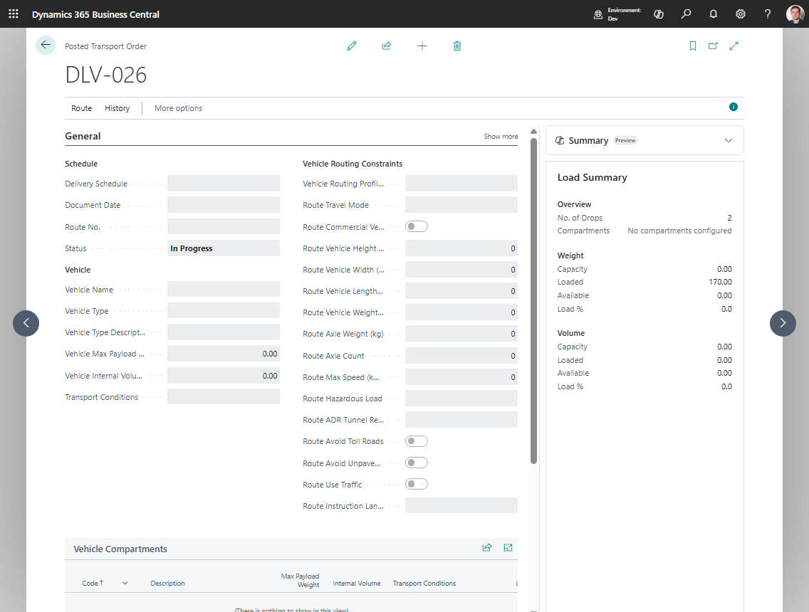

# Posted Transport Orders

A **Posted Transport Order** is the read-only history of a completed Transport Order.

Use it to review what was posted:

- route stops,
- vehicle, driver, and carrier,
- source document links,
- capacity totals,
- transport charges,
- charge assignments,
- execution entries,
- printed-document history.

## How records are created

Posted Transport Orders are created when a Transport Order is posted.

Posting removes the live order and stores the result in posted history.

## What moves to history

| Live record | Posted or history record | What it preserves |
|---|---|---|
| Transport Order header | Posted Transport Order header | Final carrier, driver, vehicle, dates, totals, route context, and document numbers |
| Transport Order Lines | Posted Transport Order Lines | Final load, unload, route-stop, and source document references |
| Transport Charges | Posted Transport Charges | Final charge amounts and source links |
| Charge Assignments | Posted Charge Assignments | Final allocation basis and assigned amounts |
| Execution Entries | Execution Entries linked to posted history | Status events, PoD facts, and attachments created before posting |

## Related record types

| Record type | Meaning |
|---|---|
| **Transport Order Lines** | Live route stops and request lines on an unposted Transport Order |
| **Posted Transport Order Lines** | Read-only route and source-line history after posting |
| **Execution Entries** | Delivery events, statuses, coordinates, proof notes, or integration facts |
| **Execution Entry Attachments** | Pictures, signatures, documents, or other evidence attached to an execution entry |

## Open a posted order

1. Search for **Posted Transport Orders**.
2. Open the list.
3. Select the posted order.
4. Open the card.
5. Review lines, route stops, charges, and execution entries.

Expected result:

- You can review the final posted route, resources, source document links, charges, and execution history.
- The posted order is read-only. Use related finance or source documents for financial correction processes.

## What you can do

| Action | Use it for |
|---|---|
| **Show Route** | Review the posted route on the map |
| **Execution Entries** | Review delivery and proof-of-delivery facts |
| **Posted Charges** | Review posted charge lines and assignments |
| **Print actions** | Reprint documents when allowed by your report setup |

## Good to know

- Posted orders are read-only operational history.
- Use the posted order for audit and customer-service questions.
- Financial corrections should be handled through the related sales, purchase, or finance documents.
- Execution attachments may be available through execution entries, depending on your PoD and telematics setup.

## What is no longer editable

After posting, users should treat the posted order as history. Do not expect to change:

- carrier, vehicle, or driver assignment;
- route stops or stop sequence;
- Transport Request assignment;
- posted transport charge lines and allocation history;
- source document links copied to posted history.

If a business correction is needed, handle it through the related finance, warehouse, or source-document correction process instead of editing posted transport history.

## Troubleshooting

| Problem | What to check |
|---|---|
| The posted order is missing | Confirm the live Transport Order was posted. Released or In Progress orders are still live documents. |
| A user cannot edit the posted order | Posted Transport Orders are read-only by design. |
| Execution entries are missing | Check whether execution events were recorded before posting or synchronized from telematics. |
| Charges do not match finance expectations | Review posted charges and the related sales or purchase documents used for billing or self-billing. |

## Related

- [Transport Order](transportorder.md)
- [Execution Entries](execution-entries.md)
- [Transport Charges](transport-charges.md)
- [Reports and Documents](reports.md)
