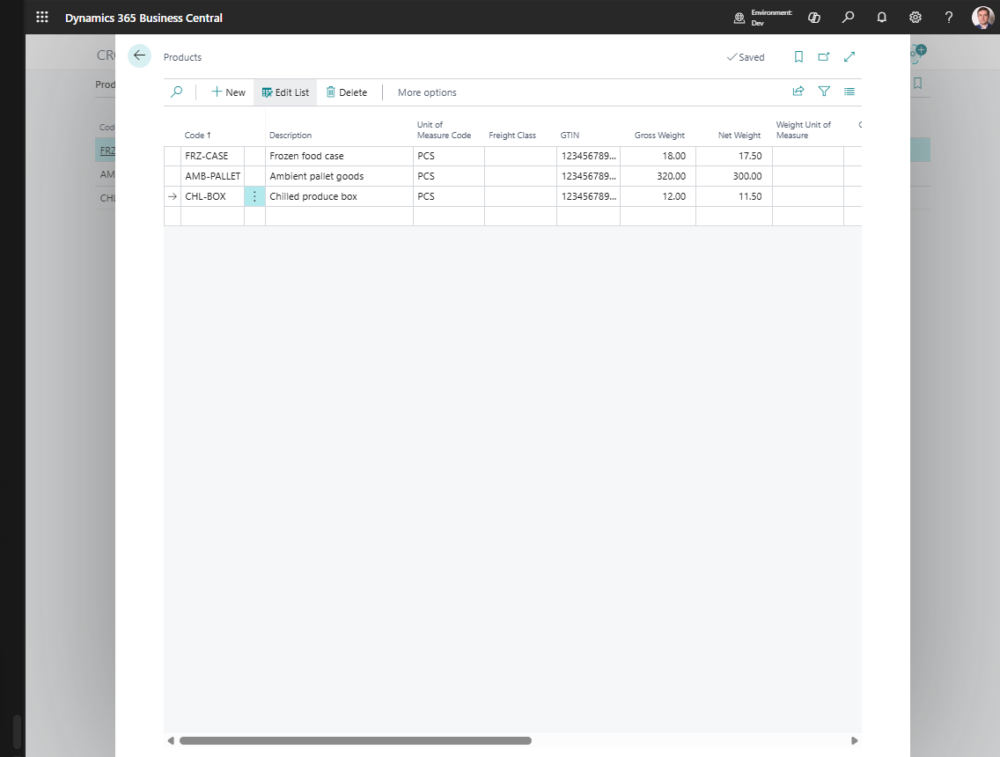

# Products

Use **Products** to maintain shipment-related product characteristics inside Shipper TMS.

This page is mainly useful when your transportation process needs a dedicated TMS product list for:

- freight classification,
- GTIN storage,
- gross and net weight,
- volume and dimensions.

## How to work in this page

Use the Products list only if your process uses TMS-specific product master data.

1. Create one product row per transport-specific product definition.
2. Fill **Code** and **Description**.
3. Fill **Unit of Measure Code** and **Freight Class** if they are used in your process.
4. Fill **GTIN** if barcode or EDI references are needed.
5. Enter gross and net weight values.
6. Enter volume directly, or enter length, width, and height so volume can be calculated.
7. Use **Blocked** when the product should no longer be used.

## When to use this page

Use **Products** if your company maintains transport-specific product attributes directly in Shipper TMS.

If your business already manages all required shipping characteristics in the main Business Central item master and does not use the TMS product list directly, this page may only be needed by administrators.

## Key fields

| Field | Why it matters |
|---|---|
| **Code** | Product identifier in TMS |
| **Description** | Product description |
| **Unit of Measure Code** | Base commercial unit |
| **Freight Class** | Freight or handling classification |
| **GTIN** | Barcode/EDI identifier |
| **Gross Weight** / **Net Weight** | Weight used for planning and reporting |
| **Volume** | Space requirement |
| **Length / Width / Height** | Optional dimensional data |
| **Blocked** | Prevents use of the product in new work |

## Related

- [Transportation Conditions](transportationconditions.md)
- [Transport Request](transportrequest.md)
- [Transport Order](transportorder.md)
