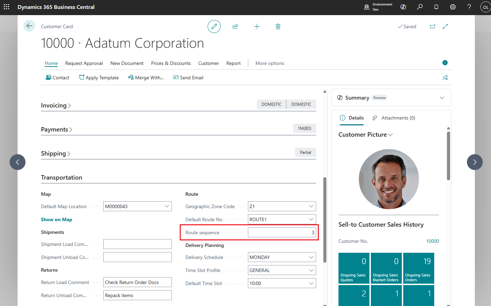

# Route Sequence

Route Sequence defines the order (priority) of a customer on a route or the sequence in which unloading points are visited along the route.

You can set this value as a default for a customer, supplier, or address, and it will be automatically added to documents (for example, a sales order). As a result, this value will be passed to the Transport Request and then to the Transport Order, where you can organize and sequence the route according to the specified Route Sequence.

