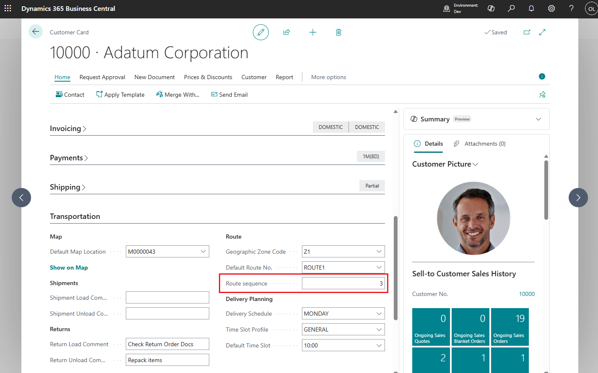

# Route Sequence

Use **Route Sequence** when you already know the preferred stop order for customers, vendors, ship-to addresses, order addresses, or locations on the same route.

Route Sequence does not create the route. It tells Shipper TMS which stop should normally come first, second, third, and so on when several deliveries belong to the same route.

## How to work with Route Sequence

Use Route Sequence as a simple ordering rule.

1. Decide the normal visit order for a route.
2. Give the first stop the lowest number.
3. Leave gaps between numbers, such as 10, 20, 30, so you can insert new stops later.
4. Maintain the value on customers, vendors, ship-to addresses, order addresses, or locations.
5. Create Transport Requests from documents that use those master records.
6. Add the requests to a Transport Order.
7. Run **Route Sequence Optimization** on the Transport Order.
8. Review the result and adjust manually if the real delivery day requires a different order.

## When to use it

Use Route Sequence when:

- one route has a fixed stop order,
- the same customers are usually visited in the same order,
- your planner wants a fast starting point before manual route adjustment,
- you want **Route Sequence Optimization** to follow a business-defined stop order.

## Set Route Sequence on master data

1. Open the relevant master data card:
   - **Customer**
   - **Vendor**
   - **Ship-to Address**
   - **Order Address**
   - **Location**
2. Fill in **Default Route No.**.
3. Fill in **Route Sequence** with the preferred stop number.

Lower numbers are visited first.

## How it flows into transportation

1. The route and route sequence flow from master data into the source document.
2. When you create a **Transport Request**, the same **Route Sequence** is copied to the request.
3. When you assign the request to a **Transport Order**, the route sequence is copied to the transport lines.
4. On the **Transport Order**, you can run **Route Sequence Optimization** to reorder stops by that value.

## Example

If three customers on route `CITY-WEST` have these values:

| Customer | Route Sequence |
|---|---:|
| Alpha Store | 10 |
| Beta Market | 20 |
| Gamma Outlet | 30 |

then **Route Sequence Optimization** will place Alpha before Beta and Beta before Gamma.

## Good to know

- Route Sequence is a planning aid, not a hard lock.
- A planner can still adjust the final stop order manually.
- Route Sequence works best when all stops on the route use the same numbering logic.

## Related

- [Routes](route.md)
- [Transport Request](transportrequest.md)
- [Transport Order](transportorder.md)
