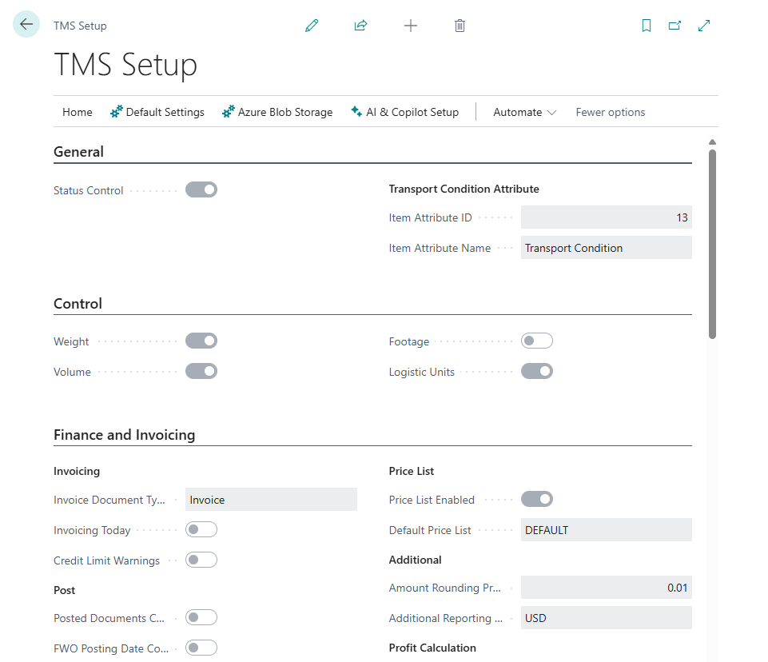

# TMS Setup

Use **Shipper TMS Setup** to define the default behavior of Shipper TMS.

This page controls:

- number series,
- planning controls,
- automatic Transport Request creation,
- default transport values,
- carrier selection,
- freight-charge behavior,
- map providers,
- proof of delivery,
- telematics access.

## How to open the page

Use one of these options:

- search for **Shipper TMS Setup**,
- open it from **Manual Setup**,
- open the assisted setup flow if your company uses guided setup.

## Minimum setup checklist

Complete these items before planners start working:

1. Fill **Transport Request Nos.**
2. Fill **Transport Order Nos.**
3. Fill **MAP Location Nos.**
4. If you print CMRs, fill **CMR Nos.**
5. Set **Default Mode of Transport**.
6. Turn on the capacity controls your company uses:
   - **Weight**
   - **Volume**
   - **Footage**
   - **Logistic Units**
7. Set **Truck Load Time Slot Profile** if you use Truck Load Management or Driver Load Management.
8. Select the **Map Provider** and enter the required key.
9. Choose **Check TMS Settings**.

Expected result:

- Transport Requests and Transport Orders can be numbered.
- Planners can release requests and create orders without missing setup errors.
- Route, distance, carrier selection, warehouse, PoD, and telematics features are enabled only when their required setup exists.

## Setup by process

| If your company uses | Set up these areas |
|---|---|
| Basic request and order planning | Number series, default mode of transport, source document behavior |
| Capacity control | Weight, volume, footage, logistic unit controls, item data, vehicle capacity |
| Own fleet planning | Vehicles, drivers, truck-load time-slot profile, depots, driver requirement |
| External carrier selection | Carriers, carrier rates, carrier selection enabled, carrier rate type mapping |
| Warehouse execution | Business Central warehouse setup, source document locations, Transport Order release process |
| Route and distance | Map provider, API key, map locations, distance matrix |
| Truck-aware routing | Azure Maps, vehicle routing profiles, vehicle unit types |
| Proof of delivery | Transport execution status profile and status setup |
| Telematics | Telematics provider setup, carrier setup code, vehicle and driver mapping |

## Settings most teams use

| Area | What to review |
|---|---|
| **Number Series** | Transport Request, Transport Order, Map Location, and CMR numbering |
| **Control** | Capacity dimensions enforced during planning |
| **Transport Requests** | Automatic request creation from released sales, purchase, or transfer documents |
| **Transport Orders** | Default transport mode, charge assignment type, and driver requirement before truck-load release |
| **Transport Condition** | Item attributes used to separate incompatible cargo |
| **Carrier Selection** | Carrier comparison, rate-type mapping, and automatic charge-line creation |
| **Proof of Delivery** | PoD enablement and the transport execution status profile |
| **Map Provider Settings** | Google Maps or Azure Maps credentials |

## Admin field reference

| Field group | What it controls |
|---|---|
| **Number Series** | Numbering for Transport Requests, Transport Orders, Map Locations, CMRs, and related documents |
| **Default Values** | Default mode of transport, charge assignment type, planning defaults, and other values copied into new documents |
| **Auto-Creation Rules** | Whether released sales, purchase, or transfer documents automatically create Transport Requests |
| **Carrier Selection** | Carrier comparison availability, automatic charge-line creation, and carrier rate type mapping |
| **Charges** | Default charge assignment behavior and posting-related charge requirements |
| **Map Provider** | Selected provider for geocoding, route display, and distance calculation |
| **Azure Maps** | Subscription key, geo scope, and truck-aware routing support |
| **Capacity Controls** | Weight, volume, footage, logistic unit, compartment, and transportation-condition controls |
| **Route Optimization** | Route, route sequence, load sequence, and scheduled time optimization behavior |
| **Proof of Delivery / Execution** | Execution status profile and PoD-related status behavior |
| **Reports** | Default report selections for transport documents |
| **Logistic Units** | Estimation and capacity behavior driven by unit types |
| **Upgrade Log** | Setup and data checks after extension updates |

## Recommended first-run sequence

1. Set the number series.
2. Select the capacity controls you will enforce.
3. Decide whether requests are created automatically when sales, purchase, or transfer documents are released.
4. Fill defaults such as **Default Mode of Transport**, **Truck Load Time Slot Profile**, and **Default Charge Assignment Type**.
5. Configure [Map Providers](mapproviders.md).
6. If you use Azure truck-aware routing, configure [Vehicle Routing Profiles](vehicle-routing-profiles.md).
7. If you use carrier comparison, configure [Carrier Rates](carrier-rates.md) and **Carrier Rate Types Mapping**.
8. If you use PoD or driver updates, configure [Statuses and Status Profiles](statuses.md).
9. If you use telematics, configure [Telematics](telematics.md).
10. Choose **Check TMS Settings**.

## Carrier selection settings

Use this section only when your company maintains carrier rates.

| Setting | Use |
|---|---|
| **Carrier Selection Enabled** | Shows Carrier Selection on Open Transport Orders |
| **Auto Create Charge Line** | Creates transport charge lines when a carrier is selected |
| **Carrier Rate Types Mapping** | Maps rate types such as rate, load, unload, return, and flat fee to charge behavior |

If carrier selection is enabled but rate-type mapping is missing, **Check TMS Settings** should be treated as a blocker before go-live.

## Useful actions

| Action | Use it for |
|---|---|
| **Check TMS Settings** | Validate whether the minimum required setup is complete |
| **Set default reports** | Restore the standard report selection setup |
| **Telematics Setups** | Open provider connections for Geotab, Samsara, or Webfleet |

## Verify setup

1. Search for **Transport Requests** and confirm the page opens.
2. Search for **Transport Orders** and confirm the page opens.
3. Create a test [Map Location](maplocation.md) and geocode it.
4. Create a test [Transport Request](transportrequest.md).
5. Create a test [Transport Order](transportorder.md).
6. Run **Get Transport Time & Distance** on the request or order.

Expected result:

- No setup validation error appears.
- Test documents receive numbers from the configured number series.
- Distance and duration update when the route and map provider are valid.
- The planning page that your team uses shows the test request or order in the expected period.

## Troubleshooting

| Problem | What to check |
|---|---|
| A request or order number is not assigned | Fill **Transport Request Nos.** or **Transport Order Nos.** and confirm the number series allows automatic numbering. |
| Users cannot open TMS pages | Assign Shipper TMS permission sets and verify license access. |
| Carrier Selection is unavailable | Turn on **Carrier Selection Enabled** and keep the Transport Order **Open**. |
| Carrier Selection creates no charge lines | Turn on **Auto Create Charge Line**, configure rate type mapping, and use a vendor-based carrier. |
| Truck Load Management has no slots | Fill **Truck Load Time Slot Profile** and review vehicle scheduling setup. |
| Distance does not calculate | Check map provider, API key, mode of transport, map locations, and coordinates. |
| Posting is blocked by charges | Review default charge assignment type, transport charge source links, and unposted source charge lines. |

## Related

- [Map Providers](mapproviders.md)
- [Vehicle Routing Profiles](vehicle-routing-profiles.md)
- [Carrier Rates](carrier-rates.md)
- [Carrier Selection](carrierselection.md)
- [Transport Charges](transport-charges.md)
- [Telematics](telematics.md)
