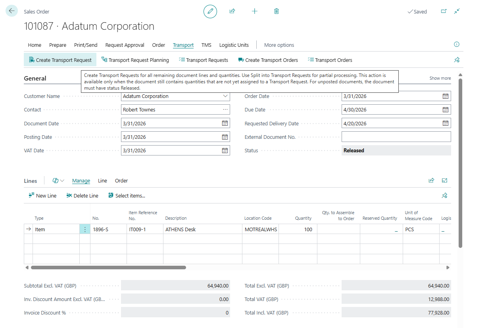

# Source documents

A **source document** is the Business Central document that creates transport demand.

Shipper TMS can create or show Transport Requests and Transport Orders from supported sales, purchase, transfer, and selected posted documents.

## Supported source types

| Area | Supported source documents |
|---|---|
| **Sales** | Sales Order, Sales Invoice, Sales Credit Memo, Sales Return Order, Posted Sales Invoice, Posted Sales Shipment, Posted Sales Return, Posted Sales Credit Memo |
| **Purchase** | Purchase Order, Purchase Invoice, Purchase Credit Memo, Purchase Return Order, Posted Purchase Invoice, Posted Purchase Receipt, Posted Purchase Return, Posted Purchase Credit Memo |
| **Transfer** | Transfer Order |

The exact action set depends on the document type and status.

Posted Transfer Shipment and Posted Transfer Receipt records exist in the Business Central transport data model, but the current UI does not add Shipper TMS source-document actions to those posted transfer pages.

## User entry points

| Entry point | Typical documents | Main Shipper TMS actions |
|---|---|---|
| Document cards | Sales Order, Purchase Order, Transfer Order, invoices, credit memos, returns, and supported posted sales/purchase documents | Create one request, open Transport Request Planning, open related requests or orders, create orders from released requests |
| Document list pages | Sales, purchase, and supported posted sales/purchase lists | Create requests or orders for selected documents in bulk and update Transportation Status |
| Posted transfer pages | Posted Transfer Shipment, Posted Transfer Receipt | No user-facing Shipper TMS source-document actions in the current UI |

## What Shipper TMS adds

On supported document pages, Shipper TMS adds transport fields and actions such as:

- **Transportation Status**,
- **Create Transport Request**,
- **Transport Request Planning**,
- **Transport Requests**,
- **Create Transport Order**,
- **Transport Orders**,
- TMS fields for route, route sequence, zone, map location, delivery schedule, and time slot where relevant.

## Create requests from a source document

Use this path when the remaining eligible lines can become Transport Requests without manual splitting.

1. Open the source document.
2. Make sure the document is **Released** when it is an unposted sales, purchase, or transfer document.
3. Choose **Create Transport Request**.
4. Confirm the result.
5. Open **Transport Requests** to review the created request.

Expected result:

- Shipper TMS creates one or more Transport Requests for remaining eligible quantities.
- The created requests are linked to the source document.
- The source document **Transportation Status** is updated to show transport-request progress.

## Location code and company endpoint

Source document lines can create Transport Requests even when **Location Code** is blank.

When **Location Code** is filled, the location is used as the warehouse-side endpoint. When **Location Code** is blank, Shipper TMS uses the **Default Map Location** from **Company Information** as the company-side endpoint.

This supports companies that do not use Business Central locations on document lines. The company Map Location is used for transportation planning only. It does not create warehouse shipment or receipt documents for blank-location lines.

## Drop shipment source documents

For **Drop Shipment** Sales Order lines, create the Transport Request from the **Sales Order**.

Shipper TMS creates the route from the linked Purchase Order vendor or order address to the Sales Order customer or ship-to address. The Sales Line **Location Code** is ignored for this route.

The drop shipment Sales Line must be linked to a Purchase Order line before request creation. If the link does not exist, create or link the Purchase Order first.

Purchase Order lines marked **Drop Shipment** are skipped during Transport Request creation. The Sales Order owns the transport demand so the same vendor-to-customer movement is not created twice.

## Split source lines across requests

Use this path when only part of the document should be planned now or when one document must become several transport requests.

1. Open the source document.
2. Choose **Transport Request Planning**.
3. Review the source lines in the upper part of the worksheet.
4. Enter **Qty. to Add** for the quantities you want to plan.
5. Choose **New Transport Request** or **Add to Existing Transport Request**.
6. Release the requests when they are ready for planning.

Use this worksheet when you need to split source document quantities across one or more Transport Requests.

For the full workflow, see [Transport Request Planning](transport-request-planning.md).

## Create Transport Order from a source document

Use **Create Transport Order** after the source document has eligible **Released** Transport Requests, or when **Create Transport Requests Before Transport Orders** is turned on and the source document still has transportable quantities.

If **Create Transport Requests Before Transport Orders** is turned on in [TMS Setup](setup.md), Shipper TMS can create missing Transport Requests first, creates them in **Released** status, releases existing **Open** Transport Requests, and then creates one Transport Order. If the setting is turned off, this is a manual request-first flow: only existing **Released** Transport Requests are used, and **Open** requests must be released by the user before a Transport Order can be created.

1. Open the source document.
2. Choose **Transport Requests** and confirm that at least one linked request is **Released**.
3. Return to the source document.
4. Choose **Create Transport Order**.
5. Confirm the prompts shown by the system.
6. Open **Transport Orders** from the same source document to review the created orders.

Expected result:

- Shipper TMS creates one Transport Order for all eligible released requests that are not already assigned.
- When the setup option is on, missing eligible requests are created in **Released** status and existing **Open** requests are released before the Transport Order is created.
- Requests that are already **Assigned** are skipped. When the setup option is off, requests that are still **Open** are skipped too.
- All eligible requests are included in the same Transport Order; this action does not split or filter them by route, transportation conditions, or vehicle capabilities.
- Create a Transport Order manually when route, transportation conditions, or vehicle capabilities must drive which Transport Requests are selected.
- The created Transport Order can be opened for carrier, vehicle, driver, route, and warehouse planning.

## When to use each action

| User goal | Use this action |
|---|---|
| Create transport demand for all remaining eligible quantities | **Create Transport Request** |
| Split quantities, dates, routes, or transport conditions before planning | **Transport Request Planning** |
| Open demand already created for this document | **Transport Requests** |
| Create one Transport Order from all released unassigned requests | **Create Transport Order** |
| Open trips already created from this document | **Transport Orders** |
| Recalculate the source document's transport progress | **Update Transportation Status** |

## Transportation Status values

| Status | Meaning |
|---|---|
| *(blank)* | No transport activity exists yet |
| **Partial Transport Request** | Some quantity is assigned to Transport Requests |
| **Transport Request** | All relevant quantity is assigned to Transport Requests |
| **Partial Transport** | Some quantity is already assigned to a Transport Order |
| **Transport** | All relevant quantity is assigned to Transport Orders |
| **Delivered** | Transport execution is complete |

## Good to know

- Manual request creation from unposted source documents requires the source document to be **Released**.
- **Create Transport Request** is for remaining eligible quantities.
- **Transport Request Planning** is for partial quantities and controlled distribution.
- Lines without **Location Code** require a Company Map Location on **Company Information**.
- Drop shipment demand is created from the Sales Order. The related Purchase Order drop shipment lines are skipped.
- Posted documents are useful when transport planning starts after posting.
- Posted transfer shipments and receipts are not user entry points for Shipper TMS actions in the current version.
- Customer, vendor, location, company, ship-to, and order-address map data improve automatic route creation.

## Troubleshooting

| Problem | What to check |
|---|---|
| **Create Transport Request** is unavailable | The source document must be released and must still contain eligible unassigned quantities. |
| No Transport Request was created | Check that source lines are item lines with remaining quantity and a usable endpoint/address context. For blank **Location Code**, check **Company Information** default Map Location. |
| Drop shipment request is not created | Create or link the Purchase Order from the Sales Order drop shipment line first. |
| **Create Transport Order** is unavailable | If **Create Transport Requests Before Transport Orders** is off, at least one linked Transport Request must be **Released** and not already assigned to a Transport Order. If the setting is on, check that the source document still has eligible transportable quantities or an existing **Open** or **Released** unassigned Transport Request. |
| Only some quantities were planned | Open **Transport Request Planning** and review already distributed quantities. |
| The route or address looks wrong | Check customer, vendor, location, company, ship-to, order address, and map location defaults. |

## Related

- [Transport Request](transportrequest.md)
- [Transport Request Planning](transport-request-planning.md)
- [Transport Order](transportorder.md)
- [Map Locations](maplocation.md)
