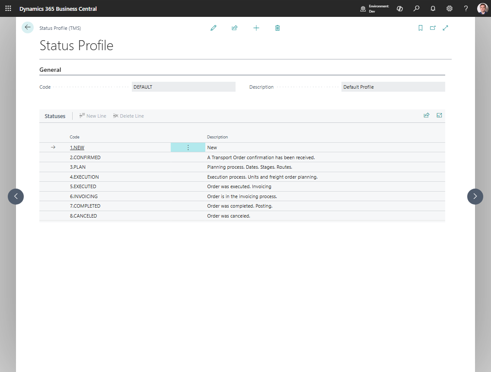

# Statuses and Status Profiles

Use **Status Profiles** and **Statuses** when your company wants to control execution stages with a custom status model.

This setup is most relevant for **Proof of Delivery** and other execution-oriented workflows where documents move through named business stages.

## How to work in these pages

Use Status Profiles to define the list of execution states that users should see.

1. Create the **Status Profile** first.
2. Add simple, business-readable statuses to the profile.
3. Keep the list short enough for dispatchers and drivers to understand.
4. Avoid technical names that only developers understand.
5. In **Shipper TMS Setup**, set **Transport Execution Status Profile** to the profile you want to use.
6. Test the execution process and confirm that users see the expected statuses.

## What is the difference

| Object | Purpose |
|---|---|
| **Status Profile** | The container that defines one status model |
| **Status** | A single step inside that profile |

## Create a status profile

1. Search for **Status Profiles**.
2. Choose **New**.
3. Fill in **Code** and **Description**.
4. Open the card.
5. Add the required statuses in the lines section.

## Create statuses in the profile

For each profile, add the statuses your process needs, for example:

- Planned
- Loaded
- Departed
- Delivered
- Closed

Use simple business language that users understand immediately.

## Where this setup is used

If your company uses Proof of Delivery, select the relevant profile in **Shipper TMS Setup** in **Transport Execution Status Profile**.

## Related

- [TMS Setup](setup.md)
- [Transport Order](transportorder.md)
