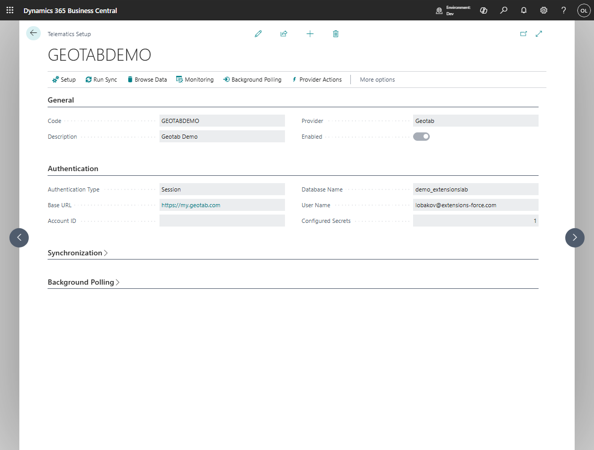

# Telematics Overview

The telematics subsystem connects Shipper TMS with fleet platforms so dispatchers can publish work and receive operational facts.



## Supported providers

| Provider | Typical use |
|---|---|
| **Geotab** | Fleet vehicles, drivers, positions, trips, and events |
| **Samsara** | Dispatch routes, vehicle and driver data, positions, and webhooks |
| **Webfleet** | Dispatch routes, queues, vehicle data, positions, and syncback |

## What telematics can support

| Area | Examples |
|---|---|
| Setup and credentials | Provider, base URL, account ID, database name, user name, password or token |
| Master data sync | Vehicles, drivers, assets, zones, driver-vehicle assignments |
| Tracking | Current positions, position history, trips, fuel entries, HOS entries, sensor entries |
| Dispatch | Transport Order publication, cancellation, refresh, provider dispatch status |
| Inbound processing | Provider messages, route-stop events, execution facts, webhook payloads |
| Administration | Logs, sync state, sync locks, diagnostic entries, stream setup |

## Core flow

```text
Telematics Setup
    |
    v
Provider master data sync
    |
    v
Vehicle, driver, zone, and location mapping
    |
    v
Transport Order publish
    |
    v
Provider dispatch, route, stops, and events
    |
    v
Execution entries and posted history
```

## Related

- [Telematics setup](telematics-setup.md)
- [Telematics provider mapping](telematics-provider-mapping.md)
- [Telematics dispatch](telematics-dispatch.md)
- [Telematics sync and logs](telematics-sync-and-logs.md)
- [Telematics troubleshooting](telematics-troubleshooting.md)
