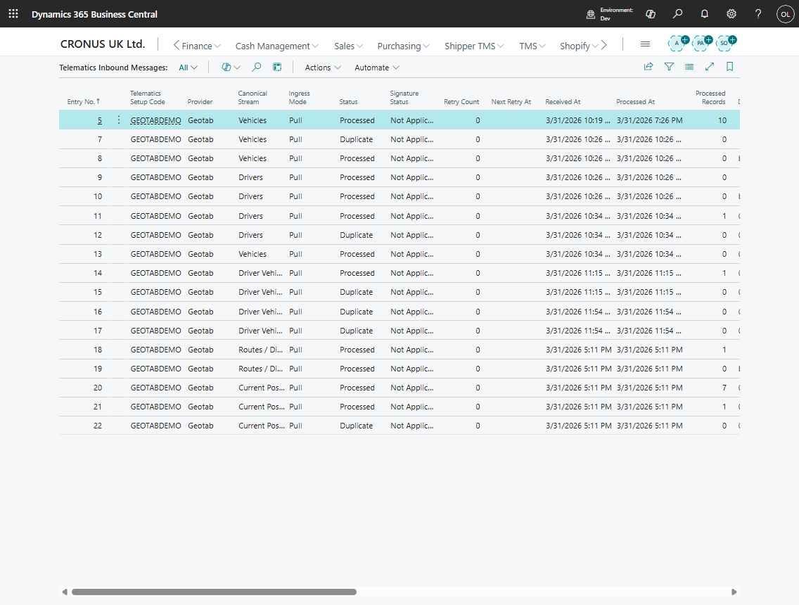

# Telematics Sync and Logs

Use telematics logs and sync pages when you need to confirm what was received from the provider or why synchronization failed.

## Pages to review

| Page | Use |
|---|---|
| Telematics Log Entries | Sync results, affected records, and messages |
| Telematics Inbound Messages | Raw or normalized provider messages waiting for processing or already processed |
| Telematics Sync States | Cursors, watermarks, last success, last error, and next poll timing |
| Telematics Sync Locks | Running or blocked sync locks |
| Telematics Diagnostic Entries | Provider-specific diagnostic or error detail |
| Telematics Vehicles and Drivers | Provider-side master data snapshots |
| Vehicle Locations and Position Entries | Current and historical position data |
| Telematics Routes, Route Stops, Trips, Events | Provider route and execution facts |
| Fuel, HOS, and Sensor Entries | Operational facts when the provider supplies them |

## Log fields

| Field | Meaning |
|---|---|
| **Telematics Setup Code** | Provider setup that wrote the log |
| **Sync Type** | Vehicles, Drivers, Routes, Positions, Trips, Zones, or another sync stream |
| **Entity Type** | Entity affected by the sync |
| **Status** | Result status of the log entry |
| **Started At** and **Finished At** | Runtime window |
| **Message** | Result or error summary |
| **Records Affected** | Count of created, updated, or processed records |
| **External ID** | Provider identifier related to the entry |

## Sync state fields

| Field | Meaning |
|---|---|
| **Cursor** or **Cursor Blob** | Provider continuation token for incremental sync |
| **State Json** | Structured provider state when one cursor is not enough |
| **Last Delivery ID** | Last provider delivery checkpoint |
| **Last Acked At** | When Shipper TMS acknowledged the provider checkpoint |
| **Last Error Category** | Coarse reason for the last failure |
| **Next Poll Not Before** | Earliest retry or next poll time |
| **Last Attempt At** | Latest sync attempt |
| **Last Success At** | Latest successful sync |
| **Last Result Message** | Latest result summary |

## Retry guidance

1. Open **Telematics Log Entries** and find the latest failed log for the setup.
2. Check the message and affected sync type.
3. Review **Telematics Sync State** for last error category and next poll time.
4. Fix provider credentials, mapping, webhook setup, or data quality as needed.
5. Retry the specific sync stream or refresh the affected Transport Order.
6. If a lock is stale, ask an administrator to review sync locks before forcing another run.

## Related

- [Telematics setup](telematics-setup.md)
- [Telematics dispatch](telematics-dispatch.md)
- [Execution Entries](execution-entries.md)
- [API](api.md)
