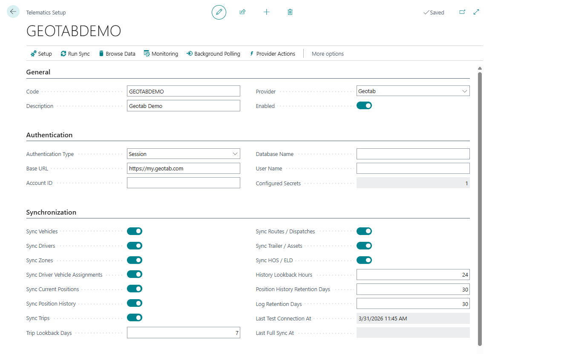

# Telematics

Use **Telematics** when Shipper TMS must exchange route, dispatch, vehicle, driver, position, or execution data with a fleet platform.

Supported provider options include:

- **Geotab**,
- **Samsara**,
- **Webfleet**.

## Telematics guide

| Topic | Use it for |
|---|---|
| [Telematics overview](telematics-overview.md) | Understand what the telematics subsystem does |
| [Telematics setup](telematics-setup.md) | Create provider setup records, credentials, and sync settings |
| [Telematics provider mapping](telematics-provider-mapping.md) | Map external vehicles, drivers, zones, and locations to Shipper TMS records |
| [Telematics dispatch](telematics-dispatch.md) | Publish, cancel, refresh, and review Transport Order dispatches |
| [Telematics sync and logs](telematics-sync-and-logs.md) | Review sync state, inbound messages, logs, positions, trips, and events |
| [Telematics troubleshooting](telematics-troubleshooting.md) | Resolve common provider, mapping, webhook, and retry issues |

## Transport Order actions

A connected order can expose actions such as:

- **Publish to Telematics**,
- **Cancel Telematics Dispatch**,
- **Refresh from Telematics**,
- **Sync Execution Facts**,
- **Show Location**,
- **Telematics Dispatches**,
- **Telematics Links**.

The exact action result depends on the provider, credentials, mapping, and provider-side configuration.

## Security note

Telematics credentials, API tokens, webhook secrets, and provider payloads can contain sensitive operational data.

- Do not include keys or tokens in screenshots.
- Use secret management for passwords and tokens where available.
- Limit telematics admin API access to trusted integration accounts.

## Related

- [Carriers](carrier.md)
- [Vehicles](vehicle.md)
- [Drivers](driver.md)
- [Transport Order](transportorder.md)
- [Execution Entries](execution-entries.md)
- [API](api.md)
