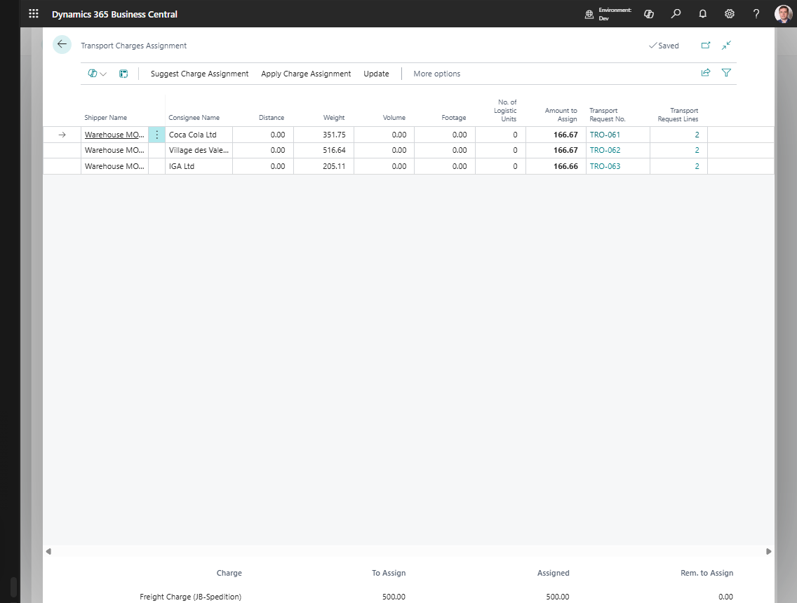

# Transport Charges

Use **Transport Charges** on a Transport Order to manage freight cost and re-billing.

Transport charges can support:

- carrier purchase charges,
- sales re-billing charges,
- self-billing purchase invoices or purchase orders,
- sales invoices for transport charges,
- allocation across requests, stops, and source document lines.

## Where to work

1. Open a [Transport Order](transportorder.md).
2. Go to the **Charges** section.
3. Add or review charge lines.
4. Use **Show Assignment** when the amount must be distributed.

Expected result:

- The Transport Order shows the carrier cost or customer re-billing amount.
- Assigned amounts explain how the charge is distributed across requests, stops, or source document lines.
- Posting is easier to validate because unassigned or unlinked charges are visible before execution is completed.

## Charge line fields

| Field | Use |
|---|---|
| **Type** | Purchase or Sales charge behavior |
| **Charge No.** | Item charge or charge code used by your finance process |
| **Customer/Vendor Name** | Account that receives or pays the charge |
| **Quantity** | Charge quantity |
| **Price** | Unit price |
| **Amount** | Total line amount |
| **Assigned Amount** | Amount already allocated inside Shipper TMS |
| **Assigned Amount to Source Line** | Amount distributed on linked source document item-charge assignment |

## Allocate a charge

1. Select the charge line.
2. Choose **Show Assignment**.
3. Choose a suggestion method:
   - **Equally**,
   - **By Distance**,
   - **By Weight**,
   - **By Volume**,
   - **By Footage**,
   - **By Number of Logistic Units**.
4. Review **Amount to Assign** on each row.
5. Adjust amounts manually if needed.
6. Choose **Apply** if the allocation must be pushed to source document item-charge assignments.
7. Confirm that the remaining amount is zero.

## Example: allocate freight by gross weight

Use this example when one carrier freight cost must be spread across several Sales Order lines.

| Sales Order line | Gross weight | Share | Assigned amount |
|---|---:|---:|---:|
| Line 10000 | 300 kg | 60% | 300.00 |
| Line 20000 | 200 kg | 40% | 200.00 |
| Total | 500 kg | 100% | 500.00 |

Steps:

1. Add a sales or purchase transport charge line for 500.00.
2. Choose **Show Assignment**.
3. Choose **By Weight**.
4. Review the suggested amounts.
5. Choose **Apply** when the assignment must update the linked source document item-charge assignment.

## Choosing an allocation method

| Method | Use it when | Watch for |
|---|---|---|
| **Equally** | Each request or source line should carry the same cost share. | Small and large shipments receive the same amount. |
| **By Distance** | Cost should follow route distance or drop distance. | Run **Get Transport Time & Distance** or **Update Distances** first. |
| **By Weight** | Freight cost is mostly driven by gross weight. | Item weights must be maintained. |
| **By Volume** | Truck space is driven more by cube than by weight. | Item volume must be maintained. |
| **By Footage** | Floor space or linear loading is the key constraint. | Footage data must be maintained consistently. |
| **By Number of Logistic Units** | Pallets, crates, or other unit counts drive the cost split. | Estimated or actual logistic unit quantities must be reliable. |

## Why posting can be blocked

Transport Order posting can stop when charge lines do not have a complete financial path.

| Blocker | What to fix |
|---|---|
| Charge amount is not fully assigned | Open **Show Assignment** and assign the remaining amount |
| Source document assignment is missing | Choose **Apply** after reviewing the assignment |
| Linked sales or purchase charge line is not posted when required | Post or correct the source document before posting the Transport Order |
| Carrier rate type has no item charge mapping | Complete **Carrier Rate Types Mapping** in TMS Setup |
| Charge is only informational | Confirm the process does not require source document assignment for that charge line |

## Purchase charge actions

| Action | Use it for |
|---|---|
| **Add Carrier Invoice Lines** | Select purchase invoice item-charge lines for assignment by drop |
| **Create Self-Billing Invoice** | Create a purchase invoice for the carrier or carrier agent |
| **Create Self-Billing Purchase Order** | Create a purchase order for the carrier or carrier agent |

## Sales charge actions

| Action | Use it for |
|---|---|
| **Suggest Sales Charges Lines** | Suggest customer re-billing based on transport cost |
| **Add Charge to Linked Sales** | Add a charge line to the original sales order |
| **Create Sales Invoice** | Create a sales invoice for transport charges |

## Good to know

- Use **Update Distances** in the assignment page when distance-based allocation depends on current route data.
- Use **Clear Amount to Assign** before rebuilding an allocation from another method.
- Use **Show Item Charge Assignment** to inspect the Business Central item-charge distribution.
- Posting the Transport Order can be blocked by unlinked, unassigned, or unposted charge lines.

## Troubleshooting

| Problem | What to check |
|---|---|
| The assigned amount is not zero after allocation | Reopen **Show Assignment**, review **Amount to Assign**, and apply or adjust the remaining amount. |
| Distance allocation looks wrong | Run **Get Transport Time & Distance** or **Update Distances** before suggesting by distance. |
| Self-billing document is not created | Check carrier vendor setup, charge type, source link, and required Business Central purchase setup. |
| Sales rebilling is not created | Check customer, source sales document status, charge type, and item charge setup. |
| Transport Order posting is blocked | Resolve charge lines where the source link is inactive or where linked sales, purchase, or transfer charge lines are still unposted. |

## Related

- [Transport Order](transportorder.md)
- [Carrier Selection](carrierselection.md)
- [Carrier Rates](carrier-rates.md)
- [TMS Setup](setup.md)
