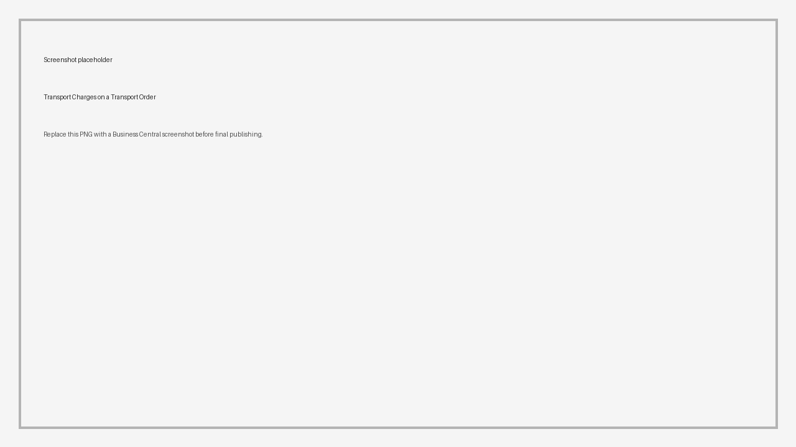

# Transport Charges

Use **Transport Charges** on a Transport Order to manage freight cost and re-billing.

Transport charges can support:

- carrier purchase charges,
- sales re-billing charges,
- self-billing purchase invoices or purchase orders,
- sales invoices for transport charges,
- allocation across requests, stops, and source document lines.

## Where to work

1. Open a [Transport Order](transportorder.md).
2. Go to the **Charges** section.
3. Add or review charge lines.
4. Use **Show Assignment** when the amount must be distributed.

## Charge line fields

| Field | Use |
|---|---|
| **Type** | Purchase or Sales charge behavior |
| **Charge No.** | Item charge or charge code used by your finance process |
| **Customer/Vendor Name** | Account that receives or pays the charge |
| **Quantity** | Charge quantity |
| **Price** | Unit price |
| **Amount** | Total line amount |
| **Assigned Amount** | Amount already allocated inside Shipper TMS |
| **Assigned Amount to Source Line** | Amount distributed on linked source document item-charge assignment |

## Allocate a charge

1. Select the charge line.
2. Choose **Show Assignment**.
3. Choose a suggestion method:
   - **Equally**,
   - **By Distance**,
   - **By Weight**,
   - **By Volume**,
   - **By Footage**,
   - **By Number of Logistic Units**.
4. Review **Amount to Assign** on each row.
5. Adjust amounts manually if needed.
6. Choose **Apply** if the allocation must be pushed to source document item-charge assignments.
7. Confirm that the remaining amount is zero.

## Purchase charge actions

| Action | Use it for |
|---|---|
| **Add Carrier Invoice Lines** | Select purchase invoice item-charge lines for assignment by drop |
| **Create Self-Billing Invoice** | Create a purchase invoice for the carrier or carrier agent |
| **Create Self-Billing Purchase Order** | Create a purchase order for the carrier or carrier agent |

## Sales charge actions

| Action | Use it for |
|---|---|
| **Suggest Sales Charges Lines** | Suggest customer re-billing based on transport cost |
| **Add Charge to Linked Sales** | Add a charge line to the original sales order |
| **Create Sales Invoice** | Create a sales invoice for transport charges |

## Good to know

- Use **Update Distances** in the assignment page when distance-based allocation depends on current route data.
- Use **Clear Amount to Assign** before rebuilding an allocation from another method.
- Use **Show Item Charge Assignment** to inspect the Business Central item-charge distribution.
- Posting the Transport Order can be blocked by unlinked or unposted charge lines.

## Related

- [Transport Order](transportorder.md)
- [Carrier Selection](carrierselection.md)
- [Carrier Rates](carrier-rates.md)
- [TMS Setup](setup.md)
