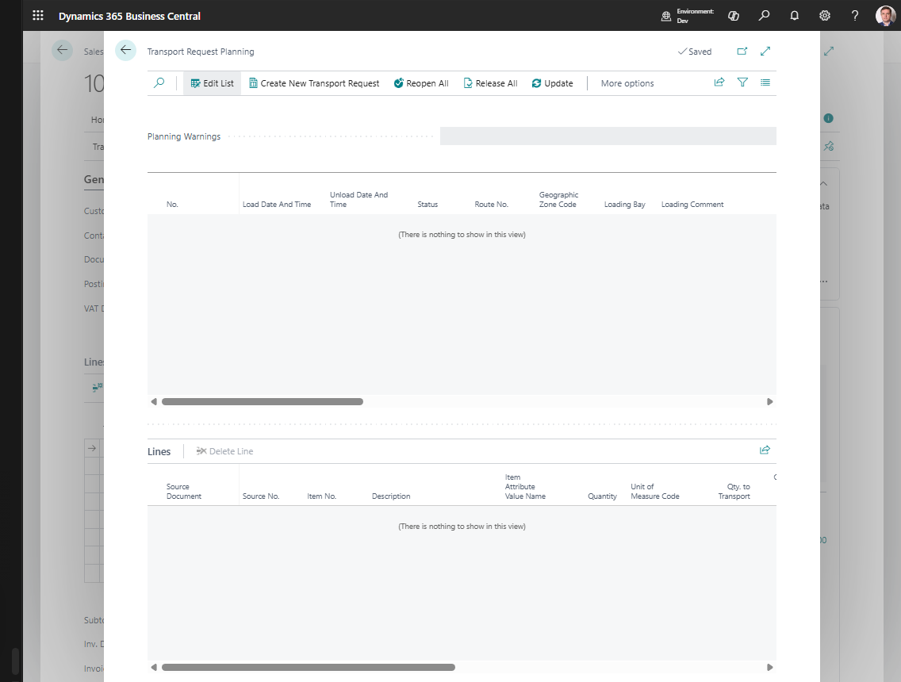

# Transport Request Planning

Use **Transport Request Planning** when one source document must be split across one or more Transport Requests.

Use it when you need to:

- create requests for only part of a document,
- split one order into several deliveries,
- add remaining quantities to an existing Open request,
- move quantities between Open requests,
- release or reopen all related requests from one page.

## Before you start

- The source document must be released when it is an unposted sales, purchase, or transfer document.
- Source lines must still have remaining quantity that can be assigned to transport.
- Use this worksheet before creating a Transport Order if one source document must become several requests.
- Existing requests must be **Open** before you add or move quantities to them.

## How the page is organized

| Area | Purpose |
|---|---|
| **Source Lines** | Shows source quantities, posted quantities, distributed quantities, remaining quantities, and **Qty. to Add** |
| **Planned Transport Requests** | Shows the Transport Requests and request lines already created for this source document |
| **Transport Request Summary** | Shows totals for the selected request |

## Create a new request from selected quantities

1. Open the source document.
2. Choose **Transport Request Planning**.
3. In **Source Lines**, enter **Qty. to Add** on the lines you want to plan.
4. Choose **New Transport Request**.
5. Review the created request number or request count.
6. Release the request when it is ready for planning.

Expected result:

- Shipper TMS creates one or more Transport Requests for the selected quantities.
- Source line balances update so users can see distributed and remaining quantities.
- Released requests become available in Transport Order planning.

## Example: split one order into two deliveries

A Sales Order has 100 units. The customer wants 60 units delivered Monday and 40 units delivered Thursday.

1. Open the Sales Order and choose **Transport Request Planning**.
2. Enter `60` in **Qty. to Add**.
3. Choose **New Transport Request**.
4. Open the created request and set the Monday load and unload dates.
5. Return to **Transport Request Planning**.
6. Enter `40` in **Qty. to Add**.
7. Choose **New Transport Request** again.
8. Set the Thursday dates on the second request.

Expected result:

- the source line shows the full quantity as distributed;
- the document has two linked Transport Requests;
- each request can be released and planned into a different Transport Order.

## Already assigned quantities

The worksheet shows what has already been distributed from each source line. Use these quantities before entering a new **Qty. to Add** value.

| Quantity | Meaning |
|---|---|
| **Source Quantity** | Quantity on the source document line |
| **Distributed Quantity** | Quantity already assigned to Transport Requests |
| **Remaining Quantity** | Quantity still available for planning |
| **Qty. to Add** | Quantity you want to add in the current action |

If the full source-line quantity is already distributed, **Qty. to Add** stays zero and should not be used for that line unless an Open request line is changed or removed.

## Add quantities to an existing request

Use this when an Open Transport Request already exists for the same source document.

1. Enter **Qty. to Add** on the source lines.
2. Choose **Add to Existing Transport Request**.
3. Select the Open Transport Request.
4. Confirm the added lines in **Planned Transport Requests**.

## Move quantity to another request

1. In **Planned Transport Requests**, select a request line.
2. Choose **Move to Another TR**.
3. Select the target Open Transport Request.
4. Enter the quantity to move.
5. Refresh the worksheet and verify the balances.

## Useful actions

| Action | Use it for |
|---|---|
| **Fill Quantity** | Set **Qty. to Add** to the remaining quantity on all source lines |
| **Clear Quantity** | Set **Qty. to Add** to zero on all source lines |
| **New Transport Request** | Create request(s) from selected source lines |
| **Add to Existing Transport Request** | Add selected quantities to an Open request |
| **Refresh** | Recalculate source and distribution balances |
| **Release All** | Release all Open requests for this source document |
| **Reopen All** | Reopen Released requests that are not assigned to a Transport Order |

## Rules

- **Qty. to Add** cannot be negative.
- **Qty. to Add** cannot exceed **Remaining Qty.**.
- You can move quantities only to Open requests.
- Released requests must be reopened before you change their lines.
- Requests already assigned to a Transport Order cannot be reopened from this worksheet.

## Troubleshooting

| Problem | What to check |
|---|---|
| **Qty. to Add** is not editable | Check **Remaining Qty.**, source-line eligibility, and whether the quantity is already assigned to a request with status **Assigned**. |
| No eligible lines are shown | Confirm the source document is supported, released when required, and still has item quantities that are not fully assigned. |
| Existing request cannot be selected | Only **Open** requests can receive added or moved quantities. |
| **Release All** does not release a request | The request must have required load and unload date/time values. |
| **Reopen All** skips a request | Requests already assigned to a Transport Order cannot be reopened from the worksheet. |
| Balances do not look current | Choose **Refresh** to recalculate source and distribution quantities. |

## Related

- [Source Documents](source-documents.md)
- [Transport Request](transportrequest.md)
- [Transport Request Load Planning](loadmanagement.md)
- [Truck Load Management](truckloadmanagement.md)
