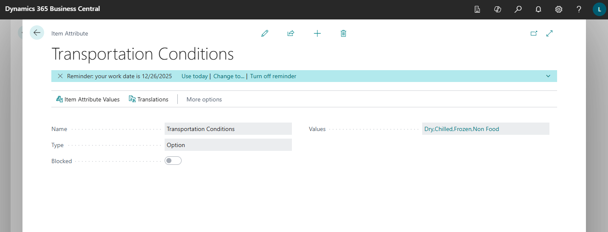
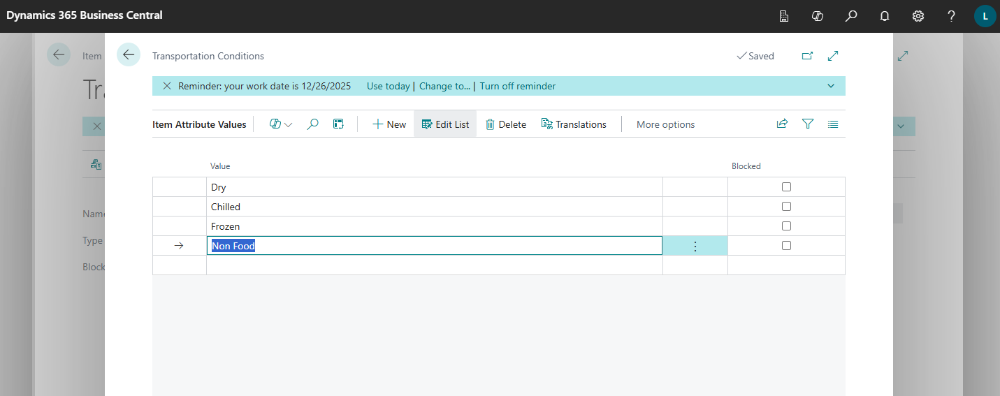
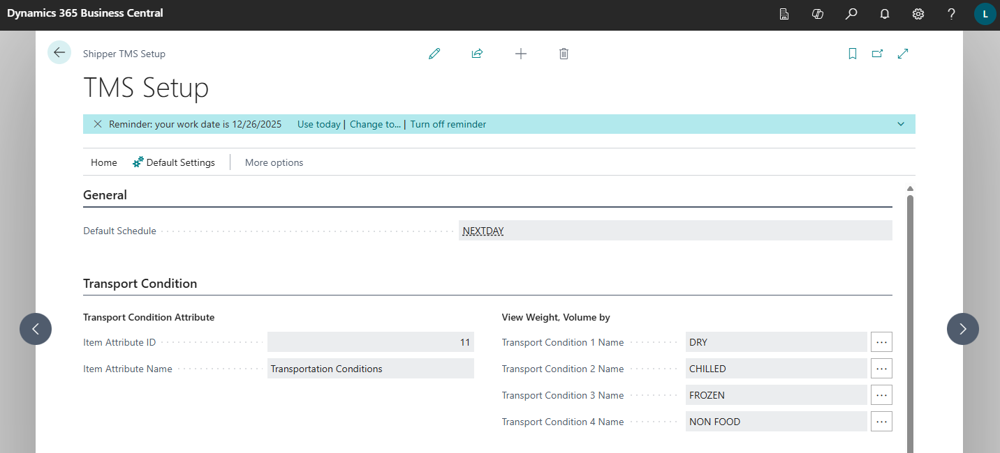

# Transportation Conditions

The TMS allows you to consider different transportation conditions and manage truck planning accordingly.

For example, a sales order may contain frozen products and regular goods. In this case, transportation must either be split into two separate deliveries using different trucks, or planned with a truck that has two compartments capable of handling this type of shipment.

After the transportation conditions control mechanism is enabled, the system will always create separate Transport Requests for goods with different transportation conditions.

That is, a single order containing items with different conditions will be converted into multiple Transport Requests.

## Setup

To enable the transportation conditions control mechanism:

- Create a product attribute called “Transportation Conditions.”
- The attribute values should reflect the conditions used by your company.
- Assign this attribute to all products.
- Add this attribute in TMS Setup.
- If you need to control weight, volume, or footage separately by transportation condition, fill in the corresponding fields in TMS Setup.

## Create a product attribute called “Transportation Conditions"

## The attribute values should reflect the conditions used by your company.

## Add this attribute in TMS Setup.

Select transportation condition attribute in "Item Attribute ID"

If you want to see the vehicle load broken down by transportation conditions (for example, if the vehicle has multiple compartments for different conditions), select the corresponding condition values (View Weight, Volume By fields group).
