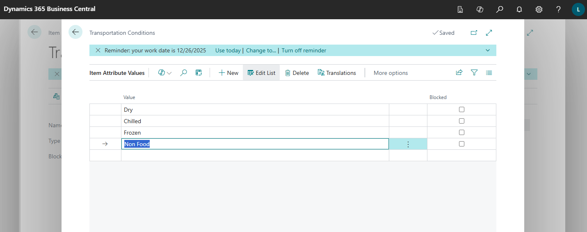

# Transportation conditions

Use **Transportation Conditions** when your company must keep different cargo types separate, for example:

- Frozen
- Refrigerated
- Ambient
- Hazardous

Shipper TMS reads the configured item attribute and uses it to separate planning automatically.

## How to work with this setup

Use this feature as a data rule, not as a daily planning page.

1. Decide which item attribute represents transport condition.
2. Create the allowed attribute values, such as Frozen, Refrigerated, Ambient, or Hazardous.
3. Assign the values to items.
4. In **Shipper TMS Setup**, select the attribute in **Transport Condition**.
5. Optionally fill the four shortcut condition names if planners need separate weight and volume columns.
6. Create a test source document with items from different conditions.
7. Create Transport Requests and verify that the system separates the lines correctly.
8. Test assigning the requests to the same Transport Order or compartment to confirm that compatibility rules behave as expected.

## What happens when it is configured

When a source document contains items with different transportation-condition values:

- Shipper TMS groups them separately,
- separate **Transport Requests** are created,
- planners can assign them to different loads or compartments,
- compatibility checks prevent mixing incompatible cargo.

## Set it up

1. In standard Business Central, create the required **Item Attribute** and values.
2. Assign those values to the relevant items.
3. Open **Shipper TMS Setup**.
4. In **Transport Condition**, select the attribute.
5. If you want condition-specific analysis columns, fill **Transport Condition 1..4 Name**.

## How it affects planning

Transportation conditions are used in:

- Transport Request creation,
- Transport Order compatibility checks,
- Transport Request Load Planning,
- Truck Load Management,
- compartment-based allocation.

## Compartments

If a vehicle uses compartment configuration, the system can match cargo to the compartment condition and help keep the load separated correctly.

## Example: frozen and ambient goods

A sales order contains frozen products and ambient products.

With transportation conditions configured:

1. Shipper TMS reads the item attribute values from the source lines.
2. Separate Transport Requests can be created for the different conditions.
3. In Truck Load Management, the planner can assign both requests to the same multi-compartment vehicle only when each request has a compatible compartment.
4. If the selected vehicle has no compatible compartment or the compartment capacity is exceeded, the candidate is shown as blocked or warning depending on the rule.

## Verify

Create a source document with items that have different transportation-condition values.

Expected result:

- Shipper TMS creates separate requests,
- or blocks incompatible assignment to the same load when conditions do not match.

## Related

- [TMS Setup](setup.md)
- [Transport Request](transportrequest.md)
- [Transport Order](transportorder.md)
- [Truck Load Management](truckloadmanagement.md)
- [Vehicle Compartments and Transportation Conditions](vehicle-compartments-and-transportation-conditions.md)
