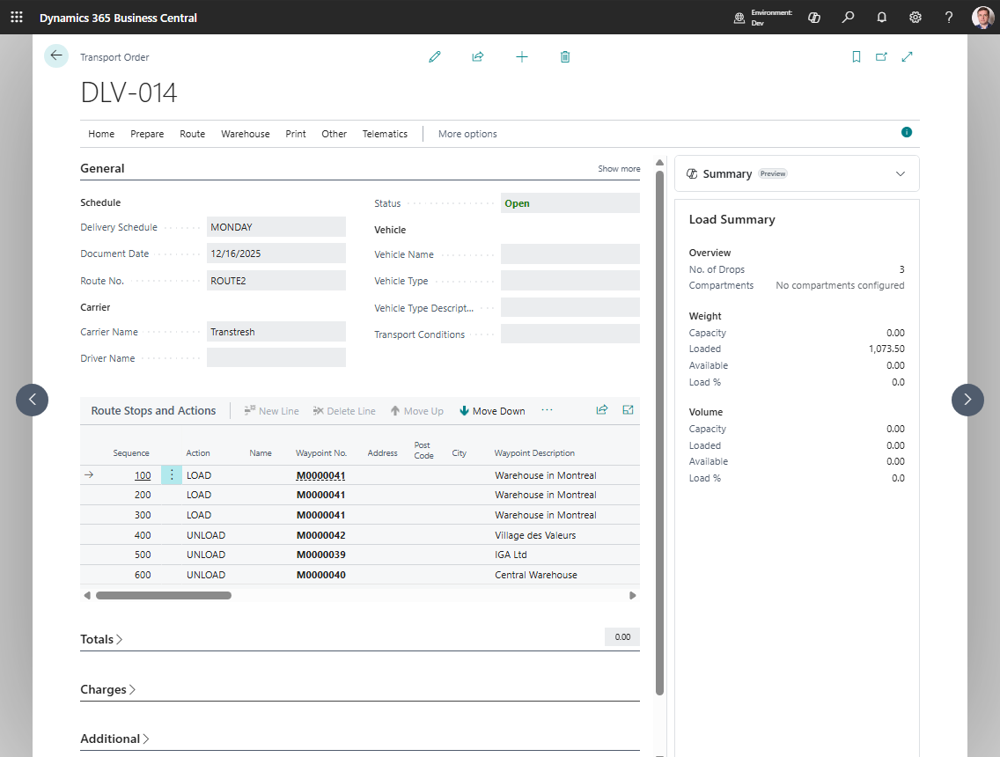
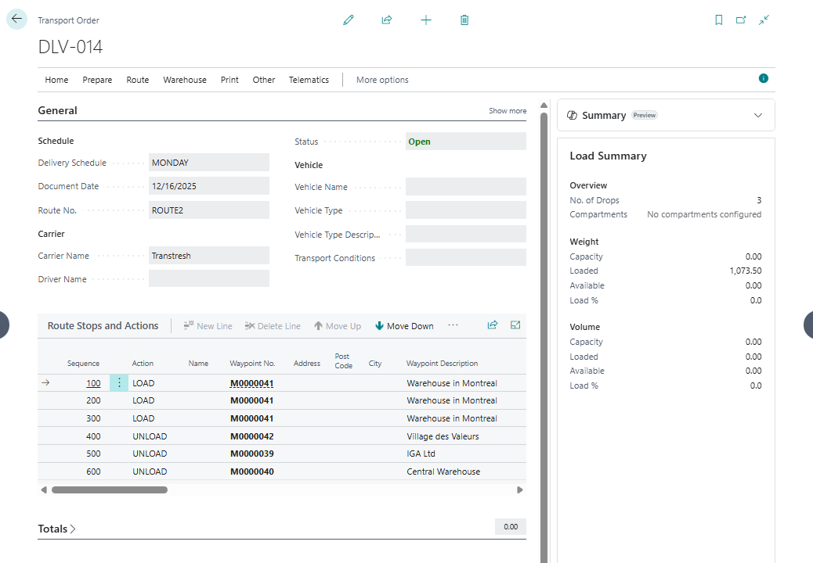

# Transport Order

A **Transport Order** is the execution document in Shipper TMS.

Use it to define the actual trip:

- which carrier executes it,
- which vehicle and driver are assigned,
- which stops are visited,
- which requests are on the load,
- which charges and documents belong to the trip.



## Before you start

Make sure that:

- [TMS Setup](setup.md) has **Transport Order Nos.** and **Default Mode of Transport** filled.
- At least one [Transport Request](transportrequest.md) is **Released** if you are creating an order from demand.
- The order is **Open** while you change requests, route stops, carrier, vehicle, driver, distance, or optimization.
- Map provider setup is complete if you calculate distance, duration, or show the route.
- Carrier rates and rate-type mapping are configured before you use [Carrier Selection](carrierselection.md).
- Warehouse locations require shipment or receipt documents before you use [Warehouse Documents](warehouse-documents.md).

## What lives on a Transport Order

A Transport Order can contain:

- one or more [Transport Requests](transportrequest.md),
- route stops,
- vehicle and carrier assignments,
- capacity totals,
- warehouse document links,
- transport charges and charge assignments,
- telematics publication links,
- execution entries.

## Statuses

| Status | Meaning |
|---|---|
| **Open** | The order can be edited and planned |
| **Released** | The order is ready for execution and warehouse document creation |
| **In Progress** | The trip is underway and can be posted |

Allowed status movement is:

```text
Open -> Released -> In Progress
Released -> Open
In Progress -> Released
```

Posting is not a live status change. When you choose **Post**, Shipper TMS creates a **Posted Transport Order** and removes the live order from the active Transport Orders list.

Use **Reopen** when you must change planning data. Use **Return to Released** when execution started but the trip must be paused or corrected before posting.

## How requests get into the order

Use one of these methods:

- **Add Transport Requests** from the Transport Order,
- **Assign to Transport Order** from the Transport Request,
- [Transport Request Load Planning](loadmanagement.md),
- [Truck Load Management](truckloadmanagement.md),
- [Driver Load Management](driverloadmanagement.md),
- [Visual Scheduler](visualscheduler.md),
- **Create Transport Order** from a supported source document.

When a request is added, Shipper TMS creates the related load and unload route lines automatically.

When you use **Create Transport Orders** on a source document, Shipper TMS creates one Transport Order per eligible released Transport Request. Use the planning pages when several requests should travel on the same trip.

## How to work in this window

1. Keep the order **Open** while you are planning.
2. Fill or review **Carrier**, **Vehicle**, and **Driver**.
3. Choose **Add Transport Requests** when you need to add released requests.
   The selected requests are added to the order and route lines are rebuilt.
4. Review **Route Stops and Actions**.
5. Use **Get Transport Time & Distance** to calculate distance and duration.
   Distance and duration are stored on the order when the map provider returns a route.
6. Use **Show Route** to review the route visually.
7. Use route optimization only after the stop list is complete enough to optimize.
   Optimization can reorder stops, so review the result before releasing.
8. Use [Carrier Selection](carrierselection.md) if you need to compare carrier rates.
   The selected carrier is written back to the order. If automatic charge creation is enabled, charge lines can also be created.
9. Review [Transport Charges](transport-charges.md) if the order carries cost or re-billing lines.
10. Release the order when planning is complete.
    The status changes to **Released**. Most planning fields become protected.
11. Create [Warehouse Documents](warehouse-documents.md) if the warehouse process requires them.
    Shipper TMS creates or opens warehouse shipments or receipts for the linked source lines.
12. Print the required documents.
13. Publish to telematics if your carrier uses a connected provider.
14. Move the order to **In Progress** when execution starts.
    The order becomes ready for execution updates and posting.
15. Post the order when the trip and financial prerequisites are complete.
    The live order is removed and a [Posted Transport Order](posted-transport-orders.md) is created.

If you need to change route, resources, requests, or charges after release, reopen the order first.

## Key actions

| Action | Typical status | Result |
|---|---|---|
| **Add Transport Requests** | **Open** | Adds released unassigned requests and rebuilds route stops |
| **Carrier Selection** | **Open** | Compares carrier costs and can apply the selected carrier |
| **Create Warehouse Documents** | **Released** | Creates or opens warehouse shipment or receipt documents |
| **In Progress** | **Released** | Starts execution and prepares the order for posting |
| **Post** | **In Progress** | Moves the order to posted history |

### Route and timing

| Action | Use it for |
|---|---|
| **Get Transport Time & Distance** | Calculate route distance and duration |
| **Show Route** | Display the route on a map |
| **Route Optimization** | Optimize stop order |
| **Route Sequence Optimization** | Reorder stops by Route Sequence |
| **Loads Optimization** | Reorder load sequence |
| **Scheduled Time Optimization** | Rebuild timing across the route |

### Execution and resources

| Action | Use it for |
|---|---|
| **Carrier Selection** | Compare carriers and apply the selected carrier |
| **Create Warehouse Documents** | Build warehouse shipment or receipt documents from a Released order |
| **Release** | Move the order from Open to Released |
| **Reopen** | Move the order from Released back to Open |
| **In Progress** | Start execution |
| **Return to Released** | Move the order back from In Progress |
| **Post** | Post the trip and move it to history |

### Telematics

If the carrier is connected to a telematics setup, the order can show actions such as:

- **Publish to Telematics**,
- **Cancel Telematics Dispatch**,
- **Refresh from Telematics**,
- **Sync Execution Facts**,
- **Show Location**,
- **Telematics Dispatches**,
- **Telematics Links**.

### Documents

Available print actions include:

- **Loading Manifest**,
- **Email Loading Manifest**,
- **Packing List**,
- **Bill Of Lading**,
- **Delivery Note**,
- **Summary Delivery Notes**,
- **Returns**,
- **CMR Blank**.

## Posting requirements

Before you post the order, Shipper TMS checks these hard requirements:

1. The Transport Order status is **In Progress**.
2. The order contains transport lines.
3. Every transport charge line still has an active source link when a source link is required.
4. Source-linked sales, purchase, or transfer charge lines are no longer active live source lines that block posting.

If posting fails, open **Charges** first. Resolve inactive source links or complete the source-document posting flow, then try posting again.

Operationally, you should also review route stops, execution facts, proof-of-delivery attachments, carrier charges, warehouse documents, and printed documents before posting. These items may be required by your company process even when they are not the exact system blocker shown in the posting check.



After posting, use [Posted Transport Orders](posted-transport-orders.md) for read-only history.

## Troubleshooting

| Problem | What to check |
|---|---|
| You cannot edit the order | The order must be **Open** for planning changes. Choose **Reopen** if the order is **Released**. |
| **Add Transport Requests** is unavailable | The order must be **Open**. |
| Released requests do not appear | Confirm the requests are **Released** and not already assigned to another Transport Order. |
| Distance or duration does not update | The order must be **Open**, the mode of transport must be filled, map provider setup must be complete, and route points must have usable map locations. |
| Carrier Selection is unavailable | Carrier Selection must be enabled in TMS Setup and the order must be **Open**. |
| Auto charge lines are not created | Check **Auto Create Charge Line**, carrier source vendor, and [Carrier Rate Type Mapping](carrier-rate-type-mapping.md). |
| **Create Warehouse Documents** is unavailable | The order must be **Released**. |
| No warehouse document is created | The linked location must require warehouse shipment or receipt, and the linked source lines must still have outstanding warehouse quantity. |
| **Post** does not complete | The order must be **In Progress**, must have transport lines, and charge lines must be linked or posted correctly. |
| A vehicle or driver cannot be assigned | Check whether the carrier, driver, vendor, or vehicle is blocked and whether fleet setup allows the assignment. |

## Good to know

- Carrier Selection is available only when the order is **Open** and carrier selection is enabled.
- Warehouse document creation is available only from **Released** orders.
- Posting is available from **In Progress** orders.
- Truck Load Management can enforce driver, conflict, capacity, and compartment checks before releasing a truck load.

## Related

- [Transport Request](transportrequest.md)
- [Carrier Selection](carrierselection.md)
- [Transport Charges](transport-charges.md)
- [Warehouse Documents](warehouse-documents.md)
- [Execution Entries](execution-entries.md)
- [Telematics](telematics.md)
- [Reports and Documents](reports.md)
- [Posted Transport Orders](posted-transport-orders.md)
