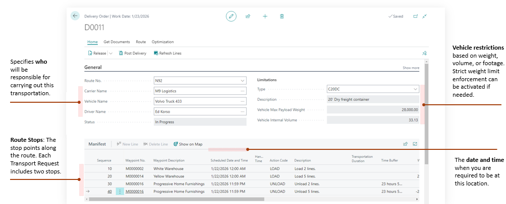

# Transport Order

A **Transport Order** is the execution document in Shipper TMS.

Use it to define the actual trip:

- which carrier executes it,
- which vehicle and driver are assigned,
- which stops are visited,
- which requests are on the load,
- which charges and documents belong to the trip.

## What lives on a Transport Order

A Transport Order can contain:

- one or more [Transport Requests](transportrequest.md),
- route stops,
- vehicle and carrier assignments,
- capacity totals,
- warehouse document links,
- transport charges,
- telematics publication links.

## Statuses

| Status | Meaning |
|---|---|
| **Open** | The order can be edited and planned |
| **Released** | The order is ready for execution |
| **In Progress** | The trip is underway and can be posted |

## How requests get into the order

Use one of these methods:

- **Get Transport Requests** from the Transport Order
- **Assign to Transport Order** from the Transport Request
- planning tools such as [Load Management](loadmanagement.md) and [Truck Load Management](truckloadmanagement.md)
- **Create Transport Orders** from supported source documents when eligible released requests already exist

When a request is added, Shipper TMS creates the related load and unload route lines automatically.

## How to work in this window

Use the Transport Order card as the main execution workspace for a trip.

1. Keep the order **Open** while you are planning.
2. Fill or review **Carrier**, **Vehicle**, and **Driver**.
3. Choose **Add Transport Requests** when you need to add released requests.
4. Review **Route Stops and Actions** to confirm load and unload sequence.
5. Use **Get Transport Time & Distance** to calculate distance and duration.
6. Use **Show Route** to review the route visually.
7. Use route optimization actions only after the stop list is complete enough to optimize.
8. Use **Carrier Selection** if you need to compare carrier rates.
9. Use **Create Warehouse Documents** after the order is **Released** and warehouse work should be created.
10. Use print actions when the driver, carrier, or warehouse needs documents.
11. Use telematics actions only after carrier, vehicle, driver, and route data are ready.
12. Move the order to **In Progress** when execution starts.
13. Use **Post** when the trip is ready to be posted.

If you need to change the route, resources, or requests after release, reopen the order first.

## Key actions

### Route and timing

| Action | Use it for |
|---|---|
| **Get Transport Time & Distance** | Calculate route distance and duration |
| **Show Route** | Display the route on a map |
| **Route Optimization** | Optimize stop order |
| **Route Sequence Optimization** | Reorder stops by Route Sequence |
| **Loads Optimization** | Reorder load sequence |
| **Scheduled Time Optimization** | Rebuild timing across the route |

### Execution and resources

| Action | Use it for |
|---|---|
| **Carrier Selection** | Compare carriers and apply the result |
| **Create Warehouse Documents** | Build warehouse shipment or receipt documents |
| **Re&lease** | Move the order from Open to Released |
| **Re&open** | Move the order from Released back to Open |
| **In Progress** | Start execution |
| **Return to Released** | Move the order back from In Progress |

### Documents

Available print actions include:

- **Loading Manifest**
- **Packing List**
- **Bill Of Lading**
- **Delivery Note**
- **Summary Delivery Notes**
- **Returns**
- **CMR Blank**

## Telematics actions

If the carrier is connected to a telematics setup, the order can expose actions such as:

- **Publish to Telematics**
- **Cancel Telematics Dispatch**
- **Refresh from Telematics**
- **Telematics Dispatches**
- **Telematics Links**

## Good to know

- The order must be **Open** for most planning changes.
- Carrier Selection is available only when the order is **Open** and carrier selection is enabled.
- Warehouse document creation is available from **Released** orders.
- Posting is available from **In Progress** orders.

## Related

- [Transport Request](transportrequest.md)
- [Carrier Selection](carrierselection.md)
- [Telematics](telematics.md)
- [Reports and Documents](reports.md)
