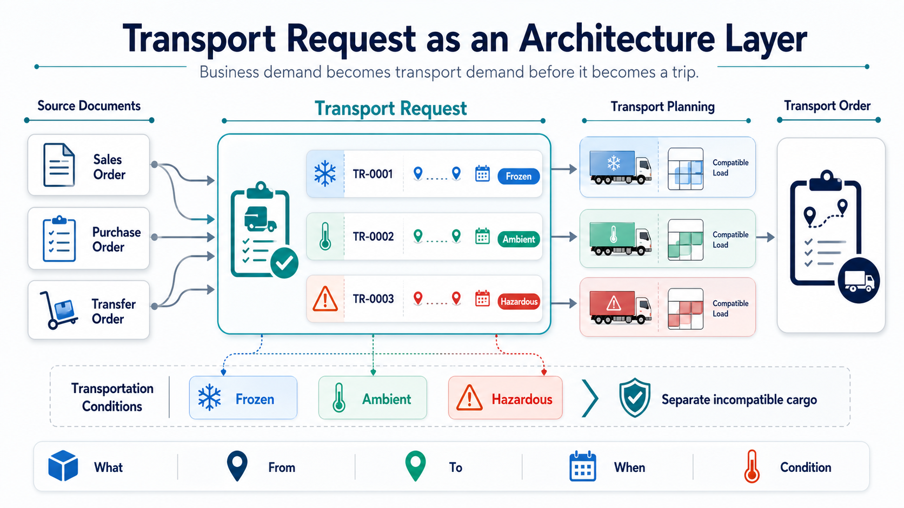

# Transport Request

A **Transport Request** is the planning document in Shipper TMS.

It answers four questions:

- what must be moved,
- from where,
- to where,
- and when.

Use a Transport Request before you build the trip in a [Transport Order](transportorder.md).

The diagram below shows how a Transport Request works as the architecture layer between source documents and transport execution. It can also separate source demand by transportation condition before planning, helping planners keep incompatible cargo in separate requests, loads, or compartments.




## Before you start

Make sure that:

- [TMS Setup](setup.md) has **Transport Request Nos.** filled.
- The source document has eligible item quantities that are not already fully assigned to transport.
- Unposted sales, purchase, and transfer documents are **Released** before you create requests from them.
- The request has **Load Date And Time** and **Unload Date And Time** before you release it.
- Map locations or complete addresses exist if you want route display, distance, or duration.

## What a Transport Request contains

A Transport Request can contain:

- source document lines,
- shipper and consignee information,
- load and unload dates,
- route and route sequence,
- transportation condition,
- calculated totals such as weight, volume, footage, and estimated logistic units.

## How requests are created

| Method | Use it when |
|---|---|
| **Automatic creation from released documents** | TMS Setup is configured to create requests during document release |
| **Create Transport Request** on a source document | The remaining eligible quantities should become requests immediately |
| **Transport Request Planning** | You need partial quantities or several requests from one document |
| **Get Source Documents** on a request | You want to add more released source lines to an Open request |
| **Document lists** | You want to create requests for several documents in bulk |

For supported document types, see [Source Documents](source-documents.md).

## How load and unload points are selected

Every Transport Request needs a load point and an unload point. When a request is created from a source document, Shipper TMS derives those endpoints from the document line and header.

| Source scenario | Load point | Unload point |
|---|---|---|
| Sales shipment or sales invoice line with **Location Code** | Location | Customer or ship-to address |
| Sales shipment or sales invoice line without **Location Code** | Company Information | Customer or ship-to address |
| Sales return or sales credit memo line with **Location Code** | Customer or ship-to address | Location |
| Sales return or sales credit memo line without **Location Code** | Customer or ship-to address | Company Information |
| Purchase receipt or purchase invoice line with **Location Code** | Vendor or order address | Location |
| Purchase receipt or purchase invoice line without **Location Code** | Vendor or order address | Company Information |
| Purchase return or purchase credit memo line with **Location Code** | Location | Vendor or order address |
| Purchase return or purchase credit memo line without **Location Code** | Company Information | Vendor or order address |

If the source line does not have a **Location Code**, Shipper TMS uses the company address as the company-side endpoint. This supports companies that do not use Business Central locations on sales or purchase lines.

To use this scenario, fill **Default Map Location** on **Company Information** with a Map Location whose source type is **Company**. This Map Location is used for route display, distance, and duration. It does not create or require a Business Central warehouse location and does not change inventory or warehouse posting behavior.

## Drop shipment

For **Drop Shipment** Sales Order lines, Shipper TMS creates the Transport Request from the Sales Order, not from the Purchase Order.

The route is:

```text
Vendor or order address -> Customer or ship-to address
```

The Sales Line **Location Code** is not used for this route. Shipper TMS uses the linked Purchase Order line to identify the vendor pickup point. If the drop shipment Sales Line is not linked to a Purchase Order line, request creation stops and asks you to create or link the Purchase Order first.

Purchase Order lines marked **Drop Shipment** are skipped during Transport Request creation. This prevents duplicate requests for the same vendor-to-customer movement.

## Statuses

| Status | Meaning |
|---|---|
| **Open** | The request can still be prepared and adjusted |
| **Released** | The request is ready for planning |
| **Assigned** | The request is assigned to a Transport Order |

Allowed status movement is:

```text
Open -> Released -> Assigned
Released -> Open
```

## Important rules

- Only **Released** requests can be assigned to a Transport Order.
- A request in **Assigned** status is already assigned to a Transport Order and is no longer freely editable or available in the planning pool.
- If the request is removed from the Transport Order, it can return to **Released**.
- For unposted source documents, manual creation from the document card requires the source document to be **Released**.

## Before you release a request

Use this checklist before choosing **Release**:

| Check | Why it matters |
|---|---|
| **Load Date And Time** is filled | Required before the request can become available for planning |
| **Unload Date And Time** is filled | Required before the request can become available for planning |
| Source lines and quantities are correct | Released requests are what planners see in load-building pages |
| Shipper and consignee addresses are correct | Route, distance, warehouse, and map behavior depend on these values |
| Transportation condition is correct when used | Conditions can affect splitting, compatibility, and compartment planning |


## How to work in this window

1. Review the **General** section and confirm the request status.
2. Review **Shipper** and **Consignee**.
3. Fill or adjust load and unload date/time values while the request is still **Open**.
4. Review **Lines**.
5. If you need to add more source lines, choose **Get Source Documents** while the request is **Open**.
   The selected released source lines are added to the request.
6. If map locations are filled, choose **Show Route**.
   The route opens on the configured map provider.
7. Choose **Transport Time & Distance** to calculate distance and duration.
   The request stores the distance and transport duration returned by the map provider.
8. Choose **Estimate** when logistic unit estimation should be rebuilt.
9. Choose **Release** when the request is ready for planning.
   The status changes to **Released** and the request becomes available for Transport Order planning.
10. Choose **Assign to Transport Order** when you want to place this request into an existing Transport Order.
    The request status changes to **Assigned** after it is added to the selected order.
11. If the request is already assigned, choose **Show Transport** to open the related order.

## What changes after assignment

After a request is assigned to a Transport Order:

- the request leaves the general planning pool;
- the request status is shown as **Assigned**;
- the **Assigned To** field points to the linked Transport Order;
- most request changes must be made by changing the Transport Order plan or by removing the request from the order first.

Use the list page when you want to release, reopen, or assign multiple requests at the same time.

## Useful actions

| Action | Available when | Result |
|---|---|---|
| **Get Source Documents** | Request is **Open** | Adds eligible released source document lines |
| **Show Route** | Endpoints have map data | Displays the route on the map |
| **Transport Time & Distance** | Endpoints and map provider are valid | Calculates distance and duration |
| **Release** | Request is **Open** | Makes the request available for planning |
| **Reopen** | Request is **Released** and not assigned to a Transport Order | Returns the request to editing |
| **Assign to Transport Order** | Request is **Released** | Assigns the request to a new or existing Transport Order |
| **Show Transport** | Request is **Assigned** | Opens the linked Transport Order |
| **Estimate** | Request has lines | Rebuilds estimated logistic units |

## Typical workflow

1. Create the request from a source document.
2. Review addresses, route, dates, and totals.
3. Release the request.
4. Assign it to a Transport Order directly or through a planning tool.

## Troubleshooting

| Problem | What to check |
|---|---|
| **Release** fails | Fill **Load Date And Time** and **Unload Date And Time**. |
| **Get Source Documents** is unavailable | The request must be **Open**. |
| The request does not appear in planning pages | Only **Released** requests are available for planning. A request in **Assigned** status is already assigned. |
| **Assign to Transport Order** is unavailable | The request must be **Released**. |
| **Show Route** fails | Check shipper and consignee map locations, coordinates, and map provider setup. |
| Distance or duration is empty | Configure a map provider and verify that both route endpoints can be geocoded. |
| Requests from lines without **Location Code** fail | Fill **Default Map Location** on **Company Information** and make sure that Map Location has source type **Company**. |
| A drop shipment Sales Order does not create a request | Make sure the Sales Line is linked to the related Purchase Order line. |
| You cannot delete the request | Requests in **Assigned** status must be removed from the Transport Order first. |

## Related

- [Source Documents](source-documents.md)
- [Transport Request Planning](transport-request-planning.md)
- [Transport Order](transportorder.md)
- [Transport Request Load Planning](loadmanagement.md)
- [Truck Load Management](truckloadmanagement.md)
