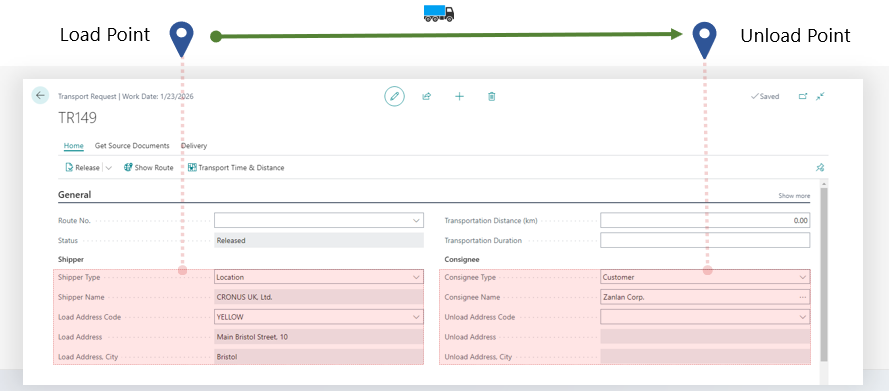

# Transport Request

A **Transport Request** is the planning document in Shipper TMS.

It answers these questions:

- what has to be moved,
- from where,
- to where,
- and when.

Use a Transport Request before you build the actual trip in a [Transport Order](transportorder.md).

## What a Transport Request contains

A Transport Request can contain:

- source document lines,
- shipper and consignee information,
- load and unload dates,
- route and route sequence,
- transportation condition,
- calculated totals such as weight, volume, footage, and estimated logistic units.

## How Transport Requests are created

### Automatically from released documents

If enabled in [TMS Setup](setup.md), Shipper TMS can create Transport Requests automatically when released documents are processed.

### From a document card

On a source document card, use:

- **Create Transport Request**
- or **Transport Request Planning**

Use **Create Transport Request** when the remaining eligible lines should become requests immediately.

Use **Transport Request Planning** when you need to split a document into multiple requests, partial deliveries, different dates, different routes, or different transportation conditions.

### From a document list

From list pages such as **Sales Orders**, **Purchase Orders**, and other supported document lists, use the list action to create requests in bulk.

### From the Transport Request card

If the request is still **Open**, you can use **Get Source Documents** to add more released source lines.

## Statuses

| Status | Meaning |
|---|---|
| **Open** | The request can still be prepared and adjusted |
| **Released** | The request is ready for planning |
| **Transport** | The request is already assigned to a Transport Order |

## Important rules

- Only **Released** requests can be assigned to a Transport Order.
- Once a request is in **Transport** status, it is no longer part of the free planning pool.
- If the request is removed from the Transport Order, it can return to **Released**.
- For unposted source documents, manual creation from the document card requires the source document to be **Released**.

## How to work in this window

Use the Transport Request card to prepare the shipment demand before it becomes a trip.

1. Review the **General** section and confirm the request status.
2. Review **Shipper and Consignee** to make sure the load and unload locations are correct.
3. In **Planning**, fill or adjust load and unload date/time values while the request is still **Open**.
4. Review **Lines** to confirm quantities, items, and source references.
5. If you need to add more source lines, choose **Get Source Documents** while the request is **Open**.
6. If map locations are filled, choose **Show Route** to see the route.
7. Choose **Transport Time & Distance** to calculate distance and duration.
8. Choose **Estimate** when logistic unit estimation should be rebuilt.
9. Choose **Re&lease** when the request is ready for planning.
10. Choose **Assign to Transport Order** when you want to place this request into an existing Transport Order.
11. If the request is already assigned, choose **Show Transport** to open the related order.

Use the list page when you want to release, reopen, or assign multiple requests at the same time.

## Useful actions on the request

| Action | Use it for |
|---|---|
| **Get Source Documents** | Add more released lines while the request is still open |
| **Show Route** | Display the route on the map |
| **Transport Time & Distance** | Calculate distance and duration |
| **Re&lease** | Move the request to Released |
| **Re&open** | Move the request back to Open |
| **Assign to Transport Order** | Add the request to an existing order |
| **Show Transport** | Open the linked Transport Order |
| **Estimate** | Rebuild estimated logistic units |

## Typical workflow

1. Create the request from a source document.
2. Review addresses, route, dates, and totals.
3. Release the request.
4. Assign it to a Transport Order directly or through a planning tool.

## Related

- [Transport Order](transportorder.md)
- [Load Management](loadmanagement.md)
- [Truck Load Management](truckloadmanagement.md)
- [Use case: Create a Transport Request from a Sales Order](usecase-salesorder-transportrequest.md)
