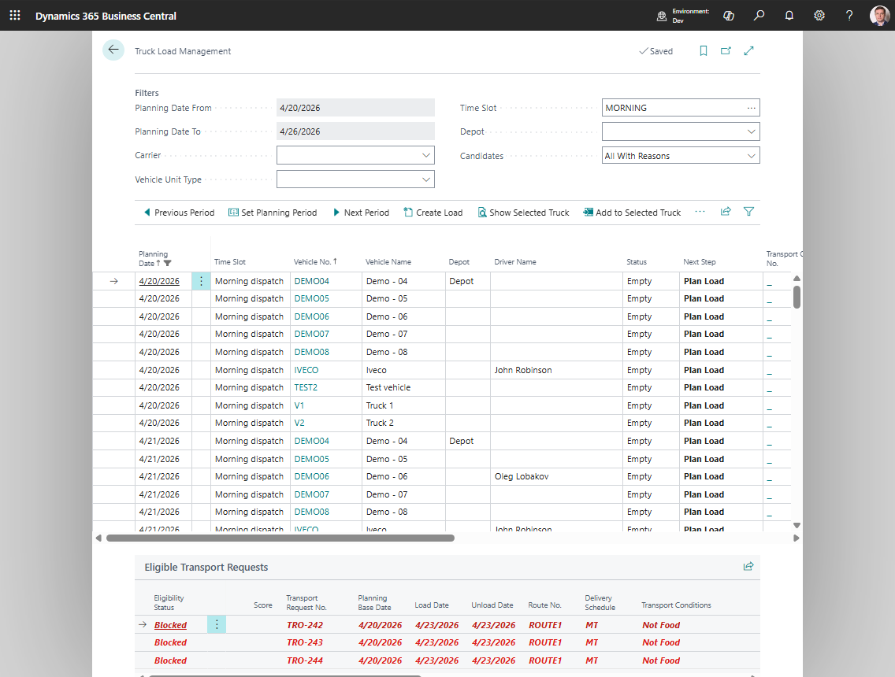

# Truck Load Management

Customer-stop route sketching for an already created trip is handled by [Customer Stop Pre-Planner](customerstoppreplanning.md). Truck Load Management remains the vehicle-first tool for capacity, time slot, driver, and truck-slot checks.

Use **Truck Load Management** when your planner wants to work from the truck side first.

The main planning object is the **truck slot**:

- vehicle,
- planning date,
- time slot.

This page answers the question: **What should this truck carry in this time window?**

## When to use it

Use Truck Load Management when you want to:

- review all available trucks for a period,
- plan by resource instead of by request pool,
- see empty, full, overloaded, or conflicting truck slots,
- add requests directly to a selected truck,
- release a finished load.

Do not start here if you only need to choose an external carrier. Use [Carrier Selection](carrierselection.md) on a Transport Order for that flow.

## Which planning tool should I use?

| Planner question | Best tool |
|---|---|
| What should this truck carry in this date and time slot? | **Truck Load Management** |
| Which released requests should be grouped first? | [Transport Request Load Planning](loadmanagement.md) |
| Which driver can take this load? | [Driver Load Management](driverloadmanagement.md) |
| How does the plan look across the day or week? | [Visual Scheduler](visualscheduler.md) |

## Before you start

- Configure **Truck Load Time Slot Profile** in [TMS Setup](setup.md).
- Create vehicles and assign carrier, vehicle unit type, depot, capacity, and default driver when used.
- Create drivers if driver assignment is required before release.
- Transport Requests must be **Released** before they can appear as candidates.
- Capacity controls, compartments, and transportation conditions should be configured before go-live if your process enforces them.

## Main sections

| Section | Purpose |
|---|---|
| **Filters** | Period, carrier, vehicle unit type, time slot, depot, candidate mode |
| **Truck Slots** | One row per vehicle/date/time-slot combination |
| **Eligible Transport Requests** | Candidate requests for the currently selected slot |

## How to work in this window

1. Set the period with **Previous Period**, **Set Planning Period**, or **Next Period**.
2. Use **Carrier**, **Vehicle Unit Type**, **Time Slot**, and **Depot** filters as needed.
3. Select a truck slot in the upper list.
4. Review **Status**, **Next Step**, **Load %**, capacity columns, and conflicts.
5. If the slot has no Transport Order, choose **Create Load**.
   Shipper TMS creates an Open Transport Order for the selected truck slot.
6. In **Eligible Transport Requests**, select one or more requests.
7. Choose **Add to Selected Truck**.
   The requests are added to the slot's Transport Order if they pass eligibility checks.
8. Open the load with **Next Step**, **Load %**, or **Open Transport Order**.
9. When the load is ready, choose **Release Load**.
   The linked Transport Order changes from **Open** to **Released** when validation succeeds.

## Customer stop pre-planning from a truck slot

Choose **Customer Stop Pre-Plan** when you want to sketch the delivery sequence at customer-stop level before adding requests to the selected truck.

- If the slot already has a Transport Order, Customer Stop Pre-Planner opens the existing trip.
- If the slot is empty, it shows released, unassigned Transport Requests grouped by consignee and unload point.
- Use **Sequence**, **Move Up**, **Move Down**, **Renumber Sequence**, or **Auto-sequence by Map Coordinates** to prepare the stop order.
- Select stops and choose **Assign Selected Stops to Truck Slot** to assign all underlying Transport Requests through the existing Truck Load Management candidate checks.

The assignment is all-or-nothing at customer-stop level. A selected stop is not split by transport condition from this worksheet.

After a load is created, Customer Stop Pre-Planner can also move selected customer stops to another truck slot. The move uses the same target-slot selection and eligibility checks as Truck Load Management, but keeps each customer stop together as one planning unit.

## Candidate modes

Use the **Candidates** filter to control how strict the lower list should be.

| Mode | Use it when |
|---|---|
| **Best Candidates** | You want the best planning suggestions first |
| **Eligible Only** | You want only requests that can be assigned |
| **All With Reasons** | You want to see why some requests are warnings or blocked |
| **Blocked Only** | You are troubleshooting planning blocks |

## Candidate and slot indicators

| Indicator | Meaning |
|---|---|
| **Best Candidate** | The request is a strong match for the selected truck slot |
| **Eligible** | The request can be added, but it may not be the best fit |
| **Warning** | The request can require planner review before assignment |
| **Blocked** | The request cannot be assigned until the shown reason is fixed |
| **Load %** | Capacity usage for the linked load |
| **Conflict Count** | Driver, vehicle, slot, or rule conflicts detected for the slot |
| **Compartment** | Capacity or transport-condition subdivision on the vehicle |

## Slot status legend

| Slot status | What it means | Planner action |
|---|---|---|
| **Empty** | The vehicle/date/time slot has no linked load. | Create a load or leave the slot available. |
| **Planned** | A Transport Order exists for the slot. | Add requests, review route and capacity, then release when ready. |
| **Partially Loaded** | The load has requests but still has capacity. | Add more compatible requests if the route still makes sense. |
| **Full** | Capacity is considered full for the selected controls. | Review and release, or move work if the load is not operationally correct. |
| **Released** | The linked Transport Order is released. | Warehouse/execution can proceed; reopen only if planning changes are needed. |
| **In Progress** | Execution has started. | Do not use the slot for planning changes unless the process is rolled back. |
| **Unavailable** | The vehicle or slot is not available for planning. | Choose another slot or fix vehicle scheduling setup. |
| **Conflict** | A scheduling or assignment conflict exists. | Open conflict details or the linked order and resolve before release. |
| **Overloaded** | The load exceeds a configured capacity control. | Remove requests, move work, or use a larger compatible vehicle. |

## How to read candidate reasons

Candidate reasons are written for the planner. Use them to decide the next action:

| Reason type | What it means | What to do |
|---|---|---|
| **Eligible** | The request can be added to the selected truck slot. | Add the request if it fits the route and capacity plan. |
| **Warning** | The request can be possible, but one planning detail needs review. | Review the reason, capacity, time slot, route, and compartment before adding it. |
| **Blocked** | The request cannot be added in the current state. | Fix the shown blocker or choose another truck slot. |
| **Conflict** | The selected truck, driver, or time slot has overlapping work or another scheduling conflict. | Open the load or conflict details and move the work, vehicle, driver, or time slot. |

## Example: truck-first planning

1. Open **Truck Load Management** for tomorrow's planning period.
2. Filter to the carrier, depot, and time slot.
3. Select an empty truck slot.
4. Choose **Create Load**.
5. Switch candidates to **Best Candidates**.
6. Add compatible released requests until capacity and time look correct.
7. Review conflicts and compartments.
8. Choose **Release Load** when the load is ready for execution.

## Release checks

Before **Release Load** succeeds, Shipper TMS checks the selected truck slot.

Common blockers include:

- no linked Transport Order,
- Transport Order is not **Open**,
- no Transport Requests on the load,
- driver is required in setup but not assigned,
- slot has conflicts,
- load is overloaded,
- compartment or transportation-condition rules are not valid.

Fix the blocker, refresh the page, and release again.

## Troubleshooting

| Problem | What to check |
|---|---|
| No truck slots are shown | Check planning period, time-slot profile, vehicle setup, carrier filter, vehicle unit type, depot filter, and whether the vehicle is blocked for scheduling. |
| Candidate requests are missing | Confirm requests are **Released**, inside the planning period, and compatible with the selected slot filters. |
| A candidate is blocked | Use **All With Reasons** or **Blocked Only** to see the reason. |
| **Add to Selected Truck** fails | The target slot and Transport Order must be selectable and open; capacity, compartment, and transportation-condition rules must allow the move. |
| **Release Load** fails | Resolve missing order, non-open order, missing requests, missing driver, conflict, overload, or compartment/condition blockers. |
| The linked order looks wrong | Use **Repair Truck Load Links** to check and repair Transport Order links to truck planning slots for the current period. |

## Move or remove work

1. Open the selected truck load from **Next Step**, **Load %**, or **Open Transport Order**.
2. Select the Transport Request row.
3. Choose **Remove from Truck** to return it to the planning pool.
4. Choose **Move to Another Truck** to move it to another truck slot.
5. Choose **Move to Another Driver** if the load should stay planned but change driver assignment.

## Main actions

| Action | Use it for |
|---|---|
| **Create Load** | Create an Open Transport Order for the current truck slot |
| **Show Selected Truck** | Refresh the candidate list for the current slot |
| **Add to Selected Truck** | Add selected requests to the selected slot |
| **Open Transport Order** | Open the linked Transport Order |
| **Release Load** | Release the current load after validation |
| **Repair Truck Load Links** | Check and repair Transport Order links to truck planning slots for the current period |

## Related

- [Driver Load Management](driverloadmanagement.md)
- [Transport Request Load Planning](loadmanagement.md)
- [Transport Order](transportorder.md)
- [Vehicle Compartments and Transportation Conditions](vehicle-compartments-and-transportation-conditions.md)
- [Time Slots and Delivery Schedules](timeslots.md)
