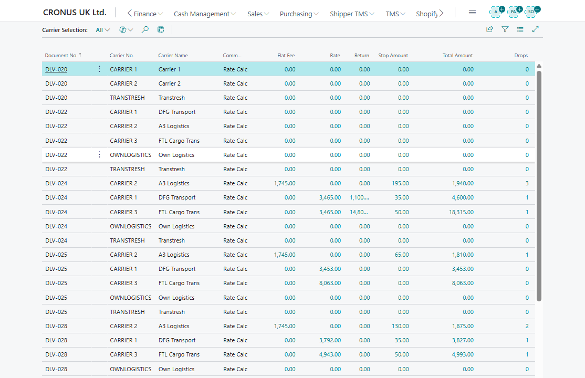

# Use case: Compare carriers and assign freight cost

## Goal

Select a carrier by rate and allocate the resulting freight cost so posting is not blocked.

## When to use it

Use this flow when carrier freight charges must be visible on the Transport Order and assigned to source document lines.

## Before you start

- Carrier Selection is enabled.
- [Carrier Rates](carrier-rates.md) and [Carrier Rate Type Mapping](carrier-rate-type-mapping.md) are configured.
- The Transport Order is **Open** and has route stops.
- Source documents are ready for item-charge assignment if charges must flow back to sales or purchase documents.

## Steps

1. Open the Transport Order.
2. Choose **Carrier Selection**.
3. Review the carrier rows and cost breakdown.
4. Apply the selected carrier.
5. Confirm that the selected carrier is written to the Transport Order.
6. Go to the **Charges** section.
7. Select the created charge line.
8. Choose **Show Assignment**.
9. Suggest allocation by distance, weight, volume, footage, logistic units, or equally.
10. Review and adjust amounts.
11. Choose **Apply** when source document item-charge assignment must be updated.

## Expected result

- The carrier is assigned to the order.
- Freight charge lines show assigned amounts.
- Required source document item-charge assignments are updated.

## What to do next

Release the order or continue planning route, warehouse, and execution details.

## Common errors

| Problem | What to check |
|---|---|
| Carrier rate does not match | Carrier Selection uses country/region code, county, city, and post code. Region Code is not used by the current matching logic. |
| Auto charge line is missing | **Auto Create Charge Line**, carrier **Source Type** = Vendor, carrier **Source No.**, and [Carrier Rate Type Mapping](carrier-rate-type-mapping.md) |
| Assigned amount is not complete | Reopen Show Assignment and assign remaining amount |
| Posting is blocked | Source charge lines, item-charge assignment, and unposted sales or purchase documents |

## Related

- [Carrier Selection](carrierselection.md)
- [Carrier Rate Type Mapping](carrier-rate-type-mapping.md)
- [Transport Charges](transport-charges.md)
- [Transport Order](transportorder.md)
