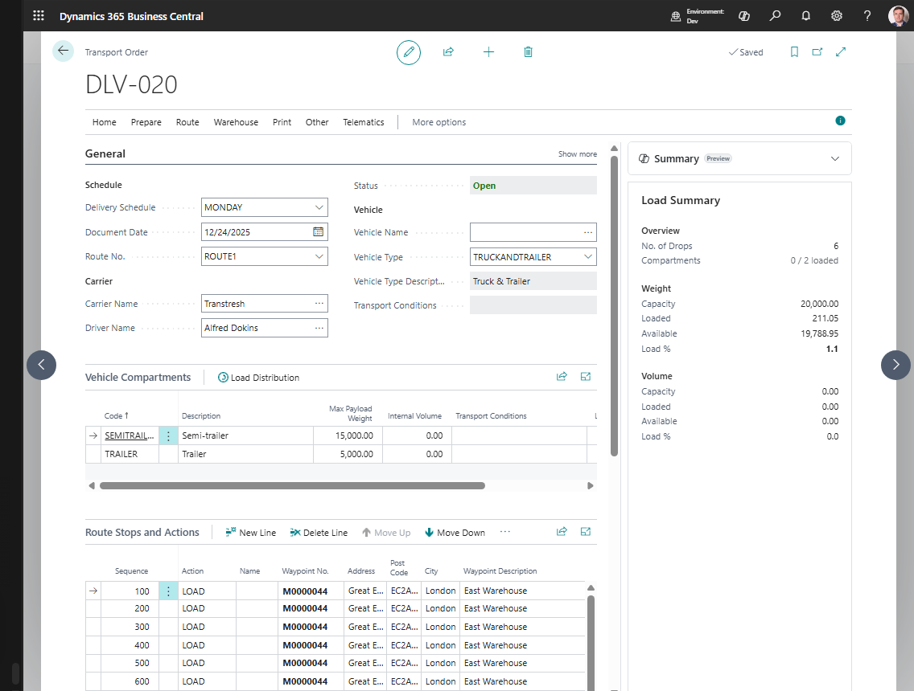

# Use case: Create warehouse documents from a Transport Order

## Goal

Create or open warehouse shipments and receipts that are linked to a Transport Order.

## When to use it

Use this flow when warehouse work should be driven by the transport plan.

## Before you start

- The Transport Order is **Released**.
- The order contains Transport Requests.
- Source lines are supported for warehouse creation.
- Business Central warehouse setup requires shipment or receive handling for the location.

## Steps

1. Open the Transport Order.
2. Confirm the status is **Released**.
3. Choose **Create Warehouse Documents**.
4. Confirm the action.
5. Open **Show Warehouse Shipments** or **Show Warehouse Receipts**.
6. Process the warehouse documents in the standard Business Central warehouse flow.

## Expected result

- Warehouse shipments are created for eligible Sales Order lines when shipment handling applies.
- Purchase Return Order lines are currently processed for Warehouse Shipment only when the same Transport Request also contains at least one eligible Sales Order line.
- Warehouse receipts are created for eligible Purchase Order lines when receive handling applies.
- Sales Return Order lines are currently processed for Warehouse Receipt only when the same Transport Request also contains at least one eligible Purchase Order line.
- Existing warehouse documents open instead of creating duplicates.

## What to do next

Pick, ship, receive, or post the warehouse documents according to your warehouse process.

## Common errors

| Problem | What to check |
|---|---|
| Action is unavailable | Transport Order must be **Released** |
| No warehouse document is created | Supported source line, location handling setup, and outstanding warehouse quantity |
| Transfer line is skipped | Transfer warehouse document creation is not implemented by this action in the current version |

## Related

- [Warehouse Documents](warehouse-documents.md)
- [Transport Order](transportorder.md)
- [Source Documents](source-documents.md)
