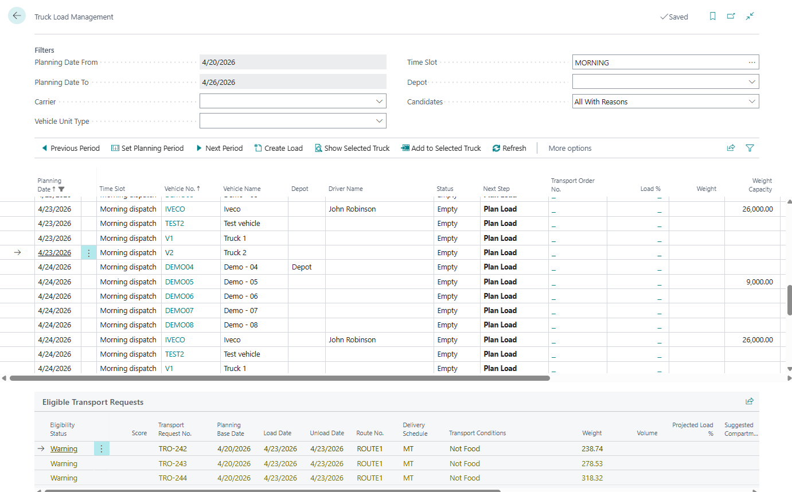

# Use case: Plan a delivery with your own fleet

## Goal

Assign released transportation demand to a company vehicle and driver.

## When to use it

Use this flow when your own fleet executes the delivery and planners work by truck slot, driver availability, capacity, or compartments.

## Before you start

- Vehicles and drivers are created and not blocked.
- Truck Load Time Slot Profile is configured.
- Transport Requests are **Released**.
- Capacity controls and transportation conditions are configured if enforced.
- If separated cargo is used, compartments and transportation conditions are configured.

## Steps

1. Open **Truck Load Management**.
2. Set the planning period, carrier, depot, and time slot filters.
3. Select the truck slot.
4. Choose **Create Load** if the slot has no Transport Order.
5. Review candidate requests.
6. If a candidate shows **Warning** or **Blocked**, switch to **All With Reasons** and review the reason before adding it.
7. Add eligible requests to the selected truck.
8. Open **Driver Load Management** if driver availability must be checked.
9. Resolve conflicts or assign a driver and vehicle.
10. Choose **Release Load**.

## Expected result

- The selected truck slot has a linked Transport Order.
- Requests are assigned to the order.
- The load is released after capacity, driver, conflict, and compatibility checks pass.

## What to do next

Print documents, publish to telematics if used, and move the Transport Order to **In Progress** when execution starts.

## Common errors

| Problem | What to check |
|---|---|
| No truck slots appear | Time-slot profile, vehicle setup, filters, and blocked vehicle status |
| Candidate is blocked | Candidate mode, capacity, compartment, date, and transportation-condition reason |
| Release Load fails | Missing driver, no requests, overload, conflicts, or non-open Transport Order |

## Related

- [Truck Load Management](truckloadmanagement.md)
- [Driver Load Management](driverloadmanagement.md)
- [Vehicle Compartments and Transportation Conditions](vehicle-compartments-and-transportation-conditions.md)
- [Transport Order](transportorder.md)
