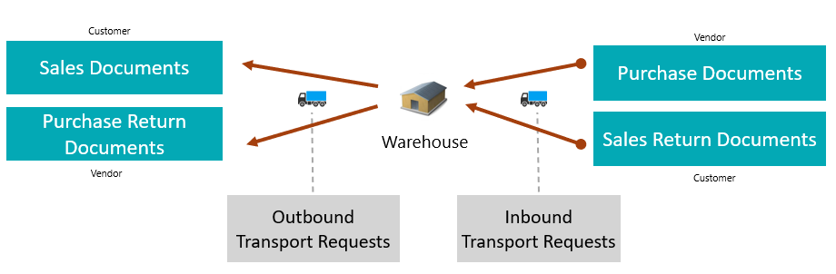

# Use case: Plan an inbound pickup from a Purchase Order

## Goal

Plan inbound vendor pickup or receipt transportation from a Purchase Order.

## When to use it

Use this flow when your company controls the inbound transportation from the vendor to your receiving location.

## Before you start

- The Purchase Order has eligible item lines.
- The Purchase Order is **Released**.
- Vendor, order address, receiving location, and company address data are complete for the endpoints you use.
- If a line has no **Location Code**, **Company Information** has a **Default Map Location**.
- Receiving locations are configured if warehouse receipts will be created.

## Steps

1. Open the Purchase Order.
2. Choose **Create Transport Request**.
3. Open and review the created request.
4. Confirm shipper, consignee, load date/time, and unload date/time.
5. Choose **Release**.
6. Assign the request to a new or existing Transport Order.
7. Review route stops and calculate distance if needed.
8. Release the Transport Order.
9. If the location requires receive handling, choose **Create Warehouse Documents**.

## Expected result

- The Purchase Order is linked to transport demand.
- The inbound request is planned on a Transport Order.
- Warehouse receipts can be created for supported Purchase Order lines when warehouse setup requires them.

## What to do next

Start execution, publish to telematics if used, or process the warehouse receipt.

## Common errors

| Problem | What to check |
|---|---|
| No request is created | Purchase Order status, item lines, remaining quantities, and address setup |
| A line without Location Code fails | Company Information default Map Location |
| Drop shipment lines are skipped | Create the Transport Request from the Sales Order for drop shipment demand |
| Warehouse receipt is not created | Transport Order status, source line support, location receive handling, and outstanding warehouse quantity |
| Distance is blank | Map provider setup and map locations for both endpoints |

## Related

- [Source Documents](source-documents.md)
- [Warehouse Documents](warehouse-documents.md)
- [Transport Order](transportorder.md)
