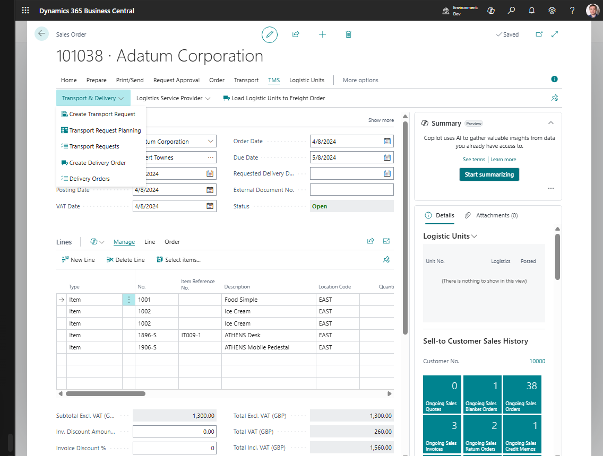

# Use case: Plan an outbound delivery from a Sales Order

## Goal

Move released Sales Order demand into transportation planning and prepare the delivery for execution.

## When to use it

Use this flow for customer deliveries where Sales Order item lines must be delivered from a warehouse, shipping location, or the company address.

## Before you start

- The Sales Order has eligible item lines.
- If a line has no **Location Code**, **Company Information** has a **Default Map Location**.
- The Sales Order is **Released**.
- Customer, ship-to, location, and company address data are complete for the endpoints you use.
- TMS Setup has Transport Request and Transport Order number series.

## Steps

1. Open the Sales Order.
2. Choose **Create Transport Request**.
3. Open the created Transport Request.
4. Fill load and unload date/time values if they were not defaulted.
5. Choose **Release**.
6. Open **Transport Requests** or **Transport Request Load Planning**.
7. Create or assign the request to a Transport Order.
8. On the Transport Order, review carrier, vehicle, driver, route stops, and charges.
9. Release the Transport Order when planning is complete.

## Expected result

- The Sales Order is linked to a Released Transport Request.
- The request is assigned to a Transport Order.
- The Transport Order is ready for warehouse, carrier, document, telematics, or execution work.

## What to do next

Use [Carrier Selection](carrierselection.md), [Warehouse Documents](warehouse-documents.md), or [Truck Load Management](truckloadmanagement.md), depending on how the delivery will be executed.

## Common errors

| Problem | What to check |
|---|---|
| Create Transport Request is unavailable | Sales Order status, item lines, remaining quantities, and endpoint setup |
| A line without Location Code fails | Company Information default Map Location |
| A drop shipment line fails | Linked Purchase Order line exists |
| Request cannot be released | Load and unload date/time values |
| Request does not appear in planning | Request status must be **Released** and not already **Assigned** |

## Related

- [Source Documents](source-documents.md)
- [Transport Request](transportrequest.md)
- [Transport Order](transportorder.md)
