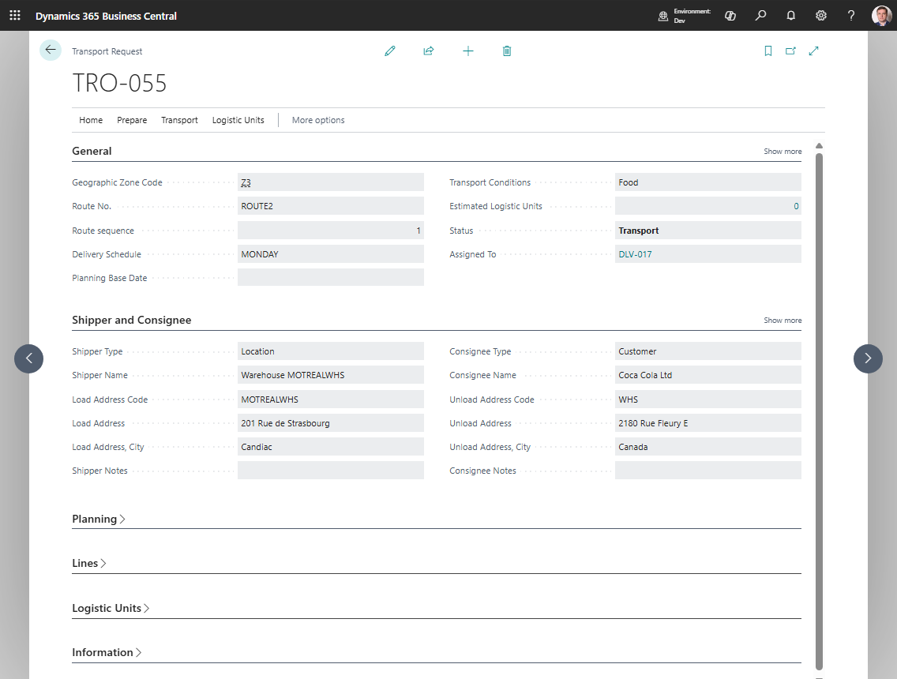

# Use case: Plan a transfer between locations

## Goal

Plan transportation for goods moving between two Business Central locations.

## When to use it

Use this flow when a released Transfer Order needs transport planning before execution.

## Before you start

- The Transfer Order is **Released**.
- Transfer-from and transfer-to locations have usable address or map location data.
- TMS Setup allows request creation from transfer documents if your process uses automatic creation.

## Steps

1. Open the Transfer Order.
2. Choose **Create Transport Request**.
3. Review the created request and its route endpoints.
4. Fill load and unload date/time values.
5. Choose **Release**.
6. Assign the request to a Transport Order.
7. Plan carrier, vehicle, driver, route, and documents.
8. Release the Transport Order when ready.

## Expected result

- The Transfer Order creates transport demand.
- The Transport Request is assigned to a Transport Order for execution planning.

## What to do next

Execute and post the Transport Order according to your transfer process.

## Common errors

| Problem | What to check |
|---|---|
| Posted transfer pages have no TMS actions | The current UI exposes source-document actions on Transfer Order, not Posted Transfer Shipment or Posted Transfer Receipt pages |
| Transfer warehouse document is not created | Transfer lines are not created as warehouse documents by the current Transport Order warehouse action |
| Route endpoints are missing | Review transfer-from and transfer-to location address and map location data |

## Related

- [Source Documents](source-documents.md)
- [Transport Request](transportrequest.md)
- [Warehouse Documents](warehouse-documents.md)
