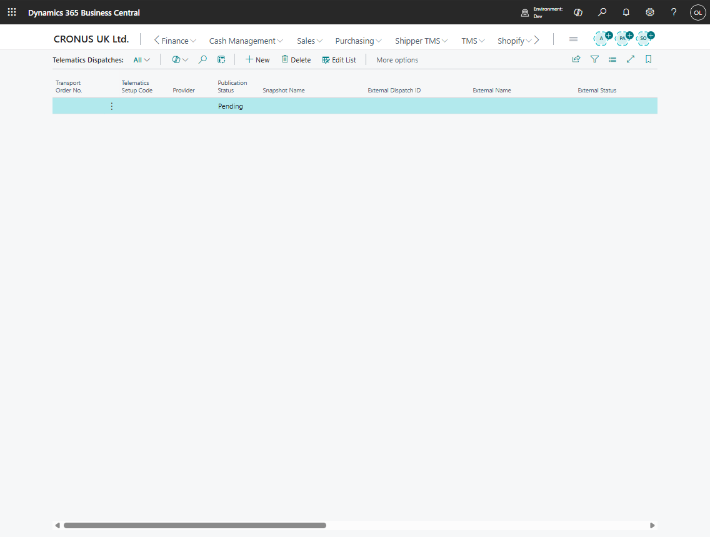

# Use case: Publish a Transport Order to telematics

## Goal

Publish a Transport Order to Geotab, Samsara, or Webfleet for execution by a connected fleet platform.

## When to use it

Use this flow when the carrier or fleet execution process is managed in a telematics provider.

## Before you start

- Telematics setup is enabled for the provider.
- The carrier is linked to the telematics setup.
- Vehicle and driver mappings exist when required.
- The Transport Order has complete route stops and schedule data.

## Steps

1. Open the Transport Order.
2. Confirm carrier, vehicle, driver, route stops, and dates.
3. Choose **Publish to Telematics**.
4. Open **Telematics Dispatches**.
5. Review publication status, external dispatch ID, external status, and last result.
6. Use **Refresh from Telematics** or **Sync Execution Facts** after provider-side updates.

## Expected result

- A telematics dispatch record is created or updated.
- Provider-side route or dispatch data is created.
- Execution facts can be synchronized back when the provider supplies them.

## What to do next

Monitor telematics logs and execution entries. Cancel or refresh the dispatch if the provider-side plan changes.

## Common errors

| Problem | What to check |
|---|---|
| Publish fails | Provider credentials, carrier setup, vehicle mapping, driver mapping, and route data |
| External status is missing | Provider response, logs, and dispatch refresh |
| Execution facts do not appear | Provider event availability, status profile, inbound messages, and sync logs |

## Related

- [Telematics dispatch](telematics-dispatch.md)
- [Telematics setup](telematics-setup.md)
- [Execution Entries](execution-entries.md)
