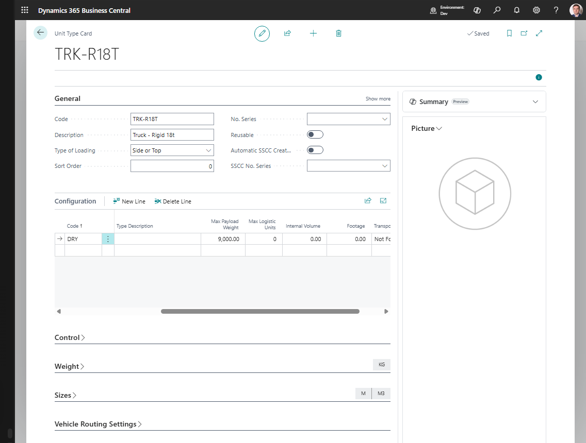
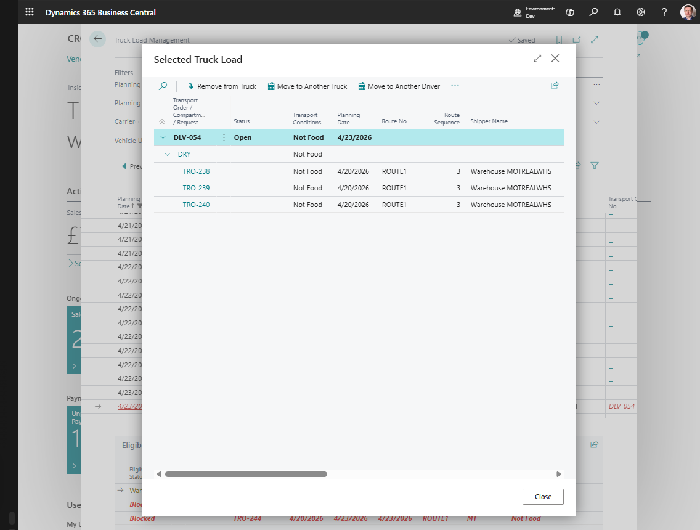

# Vehicle Compartments and Transportation Conditions

Use vehicle compartments and transportation conditions when one load can contain different cargo groups that must stay separated.

Common examples:

- frozen and ambient goods on the same truck,
- refrigerated and dry cargo,
- hazardous and non-hazardous goods,
- customer rules that require separate loading areas.

## How the pieces work together

| Setup | What it controls |
|---|---|
| **Transportation Condition** | The cargo handling requirement, usually read from an item attribute |
| **Logistic Unit Type** | Capacity profile used for pallets, containers, vehicles, or compartments |
| **Vehicle** | The truck or equipment used in planning |
| **Compartment** | A separated capacity area on the vehicle |
| **Truck Load Management candidates** | The planner-facing result: eligible, warning, or blocked |

## Before you start

Make sure that:

- item attributes identify the transportation condition used by Shipper TMS;
- items have the correct condition values;
- logistic unit types and vehicle capacity are maintained;
- vehicle compartments are configured if the truck can carry separated cargo;
- planners know which conditions can share a vehicle and which conditions must not be mixed.

## Example: frozen and ambient delivery

A truck has two compartments:

| Compartment | Capacity | Condition |
|---|---:|---|
| Front compartment | 8 pallets | Frozen |
| Rear compartment | 12 pallets | Ambient |

A planner has two released Transport Requests:

| Request | Cargo | Required condition | Planning result |
|---|---|---|---|
| TR-1001 | Ice cream | Frozen | Eligible for the frozen compartment |
| TR-1002 | Canned goods | Ambient | Eligible for the ambient compartment |

Both requests can travel on the same truck only when each request fits a compatible compartment and the compartment capacity is not exceeded.

## How planners see the result

In [Truck Load Management](truckloadmanagement.md), candidate requests can appear as:

| Candidate result | Meaning |
|---|---|
| **Eligible** | The request fits the selected truck slot and compatible compartment capacity is available. |
| **Warning** | The request might fit, but the planner should review capacity, condition, time slot, route, or driver setup. |
| **Blocked** | The request cannot be added until the shown reason is fixed. A common reason is no compatible compartment or not enough capacity. |

After assignment, **Selected Truck Load** shows the Transport Order, the matched compartment, and the Transport Requests placed under that compartment.

## Good to know

- Transportation conditions help split source demand into safer planning units.
- Compartments help one vehicle carry separated cargo without mixing it in the same capacity area.
- Capacity rules are only as reliable as item, logistic unit, vehicle, and compartment setup.
- If a request appears blocked, switch candidate view to **All With Reasons** or **Blocked Only** and read the reason before changing setup.

## Related

- [Vehicles](vehicle.md)
- [Transportation Conditions](transportationconditions.md)
- [Logistic Unit Types](logisticunittype.md)
- [Truck Load Management](truckloadmanagement.md)
