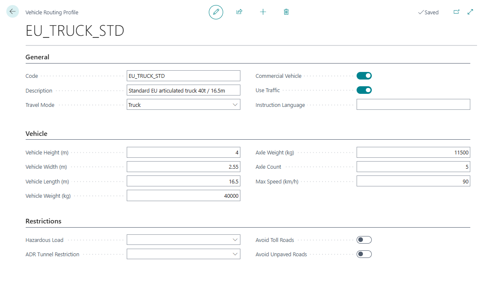
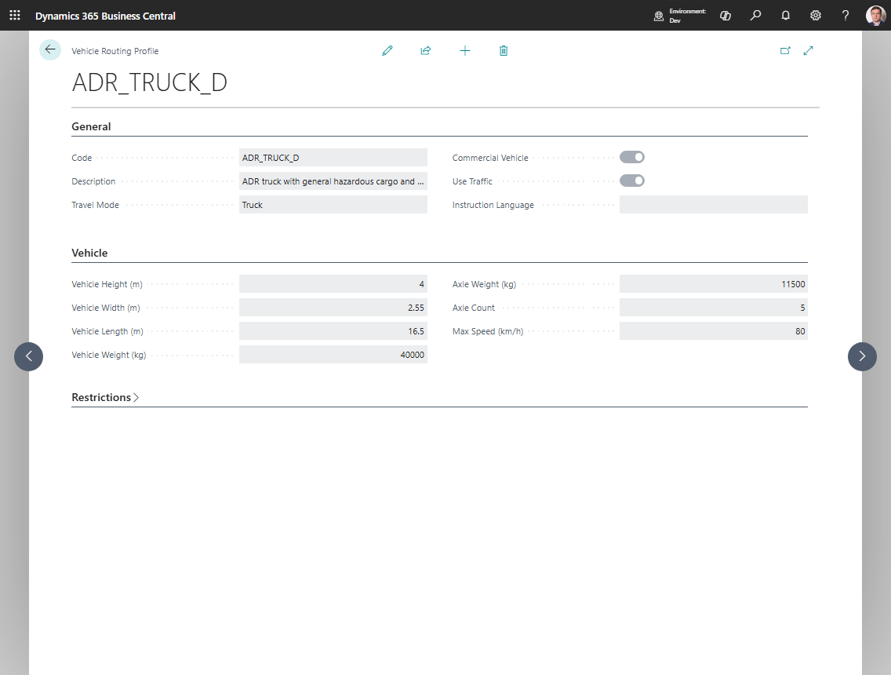

# Vehicle Routing Profiles

Use **Vehicle Routing Profiles** when Azure Maps should calculate routes with truck restrictions.

A routing profile can describe:

- travel mode,
- commercial vehicle flag,
- vehicle dimensions,
- weight,
- axle weight,
- hazardous-load category,
- ADR tunnel restriction,
- road features to avoid,
- traffic usage,
- route instruction language.

## Field reference

| Field | What it means | When to use it |
|---|---|---|
| **Travel Mode** | Provider travel mode requested for the route | Set this for normal car or truck routing behavior |
| **Commercial Vehicle** | Marks the route as commercial vehicle routing | Use for truck-aware planning in Azure Maps |
| **Vehicle Height (m)** | Legal vehicle height | Use when bridges or road restrictions matter |
| **Vehicle Width (m)** | Legal vehicle width | Use for narrow-road restrictions |
| **Vehicle Length (m)** | Legal vehicle length | Use for turning and road-access restrictions |
| **Vehicle Weight (kg)** | Gross vehicle weight | Use for road, bridge, and legal restrictions |
| **Axle Weight (kg)** | Maximum axle weight | Use when axle-weight restrictions apply |
| **Axle Count** | Number of axles | Use when provider routing differentiates by axle count |
| **Max Speed (km/h)** | Vehicle maximum speed | Use when travel-time estimates should reflect equipment limits |
| **Hazardous Load** | Hazardous or regulated load class | Use for hazmat-aware routing |
| **ADR Tunnel Restriction** | ADR tunnel category | Use for European tunnel restrictions |
| **Avoid Toll Roads** | Avoid toll roads where possible | Use when toll avoidance is part of policy or quoting |
| **Avoid Unpaved Roads** | Avoid unpaved roads where possible | Use for fragile cargo or equipment restrictions |
| **Use Traffic** | Use traffic-aware duration when supported | Use for more realistic duration estimates |
| **Instruction Language** | Language code for route instructions | Use when drivers or documents need localized route guidance |

## Before you start

1. Configure [Azure Maps Integration](azuremapsintegration.md).
2. Confirm that **Map Provider** is **Azure Maps** in [TMS Setup](setup.md).
3. Review your equipment types and restrictions.

## Create default profiles

1. Search for **Vehicle Routing Profiles**.
2. Choose **Set Default Vehicle Routing Profiles**.
3. Review the created profiles.
4. Adjust dimensions, weight, hazardous-load, and avoid settings to match your fleet.

## Assign a profile to a unit type

1. Open [Logistic Unit Types](logisticunittype.md).
2. Open the unit type that represents the vehicle or equipment profile.
3. Fill **Vehicle Routing Profile Code**.
4. Review dimensions and maximum weight.
5. Save the record.

## Use the profile on a route calculation

1. Use a vehicle or unit type that has a routing profile.
2. Add it to a Transport Order.
3. Run **Get Transport Time & Distance** or a route action.
4. Review the calculated route.

## Example: avoid a route that is not suitable for the truck

A dispatcher plans a delivery with a tall, heavy truck.

1. Create a vehicle routing profile with the truck's height, weight, axle count, and any hazardous-load rules.
2. Assign that profile to the logistic unit type used by the vehicle.
3. Use **Azure Maps** as the map provider.
4. Recalculate the route on the Transport Order.

Expected result:

- Azure Maps receives truck-related restrictions during route calculation;
- the returned route and duration can differ from a normal passenger-car route;
- planners can review the route before releasing the Transport Order.

## Good to know

- Vehicle routing profiles are used with Azure Maps truck-aware routing.
- Google Maps setup does not use these truck-specific profile fields in the same way.
- Changing a profile can make stored route-distance values outdated.
- Recalculate route distance and duration after changing a routing profile.
- Route results still depend on what the selected map provider supports for your region.

## Related

- [Azure Maps Integration](azuremapsintegration.md)
- [Map Providers](mapproviders.md)
- [Logistic Unit Types](logisticunittype.md)
- [Distance Matrix](distance-matrix.md)
- [Transport Order](transportorder.md)
