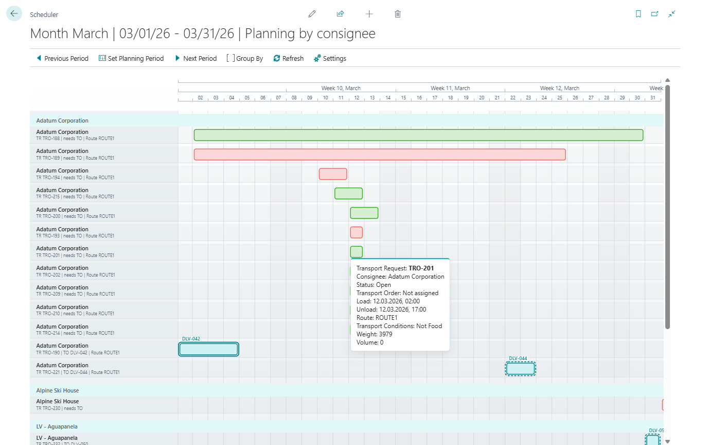

# Visual Scheduler

Use **Visual Scheduler** when you want a timeline view of transportation work instead of a worksheet.

It is best for planners who want to see:

- when requests are planned,
- which requests are already grouped into orders,
- how the load changes over time,
- and where quick drag-and-drop adjustments are possible.

## What the scheduler can show

The scheduler works with Transport Requests and the Transport Orders that group them.

Typical grouping options include:

- Carrier
- Driver
- Vehicle
- Route
- Consignee
- Shipper
- Transport Condition

## Before you start

- Transport Requests should have load and unload date/time values.
- Requests must be **Released** before they can be assigned to Transport Orders.
- Transport Orders must be **Open** before visual rescheduling or request assignment can change them.
- Use Truck Load Management or Driver Load Management first when resource slots must be validated before scheduling.

## Main interactions

Depending on status and current context, planners can:

- move a request in time,
- resize a request to change the unload timing,
- drop a request into an Open Transport Order,
- open the related request or order,
- create a new Transport Order from selected requests.

## How to work in this window

Use this window when timing and visual grouping matter more than field-by-field planning.

1. Set the visible period with **Previous Period**, **Set Planning Period**, or **Next Period**.
2. Choose a **Group By** option:
   - **Carrier** when you review subcontractor or fleet workload,
   - **Driver** when you check driver workload,
   - **Vehicle** when you check equipment usage,
   - **Route** when you plan geographically,
   - **Consignee** or **Shipper** when you review demand by business partner,
   - **Transport Condition** when special handling matters.
3. Review unassigned Transport Requests and grouped Transport Orders on the timeline.
4. Drag an eligible request to change its timing.
   The request timing changes when the document status allows it.
5. Resize the request edge when you need to change the unload timing.
6. Drag a request into an **Open** Transport Order when it should travel with that order.
   The request is assigned to the order and the order route is refreshed.
7. Double-click or use the context menu to open the related document.
8. Use multi-select and create a Transport Order when several eligible requests should become one trip.
   A new Transport Order is created for the selected released requests.
9. Choose **Refresh** after changes made outside the scheduler.

If a request or order cannot be moved, check the document status. Released or In Progress orders are intentionally protected from visual rescheduling.

## When to use it

Use Visual Scheduler when you want to:

- spot gaps or overloads in the calendar,
- review work by route, vehicle, or driver,
- make quick timing adjustments,
- group eligible requests visually before creating the trip.

## Troubleshooting

| Problem | What to check |
|---|---|
| A request cannot be moved | Check request status and whether the timing fields are protected by the current workflow. |
| A request cannot be dropped into an order | The target Transport Order must be **Open**, and the request must be eligible for assignment. |
| An order cannot be changed visually | Released and In Progress orders are protected from visual planning changes. |
| Timeline looks incomplete | Check the visible period, grouping option, filters, and whether documents have planning dates. |
| Changes made elsewhere are missing | Choose **Refresh**. |

## Related

- [Load Management](loadmanagement.md)
- [Truck Load Management](truckloadmanagement.md)
- [Transport Request](transportrequest.md)
- [Transport Order](transportorder.md)
